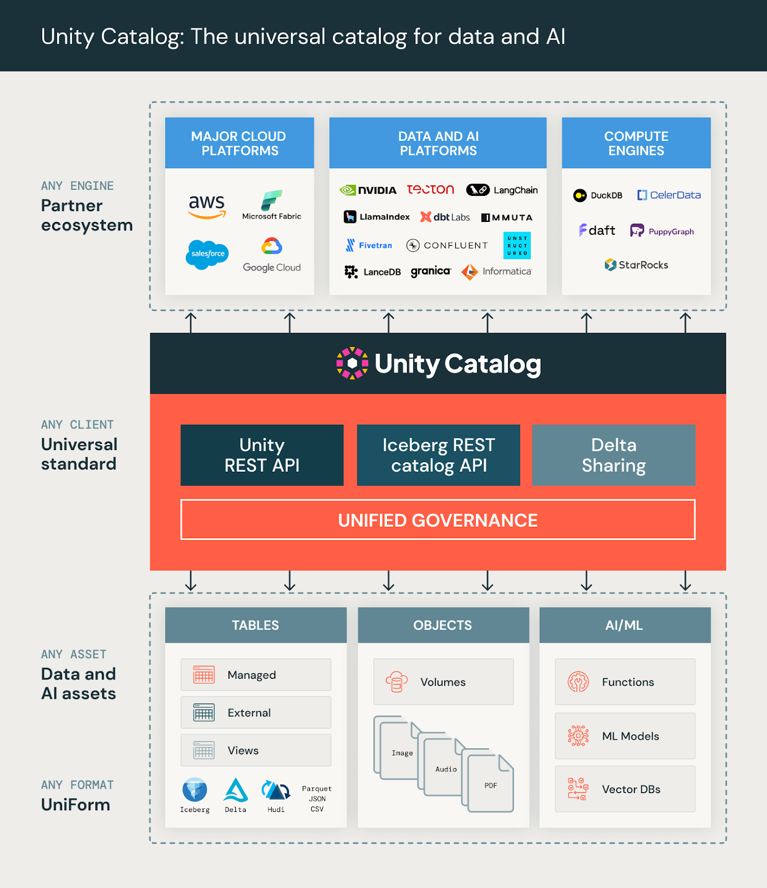
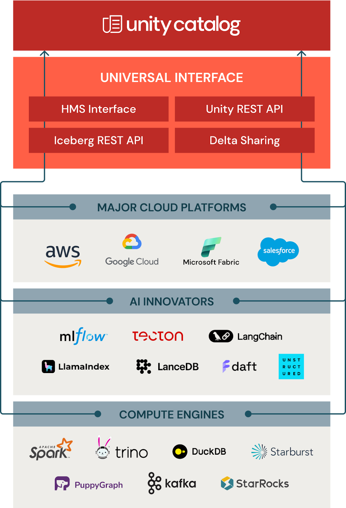
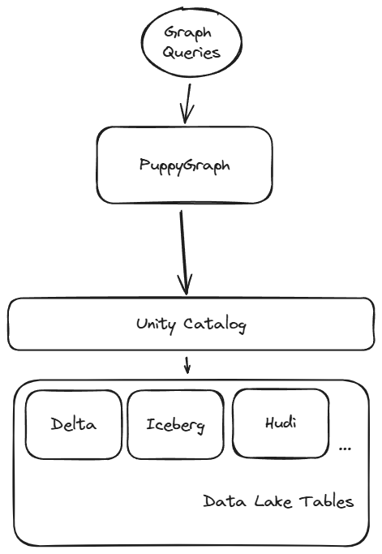
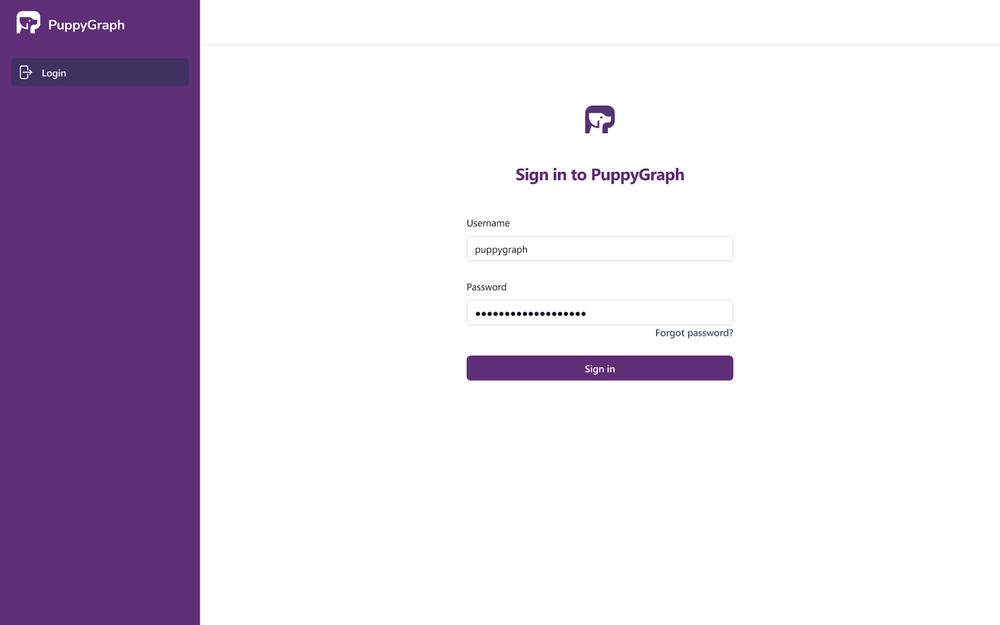
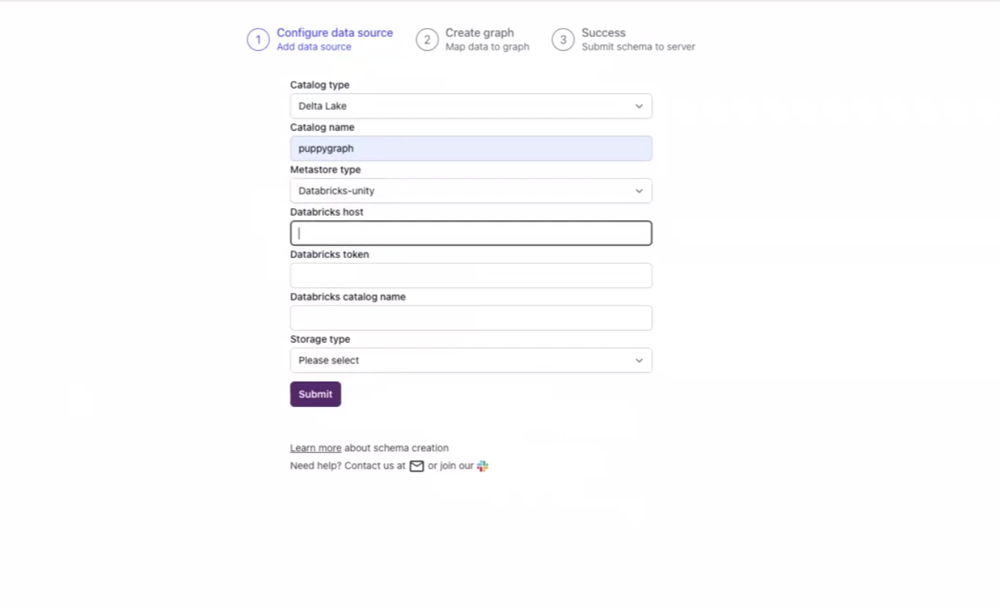
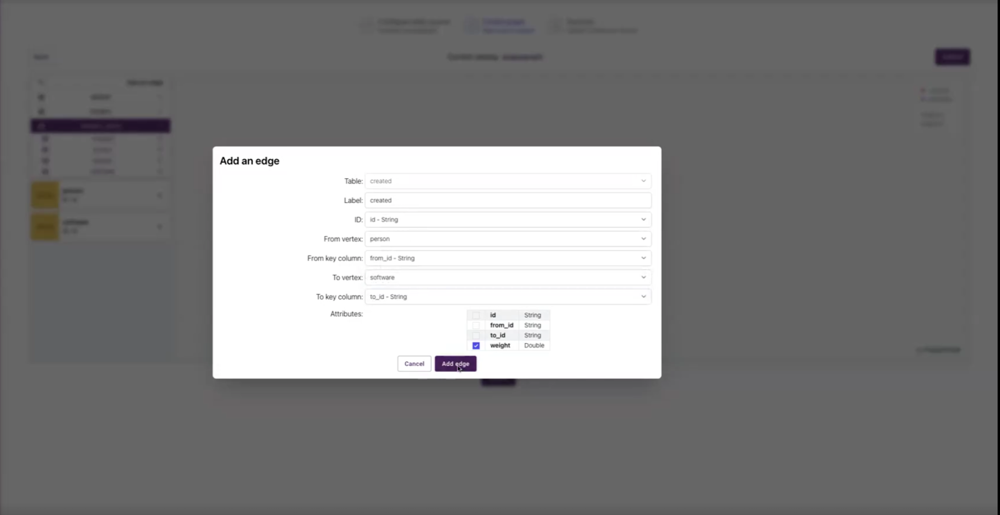
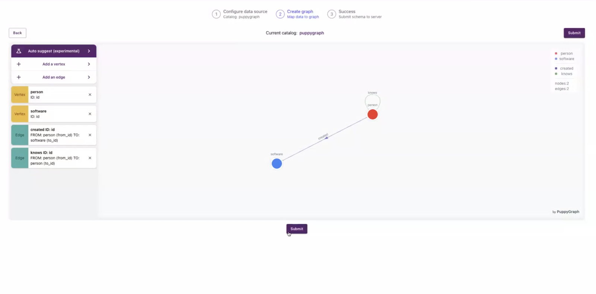
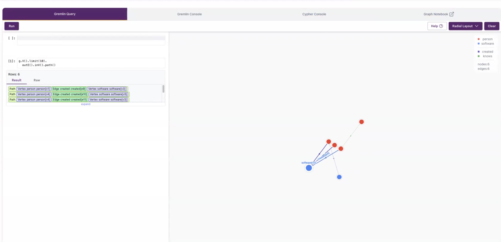
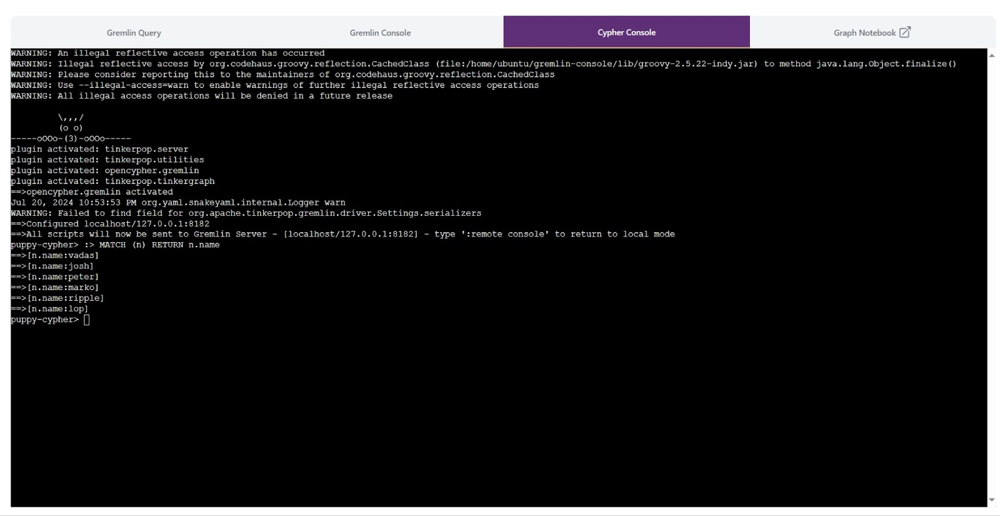

At this year's Data + AI Summit, a groundbreaking [announcement](https://www.databricks.com/blog/open-sourcing-unity-catalog) was made: Unity Catalog is now open source. This pioneering catalog, available on [GitHub](https://go.unitycatalog.io/GitHub), is the industry's first to offer governance for data and AI across various clouds, data formats, and platforms. In an era where rapid AI advancements are commonplace, enterprises recognize the crucial need to manage data and AI assets cohesively. This includes everything from handling unstructured data in complex AI systems to developing comprehensive tool catalogs for autonomous LLM applications.

PuppyGraph is thrilled to be the [first graph compute engine partner](https://www.linkedin.com/posts/puppygraph_unitycatalog-dais-puppygraph-activity-7207059910428160000-2VFP?utm_source=share&utm_medium=member_desktop) for the newly open-sourced Unity Catalog, standing alongside other esteemed compute engines such as [Apache Spark](https://spark.apache.org/), [Trino](https://trino.io/), [DuckDB](https://duckdb.org/), [StarRocks](https://www.starrocks.io/), and [Daft](https://www.getdaft.io/). This partnership underscores our commitment to advancing graph compute technology within the dynamic landscape of AI and data governance.


With all the buzz around Unity Catalog, usage and adoption are set to grow exponentially.

Of course, to expand and use the data within Unity Catalog, many organizations depend on compute engines that integrate directly with Unity Catalog. As part of Unity Catalog's open accessibility, organizations can securely access their data and AI assets from any compute engine using open APIs and standard interfaces. This allows for massive flexibility without relying on proprietary formats, complex ETL processes, or costly data replication.

As the first graph query engine to natively integrate with Unity Catalog, PuppyGraph offers a unique approach to querying the data within a Unity Catalog instance: through graph. As many know, although SQL queries can and do power the bulk of queries, graph queries can allow organizations to explore their data in unique and new ways that SQL-based querying cannot handle efficiently. This blog will explore the power of pairing Unity Catalog with graph analytics capabilities using PuppyGraph's zero-ETL graph query engine. Let's begin with a deeper dive into Unity Catalog.



_Image source: [https://bit.ly/3YyINm2](https://bit.ly/3YyINm2)_

## What is Unity Catalog?

Unity Catalog is a unified governance solution for data and AI across cloud platforms. It centralizes data management, providing fine-grained access controls to secure data handling. Unity Catalog simplifies data discovery and collaboration by managing structured and unstructured data, machine learning models (coming soon), functions, and files. This enhances security, boosts productivity, and ensures regulatory compliance, making it essential for efficient data governance.

A major component of Unity Catalog is its push for open accessibility, making the data within Unity Catalog accessible through various compute engines. These engines include SQL-based engines such as Apache Spark and Trino, among others that deliver unique capabilities, such as graph query and analytics capabilities offered by PuppyGraph.



By offering various ways to query, analyze, and integrate data, Unity Catalog is one of the most flexible and scalable ways for organizations to store their data.

## Why Add Graph Capabilities to Unity Catalog?

Although traditional query languages are excellent for most use cases, highly interconnected data and querying it is not always so simple. This is where Unity Catalog users can benefit significantly from using graph queries instead of traditional SQL queries. Here are a few reasons why users may choose to use graph queries as part of their query toolkit:

- **Enhanced Data Relationships**: Graph queries excel at uncovering complex relationships and patterns within data, which can be cumbersome with SQL.
- **Performance**: Graph queries work well for traversing relationships, making them faster for certain queries, especially those involving deep link analysis.
- **Flexibility**: Graphs provide a more intuitive way to model and query interconnected data without the need for complex JOIN operations, which are common in SQL.
- **Advanced Analytics**: Graph platforms offer advanced graph analytics capabilities like community detection, shortest path calculations, and centrality measures, which are difficult to implement with traditional SQL. Many algorithms needed to support these queries are built into graph platforms, allowing for easy access.

> _"PuppyGraph is a very interesting graph query engine. It doesn't require us to load or ETL any of the data into a specialized or proprietary database storage layer for graphs. They can just simply query everything on your data lake. Doesn't matter if it's Delta or Iceberg or just pure Parquet file. And they can pull the data into the graph model and in another distributed computation engine and render all the results for you. We just use this one to couple this with Unity Catalog so that we open up all our transactional and the crypto data which are already on our Delta Lake. Then PuppyGraph can query them directly and perform all kinds of graph-based exploration and aggregation. This is so powerful, and our users really enjoy this type of flexibility."_

_— [Excerpt from a talk](https://www.databricks.com/dataaisummit/session/data-warehouse-performance-data-lakehouse) given by Eric Sun, Sr. Manager of Data Platform at Coinbase, at Data+AI Summit 2024_

By leveraging graph-based querying and analytics, Unity Catalog users can gain deeper insights, improve query performance, and simplify handling complex data structures. The best way to do this is to leverage PuppyGraph's zero-ETL graph query engine, which integrates directly with Unity Catalog. Let's take a deeper look at that in the next section.

## Unity Catalog + PuppyGraph Architecture

Traditionally, to enable graph querying and analytics on an organization's data, data had to be replicated into a completely separate graph database before a query could be executed. This is a big lift requiring various technologies and teams, not to mention an extended timeline. Being able to run graph queries on data stored in SQL-based data stores is a significant project not for the faint of heart. This is likely why graph analysis was classified as a niche technology in the past; its applicability was high, but the investment was too steep.

PuppyGraph gets around all of these limitations by introducing a new approach to adding graph capabilities: skipping the need for a graph database. Without a graph database in the equation, time to market is less, and so is the cost of implementing a graph-based solution. Connect directly to the data source with PuppyGraph's Zero-ETL graph query engine, then run graph queries on your Unity Catalog instance with fine-grained governance & lineage. Here's a high-level view of what that looks like in action:



This approach allows for performant graph querying, such as supporting 10-hop neighbor queries across half a billion edges in 2.26 seconds without ETL or data duplication. To prove just how easy it is, let's look at how you can connect PuppyGraph to the data you have stored in Unity Catalog.

## Connecting PuppyGraph to Unity Catalog

Enabling graph capabilities on your underlying data is extremely simple with PuppyGraph. We like to summarize it into three steps: deploy, connect, and query. Many users can be up and running in a matter of minutes. We'll walk through the steps below to show how easy it is.

### Deploy PuppyGraph

First, you'll need to deploy PuppyGraph. Luckily, this is easy and can currently be done through Docker (see [Docs](https://docs.puppygraph.com/getting-started)) or an [AWS AMI](https://aws.amazon.com/marketplace/pp/prodview-dgmn5jnwnfacu) through AWS Marketplace. The AMI approach requires a few clicks and will deploy your instance on the infrastructure of your choice. Below, we will focus on what it takes to launch a PuppyGraph instance on Docker.

With Docker installed, you can run the following command in your terminal:

```bash
docker run -p 8081:8081 -p 8182:8182 -p 7687:7687 -d --name puppy --rm --pull=always puppygraph/puppygraph:stable
```

This will spin up a PuppyGraph instance on your local machine (or on a cloud or bare metal server if that's where you want to deploy it). Next, you can go to **localhost:8081** or the URL on which you launched the instance. This will show you the PuppyGraph login screen:



After logging in with the default credentials (username: "puppygraph" and default password: "puppygraph123") you'll then come into the application itself. At this point, our instance is ready to go and we can proceed with connecting to the underlying data stored in Unity Catalog.

### Connect to Your Data Source and Define Your Schema

Next, we must connect to our data source to run graph queries against it. Users have a choice of how they would like to go about this. Firstly, you could use a JSON schema document to define your connectivity parameters and data mapping. As an example, here is what one of these schemas might look like:

```json
{
  "catalogs": [
    {
      "name": "puppygraph",
      "type": "deltalake",
      "metastore": {
        "type": "unity",
        "host": "",
        "token": "",
        "databricksCatalogName": ""
      },
      "storage": {
        "useInstanceProfile": "false",
        "region": "us-east-1",
        "accessKey": "",
        "secretKey": "",
        "enableSsl": "false",
        "type": "S3"
      }
    }
  ],
  "vertices": [
    {
      "label": "person",
      "attributes": [
        {
          "type": "String",
          "name": "name"
        },
        {
          "type": "Int",
          "name": "age"
        }
      ],
      "mappedTableSource": {
        "catalog": "puppygraph",
        "schema": "modern_demo",
        "table": "person",
        "metaFields": {
          "id": "id"
        }
      }
    },
    {
      "label": "software",
      "attributes": [
        {
          "type": "String",
          "name": "name"
        },
        {
          "type": "String",
          "name": "lang"
        }
      ],
      "mappedTableSource": {
        "catalog": "puppygraph",
        "schema": "modern_demo",
        "table": "software",
        "metaFields": {
          "id": "id"
        }
      }
    }
  ],
  "edges": [
    {
      "label": "created",
      "from": "person",
      "to": "software",
      "attributes": [
        {
          "type": "Double",
          "name": "weight"
        }
      ],
      "mappedTableSource": {
        "catalog": "puppygraph",
        "schema": "modern_demo",
        "table": "created",
        "metaFields": {
          "from": "from_id",
          "id": "id",
          "to": "to_id"
        }
      }
    },
    {
      "label": "knows",
      "from": "person",
      "to": "person",
      "attributes": [
        {
          "type": "Double",
          "name": "weight"
        }
      ],
      "mappedTableSource": {
        "catalog": "puppygraph",
        "schema": "modern_demo",
        "table": "knows",
        "metaFields": {
          "from": "from_id",
          "id": "id",
          "to": "to_id"
        }
      }
    }
  ]
}
```

In the example, you can see the data store details under the **catalogs** section. This is all that is needed to connect to the Unity Catalog instance. Underneath the **catalogs** section, you'll notice that we have defined the nodes and edges and where the data comes from. This tells PuppyGraph how to map the SQL data into the graph hosted within PuppyGraph. This can then be uploaded to PuppyGraph, and you'll be ready to query!

To give a bit more understanding of how the schema above maps in the data, here is the script used to create the initial data:

```sql
create table modern_demo.person (id string, name string, age int) USING DELTA;
insert into modern_demo.person values
                              ('v1', 'marko', 29),
                              ('v2', 'vadas', 27),
                              ('v4', 'josh', 32),
                              ('v6', 'peter', 35);

create table modern_demo.software (id string, name string, lang string) USING DELTA;
insert into modern_demo.software values
                                    ('v3', 'lop', 'java'),
                                    ('v5', 'ripple', 'java');

create table modern_demo.created (id string, from_id string, to_id string, weight double) USING DELTA;
insert into modern_demo.created values
                                 ('e9', 'v1', 'v3', 0.4),
                                 ('e10', 'v4', 'v5', 1.0),
                                 ('e11', 'v4', 'v3', 0.4),
                                 ('e12', 'v6', 'v3', 0.2);

create table modern_demo.knows (id string, from_id string, to_id string, weight double) USING DELTA;
insert into modern_demo.knows values
                               ('e7', 'v1', 'v2', 0.5),
                               ('e8', 'v1', 'v4', 1.0);
```

Alternatively, for those who want a more UI-based approach, PuppyGraph also offers a schema builder that allows users to use a drag-and-drop editor to build their schema. In an example similar to the one above, here is what the UI would look like with the schema built out this way:







We can instantly query the data after either approach is used and the schema is uploaded to PuppyGraph.

### Query your Data as a Graph

Now, without needing data replication or ETL, you can query your data as a graph. Our next step is to figure out **how** we want to query our data and **what** insights we want to gather from it.

PuppyGraph allows users to use [Gremlin](https://docs.puppygraph.com/reference/gremlin-query-language), Cypher, or Jupyter Notebook. For example, based on the schemas above, a Gremlin query, shown in a visualized format that can be explored further, will look like this:



In the Cypher Console, a related query output would look like this:

```sql
puppy-cypher> :> MATCH (n) RETURN n.name
==>[n.name:vadas]
==>[n.name:josh]
==>[n.name:peter]
==>[n.name:marko]
==>[n.name:ripple]
==>[n.name:lop]
```



As you can see, graph capabilities can be achieved with PuppyGraph in minutes without the heavy lift usually associated with graph databases. Whether you're a seasoned graph professional looking to expand the data you have to query as a graph or a budding graph enthusiast testing out a use case, PuppyGraph offers a performant and straightforward way to add graph querying and analytics to the data you have sitting within Unity Catalog.

## Get Started For Free

In this blog, we looked at how to enable real-time graph querying with PuppyGraph's zero-ETL graph query engine and how to pair it with Unity Catalog. In a matter of minutes, we explored how PuppyGraph can be deployed and connected to your Unity Catalog instance, enabling graph queries without the overhead of traditional graph technologies.

Want to try PuppyGraph with Unity Catalog for yourself? Download PuppyGraph's [forever-free Developer Edition](https://www.puppygraph.com/dev-download) and start running graph queries on your Unity Catalog instance with fine-grained governance & lineage in 10-mins. You can also check instructions for connecting to and [Unity Catalog](https://docs.puppygraph.com/getting-started/querying-unity-catalog-data-as-a-graph) in PuppyGraph Documentation.
