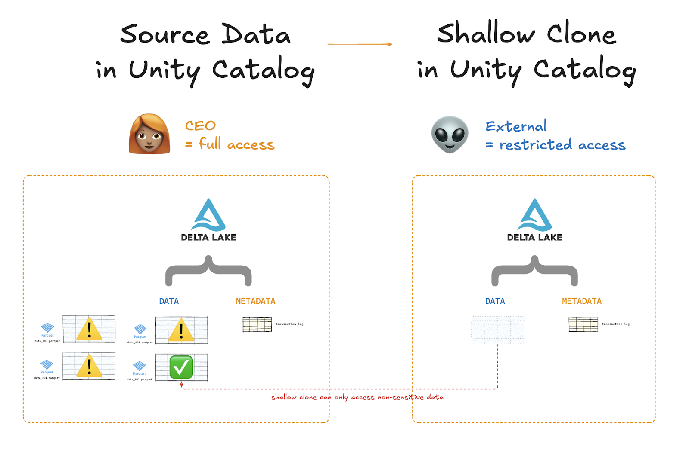

Unity Catalog is a data catalog for managing all your data and AI assets easily and securely. You can use Unity Catalog to organize your data assets, collaborate, manage data access, and ensure compliance with data regulations.


This blog will introduce you to how Unity Catalog works and how you can use it to manage your data assets. We will explore [Unity Catalog's great features](/blogs/unity-catalog-oss#features-catalog) for data management, examine its [architecture and main concepts](/blogs/unity-catalog-oss#architecture), and work through a practical [hands-on coding example](/blogs/unity-catalog-oss#starting).

If you're new to data catalogs, [you can review the basics of data catalogs](http://www.unitycatalog.io/blogs/data-catalog), which includes a discussion of why you should use a data catalog in any serious data-driven business organization.

Unity Catalog is in active development and the community is growing quickly, so it's a really exciting time to join the project! You can find our recommendations for [contributing to the project](/blogs/unity-catalog-oss#join) at the end of this post.

Let's jump in! 🪂

## What Is Unity Catalog?

Unity Catalog is a modern data catalog that helps you organize and manage all of your data and AI assets.

With Unity Catalog, you can:

- Organize all your data assets in one place
- Govern access to data assets and ensure compliance through a single source of truth
- Use your favorite query engines and tools to process your data

Unity Catalog offers full interoperability for all your data objects, regardless of their formats. Unlike many other catalogs, its capabilities extend beyond managing structured, tabular data. Unity Catalog can also help you organize and govern unstructured data, including text, images, video and audio, AI and ML models, vector databases, and user-defined functions (UDFs).

This means Unity Catalog can serve as the single source of truth for _all_ of your data.

## Why Should I Use Unity Catalog?

Unity Catalog has some great features that make it a great choice for managing your data. It makes it easy to:

1. [Find your data](/blogs/unity-catalog-oss#find-your-data)
2. [Use your favorite data tools](/blogs/unity-catalog-oss#favorite-tools)
3. [Collaborate with many users on the same data](/blogs/unity-catalog-oss#data-assets)
4. [Manage who can access your data](/blogs/unity-catalog-oss#manage-data-access)

Let's take a closer look at each of these features.

## Find Your Data Easily

Unity Catalog makes it easy to organize large amounts of data for quick and easy discovery and retrieval.

Any serious business organization creating value from data stores large amounts of it for processing and analysis. The volume of these data assets can grow exponentially over time, making it very difficult to quickly find the exact data you need to do your job. Without clear organization, data discovery becomes a bottleneck and slows you down.

Unity Catalog helps by using the metadata of your data objects to automatically tag and organize your assets. This means there's no more need to search through your local files or S3 buckets for that specific version of that one table you were working on the other day. All your data assets are registered in one central repository; you don't need to know where it's stored, you just need to know its name.

Unity Catalog uses a three-level naming convention to organize your data: _<catalog>.<schema>.<asset>_. You'll read more about this in the [Unity Catalog Architecture & Concepts](/blogs/unity-catalog-oss#architecture) section below.


## Use Your Favorite Tools

Unity Catalog is fully open source and supports open data formats.

Many data warehousing solutions store your data and metadata in proprietary formats. This is fine when you're working in their environment but becomes a problem when you need to process the data elsewhere—for example, because another query engine is faster.

Unity Catalog provides open access to all of your data and metadata by supporting the OpenAPI spec and open table formats. This eliminates the risk of vendor lock-in. You are free to access and process your data using your favorite tools and engines.

Unity Catalog is built by a great and friendly open source community. See our [recommendations for contributing](/blogs/unity-catalog-oss#join) to the project to learn how you can join the community!


## Collaborate on Data Assets

Unity Catalog makes it easy for multiple users to collaborate on the same data assets.

Suppose you need to work together on a Parquet table with an external client. You create a copy of the table and share it with them. You then both make edits to this file, and when you're done you just need to merge the changes in the copied table back to the source. But in the meantime, your colleague has made changes to the source table, and the column names no longer match. You now have to manually figure out how to resolve the data conflicts. Not fun.

Unity Catalog solves this problem by storing all your data assets in a central repository. Users who want to collaborate can access the same table or ML model from the central catalog. Changes to the assets are managed reliably through secure transactions to avoid data corruption. This way, you no longer need to maintain multiple versions across many locations when collaborating and you can avoid data clutter and corruption.


## Manage Data Access

Unity Catalog makes it easy to manage access to data assets per user role.

As you just saw, Unity Catalog helps you with data discovery and collaboration by storing all of your data assets in a central data repository. But not everyone should have equal access to this centralized data. Your company's HR director, for example, will probably need access to company-wide employee data (including salaries) that you and your data engineering colleague who are working on a BI dashboard project probably should not be able to see.

Unity Catalog helps you define access policies based on user profiles.


This is also great for sharing data outside of your organization.

Suppose you want to share a dataset with an external organization, but the dataset has some sensitive columns that should not be shared. Instead of manually copying the table without the sensitive columns, you can use Unity Catalog to allow certain users to only access specific parts of your data asset, for example by performing a [shallow clone of your Delta Lake table](https://delta.io/blog/delta-lake-clone/).



Unity Catalog provides centralized and secure governance through temporary credential vending. Credential vending allows data access to be precise (users only access the data they need to see) and fully auditable.


## Unity Catalog Architecture & Concepts

Unity Catalog stores all of your data assets in a three-level namespace:

- Catalog
- Schema
- Data asset


A **catalog** is the top-level organizational unit for your data assets. Catalogs often correspond to business units or other higher-level categorizations.

A **schema** is the next level of organization, used to collect your data and AI assets into more granular logical categories. Often a schema will represent a single project or use case. Unity Catalog schemas should not be confused with table schemas. Catalog schemas and table schemas are not related to each other, despite the name.

A **data asset** is any data object that you want to store for future processing and analysis. Unity Catalog supports many different kinds of assets, including tables, volumes, models, and functions.

Tables and volumes can be either _managed_ or _external_.

Managed tables and volumes are fully managed by Unity Catalog, which means that Unity Catalog fully owns the creation, deletion, and storage of these data assets. When you create or delete a managed data asset, Unity Catalog automatically creates or deletes the underlying files.

External tables and volumes are stored outside of managed storage, for example in cloud object stores. If you create or delete an external table, you will manually create or delete the corresponding files. In this case, Unity Catalog only manages the metadata for these data assets.

## Data Assets

Unity Catalog can manage all sorts of data assets for you:

- **Tables** store tabular data in many formats.
- **Volumes** store semi- and unstructured data such as nested JSON, audio, video, and text.
- **Functions** store units of programming logic (also known as user-defined functions, or UDFs) that return a scalar value or a set of rows.
- **Models** store AI and ML models packaged with MLflow.

Tables and volumes can be either _managed_ or _external_.

Managed tables and volumes are fully managed by Unity Catalog, which means that Unity Catalog fully owns the creation, deletion, and storage of these data assets. When you create or delete a managed data asset, Unity Catalog automatically creates or deletes the underlying files.

External tables and volumes are stored outside of managed storage, for example in cloud object stores. If you create or delete an external table, you will manually create or delete the corresponding files. In this case, Unity Catalog only manages the metadata for these data assets.

## Getting Started with Unity Catalog

Now let's take a look at how you can use Unity Catalog to work with your data assets. Here's an overview of what you will learn in this tutorial:

You will need to clone the open source Unity Catalog GitHub repository:

I. Configuration and setup
A. Cloning the Unity Catalog repository
B. Launching the Unity Catalog server
II. How to work with data assets
A. Tables
B. Volumes
C. Functions
III. Setting up authentication and authorization
IV. Integrations with other tools
A. Using Unity Catalog with Spark
B. Using Unity Catalog with MLFlow

## Cloning the Unity Catalog Repository

You will need to clone the open source Unity Catalog GitHub repository:

```bash
git clone git@github.com:unitycatalog/unitycatalog.git
```

You will also need Java 17 or above installed on your machine. You can run the `java --version` command in a terminal to verify that you have the right version of Java installed.

## Launching the Unity Catalog Server

Open a terminal window and navigate into the unity catalog repo directory. Run `bin/start-uc-server` to spin up a local server.

Here is what you should see:

```
###################################################################
#  _    _       _ _            ____ _      _        _              #
# | |  | |     (_) |          / ____|    | |      | |             #
# | |  | |_ __  _| |_ _   _  | |     __ _| |_ __ _| | ___   __ _  #
# | |  | | '_ \| | __| | | | | |    / _` | __/ _` | |/ _ \ / _` | #
# | |__| | | | | | |_| |_| | | |___| (_| | || (_| | | (_) | (_| | #
#  \____/|_| |_|_|\__|\__, |  \_____\__,_|\__\__,_|_|\___/ \__, | #
#                      __/ |                                __/ | #
#                     |___/               v0.3.0-SNAPSHOT  |___/  #
###################################################################
```

Leave this terminal window as it is to keep the Unity Catalog server running, and open a new terminal window to start running Unity Catalog commands and interacting with your data.

## Working with Tables

The Unity Catalog local server comes with some tables preloaded by default. These are great for quick experimentation.

### List Tables

You can list all the tables in a catalog schema using the `bin/uc table list` command. You will need to specify the catalog and schema by name using the `--catalog` and `--schema` flags, like this:

```bash
bin/uc table list --catalog unity --schema default
```

You should see output similar to:

```
┌─────────────┬───────┬───────┬───────┬───────┬───────┬───────┬───────┬───────┬───────┬───────┬────────────────────────────────────┐
│    NAME     │CATALOG│SCHEMA_│TABLE_T│DATA_SO│COLUMNS│STORAGE│COMMENT│PROPERT│CREATED│UPDATED│              TABLE_ID              │
│             │ _NAME │  NAME │  TYPE │FORMAT │       │LOCATI │       │  IES  │  _AT  │  _AT  │                                    │
├─────────────┼───────┼───────┼───────┼───────┼───────┼───────┼───────┼───────┼───────┼───────┼────────────────────────────────────┤
│marksheet    │unity  │default│MANAGED│DELTA  │[...]  │file...│Mana...│{...}  │...    │...    │c389adfa-5c8f-497b-8f70-26c2cca4976d│
│...          │...    │...    │...    │...    │...    │...    │...    │...    │...    │...    │...                                 │
└─────────────┴───────┴───────┴───────┴───────┴───────┴───────┴───────┴───────┴───────┴───────┴────────────────────────────────────┘
```

As you can see here, the Unity Catalog local server comes with four tables by default, all stored in the unity catalog under the default schema. One of these tables is managed, and the others are external. All four tables are in the Delta Lake format.

Let's take a closer look at a specific table.

### Read Tables

You can use the `bin/uc table read` command to read the content of a table. You will need to refer to it by its `full_name`, in the format `<catalog>.<schema>.<table>`. You can limit the number of returned rows using the `--max_results` keyword. For example, let's look at the first three rows of the numbers table:

```bash
bin/uc table read --full_name unity.default.numbers --max_results 3
```

Example output:

```
┌───────────────┬──────────────────┐
│as_int(integer)│as_double(double) │
├───────────────┼──────────────────┤
│564            │188.75535598441473│
│755            │883.6105633023361 │
│644            │203.4395591086936 │
└───────────────┴──────────────────┘
```

### Create Tables

Use the `bin/uc table create` command to create a new table in your Unity Catalog.

You will need to specify its `full_name` and columns along with their data types. This will define the new table's schema (again, not to be confused with the Unity Catalog schema). For external tables, you will also need to define the `storage_location`.

You can create tables in many different formats, including Delta Lake, Parquet, ORC, JSON, CSV, AVRO, and TXT. Use the `--format` flag to specify the format. If not specified, a Delta Lake table will be created.

Let's see this in action. Run the command below with the correct path to storage to create a new external Delta Lake table with two columns, some_numbers and some_letters:

```bash
bin/uc table create --full_name unity.default.test --columns "some_numbers INT, some_letters STRING, some_times TIMESTAMP" --storage_location $DIRECTORY$
```

Note that you will need to manually set the `$DIRECTORY$` variable to the correct storage location. If you don't know where Unity Catalog is storing your files, take a look at the metadata of an existing table using `bin/uc table get --full_name <catalog>.<schema>.<table>` to see its storage location.

This should output something like:

```
Table created successfully at: <path/to/storage>

┌──────────────────┬────────────────────────────────────────────────────────────────────────────────────────────────────┐
│     KEY          │                                               VALUE                                                │
│──────────────────┼────────────────────────────────────────────────────────────────────────────────────────────────────┤
│NAME              │test                                                                                                │
│CATALOG_NAME      │unity                                                                                               │
│SCHEMA_NAME       │default                                                                                             │
│TABLE_TYPE        │EXTERNAL                                                                                            │
│DATA_SOURCE_FORMAT│DELTA                                                                                               │
│COLUMNS           │{"name":"some_numbers",...}                                                                         │
│STORAGE_LOCATION  │file:///...                                                                                         │
│COMMENT           │null                                                                                                │
│PROPERTIES        │{}                                                                                                  │
│CREATED_AT        │...                                                                                                 │
│UPDATED_AT        │...                                                                                                 │
│TABLE_ID          │...                                                                                                 │
└──────────────────┴────────────────────────────────────────────────────────────────────────────────────────────────────┘
```

### Get Table Metadata

Tables stored in Unity Catalog have rich metadata. You can use the `bin/uc table get` command to examine a table's metadata.

Let's take a look at the metadata for the numbers table:

```bash
bin/uc table get --full_name unity.default.numbers
```

Example output:

```
┌──────────────────┬────────────────────────────────────────────────────────────────────────────────────────────────────┐
│     KEY          │                                               VALUE                                                │
├──────────────────┼────────────────────────────────────────────────────────────────────────────────────────────────────┤
│NAME              │numbers                                                                                             │
│CATALOG_NAME      │unity                                                                                               │
│SCHEMA_NAME       │default                                                                                             │
│TABLE_TYPE        │EXTERNAL                                                                                            │
│DATA_SOURCE_FORMAT│DELTA                                                                                               │
│COLUMNS           │{"name":"as_int",...}                                                                               │
│STORAGE_LOCATION  │file:///...                                                                                         │
│COMMENT           │External table                                                                                      │
│PROPERTIES        │{"key1":"value1","key2":"value2"}                                                                   │
│CREATED_AT        │...                                                                                                 │
│UPDATED_AT        │...                                                                                                 │
│TABLE_ID          │...                                                                                                 │
└──────────────────┴────────────────────────────────────────────────────────────────────────────────────────────────────┘
```

For more table functionality, check out the [tables documentation](https://docs.unitycatalog.io/usage/cli/#table-management-cli-usage).

## Working with Volumes

Unity Catalog volumes are useful for registering datasets that are non-tabular or not supported as Unity Catalog tables. They're a great option for JSON files, text files, Lance datasets, and media files such as audio, video, and images.

Here's an example of a Unity Catalog schema that contains three volumes:


The Unity Catalog local server comes with some volumes preloaded by default. Let's take a look at them.

### List Volumes

You can list the volumes in a catalog schema using the `bin/uc volume list` command:

```bash
bin/uc volume list --catalog unity --schema default
```

Example output:

```
┌────────┬────────┬──────────┬────────┬────────┬────────┬────────────────────────────────────┬────────┬────────┬────────┐
│CATALOG_│SCHEMA_N│   NAME   │COMMENT │CREATED_│UPDATED_│             VOLUME_ID              │VOLUME_T│STORAGE_│FULL_NAM│
│  NAME  │  AME   │          │        │   AT   │   AT   │                                    │  YPE   │LOCATION│   E    │
├────────┼────────┼──────────┼────────┼────────┼────────┼────────────────────────────────────┼────────┼────────┼────────┤
│unity   │default │txt_files │null    │...     │...     │74695d77-d48b-4f8e-9894-54a3e110b1ae│MANAGED │file:...│unity...│
│unity   │default │json_files│null    │...     │...     │d3f18882-eb1f-4cbb-bbc4-0347091224e8│EXTERNAL│file:...│unity...│
└────────┴────────┴──────────┴────────┴────────┴────────┴────────────────────────────────────┴────────┴────────┴────────┘
```

You should see two volumes: txt_files (managed) and json_files (external).

### Get Volume Metadata

You can get the metadata of a volume using the `bin/uc volume get` command:

```bash
bin/uc volume get --full_name unity.default.json_files
```

Example output:

```
┌────────────────┬─────────────────────────────────────────────────────────────────────────────────────────────────┐
│     KEY        │                                              VALUE                                              │
├────────────────┼─────────────────────────────────────────────────────────────────────────────────────────────────┤
│CATALOG_NAME    │unity                                                                                            │
│SCHEMA_NAME     │default                                                                                          │
│NAME            │json_files                                                                                       │
│COMMENT         │null                                                                                             │
│CREATED_AT      │...                                                                                              │
│UPDATED_AT      │...                                                                                              │
│VOLUME_ID       │d3f18882-eb1f-4cbb-bbc4-0347091224e8                                                             │
│VOLUME_TYPE     │EXTERNAL                                                                                         │
│STORAGE_LOCATION│file:///...                                                                                      │
│FULL_NAME       │unity.default.json_files                                                                         │
└────────────────┴─────────────────────────────────────────────────────────────────────────────────────────────────┘
```

### Read Volumes

To read the contents of a volume, use the `bin/uc volume read` command. This will list the directories and/or files in your volume:

```bash
bin/uc volume read --full_name unity.default.json_files
```

Example output:

```
d.json [file]
c.json [file]
dir1 [directory]
```

Here, you can see that the json_files volume contains two JSON files and one directory. Let's dig a little deeper to read the contents of a specific file using the `--path` keyword:

```bash
bin/uc volume read --full_name unity.default.json_files --path c.json
```

Example output:

```json
{
  "marks": [
    { "name": "a", "score": 20 },
    { "name": "b", "score": 30 },
    { "name": "c", "score": 40 },
    { "name": "d", "score": 50 }
  ]
}
```

Nice work! You've read the contents of a file stored in a volume.

### Create Volumes

Now let's try creating a new external volume.

First, physically create a directory with some files in it. For the purposes of illustration, let's assume you've created a directory called `/tmp/my_volume` and put two files in it, `doc001.txt` and `doc002.json`.

Next, create the volume in Unity Catalog using the `bin/uc volume create` command:

```bash
bin/uc volume create --full_name unity.default.my_volume --storage_location /tmp/my_volume
```

Now add a file to your local volume directory:

```bash
mkdir /tmp/my_volume

touch /tmp/my_volume/new_doc.txt
```

Unity Catalog will catalog any new files in your registered volume. You can see the new contents of this volume using the `bin/uc volume read` command:

```bash
bin/uc volume read --full_name unity.default.my_volume
```

Example output:

```
doc001.txt
doc002.json
new_doc.txt
```

You can read more about working with volumes in the [Unity Catalog volumes documentation](https://docs.unitycatalog.io/usage/volumes/).

## Working with Functions

You can register user-defined functions in Unity Catalog schemas. Storing and managing functions is great for reusing code and applying permissions or filters.

The following diagram shows an example of a Unity Catalog instance with two functions, sum and my_function:


### List Functions

You can list the functions in your Unity Catalog namespace using the `bin/uc function list` command:

```bash
bin/uc function list --catalog unity --schema default
```

Example output:

```
┌────────────┬────────┬────────┬────────┬────────┬────────┬────────┬────────┬────────┬────────┬────────┬────────┬────────┬────────┬────────┬────────┬────────┬────────┬────────┬────────┬────────┬────────┬────────┐
│    NAME    │CATALOG_│SCHEMA_N│INPUT_PA│DATA_TYP│FULL_DAT│RETURN_P│ROUTINE_│ROUTINE_│ROUTINE_│PARAMETE│IS_DETER│SQL_DATA│IS_NULL_│SECURITY│SPECIFIC│COMMENT │PROPERTI│FULL_NAM│CREATED_│UPDATED_│FUNCTION│EXTERNAL│
│            │  NAME  │  AME   │  RAMS  │   E    │ A_TYPE │ ARAMS  │  BODY  │DEFINITI│DEPENDEN│R_STYLE │MINISTIC│_ACCESS │  CALL  │ _TYPE  │ _NAME  │        │   ES   │   E    │   AT   │   AT   │  _ID   │_LANGUAG│
│            │        │        │        │        │        │        │        │   ON   │  CIES  │        │        │        │        │        │        │        │        │        │        │        │        │   E    │
├────────────┼────────┼────────┼────────┼────────┼────────┼────────┼────────┼────────┼────────┼────────┼────────┼────────┼────────┼────────┼────────┼────────┼────────┼────────┼────────┼────────┼────────┼────────┤
│sum         │unity   │default │{"par...│INT     │INT     │null    │EXTERNAL│t = x...│null    │S       │true    │NO_SQL  │false   │DEFINER │sum     │Adds ...│null    │unity...│17183...│null    │8e83e...│python  │
│lowercase   │unity   │default │{"par...│STRING  │STRING  │null    │EXTERNAL│g = s...│null    │S       │true    │NO_SQL  │false   │DEFINER │lower...│Conve...│null    │unity...│17183...│null    │33d81...│python  │
└────────────┴────────┴────────┴────────┴────────┴────────┴────────┴────────┴────────┴────────┴────────┴────────┴────────┴────────┴────────┴────────┴────────┴────────┴────────┴────────┴────────┴────────┴────────┘
```

### Get Function Metadata

You can get the metadata of one of these functions using `bin/uc function get`. For example, if you enter this command:

```bash
bin/uc function call --full_name unity.default.sum --input_params "1,2,3"
```

Example output:

```
6
```

You should see something that looks like this:

```
┌────────────────────┬────────────────────────────────────────────────────────────────────────────────────────────────────┐
│     KEY            │                                               VALUE                                                │
├────────────────────┼────────────────────────────────────────────────────────────────────────────────────────────────────┤
│NAME                │sum                                                                                                 │
│CATALOG_NAME        │unity                                                                                               │
│SCHEMA_NAME         │default                                                                                             │
│INPUT_PARAMS        │{"parameters":[{"name":"x","type_text":"int",...}, ...]}                                            │
│DATA_TYPE           │INT                                                                                                 │
│FULL_DATA_TYPE      │INT                                                                                                 │
│RETURN_PARAMS       │null                                                                                                │
│ROUTINE_BODY        │EXTERNAL                                                                                            │
│ROUTINE_DEFINITION  │t = x + y + z\nreturn t                                                                             │
│ROUTINE_DEPENDENCIES│null                                                                                                │
│PARAMETER_STYLE     │S                                                                                                   │
│IS_DETERMINISTIC    │true                                                                                                │
│SQL_DATA_ACCESS     │NO_SQL                                                                                              │
│IS_NULL_CALL        │false                                                                                               │
│SECURITY_TYPE       │DEFINER                                                                                             │
│SPECIFIC_NAME       │sum                                                                                                 │
│COMMENT             │Adds two numbers.                                                                                   │
│PROPERTIES          │null                                                                                                │
│FULL_NAME           │unity.default.sum                                                                                   │
│CREATED_AT          │...                                                                                                 │
│UPDATED_AT          │...                                                                                                 │
│FUNCTION_ID         │8e83e2d9-e523-46a1-b69c-8fe9212f1057                                                                │
│EXTERNAL_LANGUAGE   │python                                                                                              │
└────────────────────┴────────────────────────────────────────────────────────────────────────────────────────────────────┘
```

The ROUTINE_DEFINITION is probably most helpful here: `t = x + y + z\nreturn t`. This function takes in three arguments and returns their sum. The DATA_TYPE field tells us that the output should be of type INT.

### Calling Functions from Unity Catalog

Let's try calling this function.

We'll use the `bin/uc function call` command to reference the function by its full name and pass three input parameters:

```bash
bin/uc function call --full_name unity.default.sum --input_params "1,2,3"
```

This will output the result as expected:

```
6
```

You can register your own function in Unity Catalog as follows:

```bash
bin/uc function create --full_name unity.default.dateToQuarter --data_type STRING --input_params "date_string string" --language "python" --def "import datetime\ndate = datetime.datetime.strptime(date_str, '%Y-%m-%d')\nquarter = (date.month - 1) // 3 + 1\nreturn print(f'The quarter for the provided date is: Q{quarter}.')"
```

Here, we define a new function by its full name, specifying the data type of the output as well as the input parameters and their data types.

This command should output something like:

```
┌────────────────────┬────────────────────────────────────────────────────────────────────────────────────────────────────┐
│     KEY            │                                               VALUE                                                │
├────────────────────┼────────────────────────────────────────────────────────────────────────────────────────────────────┤
│NAME                │dateToQuarter                                                                                       │
│CATALOG_NAME        │unity                                                                                               │
│SCHEMA_NAME         │default                                                                                             │
│INPUT_PARAMS        │{"parameters":[{"name":"date","type_text":"string",...}]}                                           │
│DATA_TYPE           │STRING                                                                                              │
│FULL_DATA_TYPE      │STRING                                                                                              │
│RETURN_PARAMS       │null                                                                                                │
│ROUTINE_BODY        │EXTERNAL                                                                                            │
│ROUTINE_DEFINITION  │import datetime\ndate = datetime.datetime.strptime(date_str, '%Y-%m-%d')\nquarter = (date.month - 1) // 3 + 1\nreturn print(f'The quarter for the provided date is: Q{quarter}.')│
│ROUTINE_DEPENDENCIES│null                                                                                                │
│PARAMETER_STYLE     │S                                                                                                   │
│IS_DETERMINISTIC    │true                                                                                                │
│SQL_DATA_ACCESS     │NO_SQL                                                                                              │
│IS_NULL_CALL        │false                                                                                               │
│SECURITY_TYPE       │DEFINER                                                                                             │
│SPECIFIC_NAME       │dateToQuarter                                                                                       │
│COMMENT             │null                                                                                                │
│PROPERTIES          │null                                                                                                │
│FULL_NAME           │unity.default.dateToQuarter                                                                         │
│CREATED_AT          │...                                                                                                 │
│UPDATED_AT          │...                                                                                                 │
│FUNCTION_ID         │3363ccc9-5000-460e-8b85-2273f8a2323c                                                                │
│EXTERNAL_LANGUAGE   │python                                                                                              │
└────────────────────┴────────────────────────────────────────────────────────────────────────────────────────────────────┘
```

You can call your new function using `bin/uc function call`, as you saw above:

```bash
bin/uc function call --full_name unity.default.dateToQuarter --input_params "2022-08-03"
```

This will output the corresponding quarter as expected:

```
The quarter for the provided date is: Q3.
```

Nice work!

## Setting up Authentication and Authorization

Your data and ML/AI pipelines need a robust security mechanism to make sure only the right people access the right data assets. Unity Catalog helps you manage who can access your data via authentication and authorization protocols.

You can use external authentication providers like Google Auth or Okta to verify Unity Catalog users. Once authenticated, you can define access permissions to define who can access which data.


By configuring an external identity provider and setting precise user permissions, you create a secure system that scales with your organization. Read more in the Unity Catalog Auth tutorial. #add-link-when-live

## Using Unity Catalog with Apache Spark

You can use Unity Catalog together with Apache Spark to process large tabular datasets efficiently and reliably, for example with Delta Lake. Apache Spark gives you fast, scalable compute power. Unity Catalog gives you secure governance and an easy-to-use data and AI asset organization structure.

_You will need Apache Spark version 3.5.3+ and Delta Lake version 3.2.1+ to follow along._

You can configure your Spark session to access data stored in Unity Catalog by setting the following configurations:

```bash
bin/pyspark --name "local-uc-test" \
    --master "local[*]" \
    --packages "io.delta:delta-spark_2.12:3.2.1,io.unitycatalog:unitycatalog-spark_2.12:0.2.0" \
    --conf "spark.sql.extensions=io.delta.sql.DeltaSparkSessionExtension" \
    --conf "spark.sql.catalog.spark_catalog=io.unitycatalog.spark.UCSingleCatalog" \
    --conf "spark.sql.catalog.unity=io.unitycatalog.spark.UCSingleCatalog" \
    --conf "spark.sql.catalog.unity.uri=http://localhost:8080" \
    --conf "spark.sql.catalog.unity.token=$token" \
    --conf "spark.sql.defaultCatalog=unity"
```

Now you can use standard Spark SQL syntax to access, query, and transform your Delta tables.

For example, you can query rows from a table as follows:

```python
sql("SELECT * FROM default.marksheet LIMIT 5;").show()
```

Example output:

```
+---+----------+-----+
| id|      name|marks|
+---+----------+-----+
|  1|nWYHawtqUw|  930|
|  2|uvOzzthsLV|  166|
|  3|WIAehuXWkv|  170|
|  4|wYCSvnJKTo|  709|
|  5|VsslXsUIDZ|  993|
+---+----------+-----+
```

Your Spark jobs will automatically acquire per-table, temporary credentials from Unity Catalog. This process is known as **credential vending** and is much more secure than giving your Spark session access credentials directly.

Read more in the [Unity Catalog with Apache Spark and Delta Lake tutorial](https://www.unitycatalog.io/blogs/unity-catalog-spark-delta-lake).

## Using Unity Catalog with MLflow

You can use Unity Catalog and MLflow for secure and effective governance of your ML models. Unity Catalog lets you control who can access which models via roles and permission protocols. This keeps them secure and easy to find. MLflow helps you track experiments and manage the lifecycle of your models.

By combining the two, you can register, version, and organize models while also making sure only the right people have access. This setup gives you clear visibility into model history and usage. It makes managing ML and AI workflows simple and reliable.


Models are registered in Unity Catalog using a three-level namespace (`<catalog>.<schema>.<model>`). This is the same namespace architecture used for your data assets (tables, volumes, functions, etc.), so you can use the same logical structure to organize and retrieve all of your data and AI/ML assets.

Read more in the [Unity Catalog and MLflow tutorial](https://unity-catalog.webflow.io/blogs/machine-learning-data-catalog).

## Join the Project!

Unity Catalog is the industry's only universal catalog for data and AI assets. The project is new and in active development, which means it's a really exciting time to join! New functionality is continually being designed and implemented, and we are looking to grow the contributing community.

The Unity Catalog project is built and maintained by an open and friendly community that values kind communication and building a productive environment for maximum collaboration and fun. We welcome contributions from all developers, regardless of your experience or programming background—you can write Java, Scala, or Python code, create documentation, submit bugs, or give talks to the community.

If you'd like to join the Unity Catalog project, here are some ideas to get you started:

- Check out the [Good First Issues](https://github.com/unitycatalog/unitycatalog/issues?q=is%3Aopen+is%3Aissue+label%3A%22good+first+issue%22) in the GitHub repo
- Build integrations with your favorite engines and tools
- Contribute documentation pages to help other developers use Unity Catalog
- Write a blog about your Unity Catalog use case and share it with fellow developers and industry experts

[Join our Slack community](https://go.unitycatalog.io/slack) to get started. See you there!
