A data catalog is a tool for easily and securely managing all your data and AI assets. It helps you organize your data, manage access privileges, and ensure compliance with data regulations.

In this blog, you will learn how data catalogs work and how you can use them to manage your data assets. We'll review [the basics of data catalogs](/blogs/data-catalog#catalog-basics) and discuss [why you should use a data catalog](/blogs/data-catalog#why-catalog) in any serious data-driven business organization.

If you're interested in learning more specifically about Unity Catalog, check out the dedicated [Unity Catalog tutorial](/blogs/unity-catalog-oss).

Let's jump in! 🪂

## What Is a Data Catalog?

A data catalog is a tool for managing access, governance, and organization of your data assets. It is the single source of truth for all of your data assets

A data catalog creates an inventory of your data assets and provides a central portal for easy access and reference. Data professionals across your organization can then search through the catalog to quickly find the data assets they need to do their job. Multiple users can collaborate on assets without needing to maintain multiple versions of the same data. You can also use a data catalog to define access policies and to ensure data governance compliance.

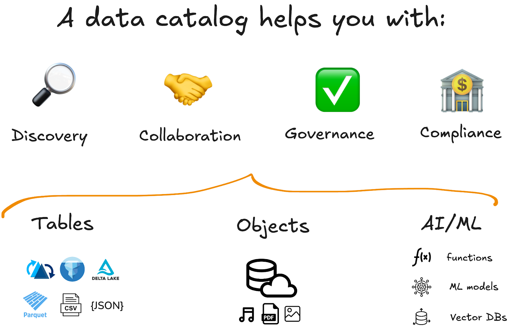

A good data catalog should make it easy for you to:

- Find your data
- Use the best engines and tools without vendor lock-in
- Control who can access which data
- Collaborate within and across organizations
- Ensure compliance with relevant regulations

## What Is a Data Asset?

A data asset is a piece of information that is valuable to your organization. Any data object that needs to be stored and used for later processing or analysis can be considered a data asset.

Data assets can have many formats, including tables (structured data), views, volumes (unstructured data), machine learning models, functions, and more.

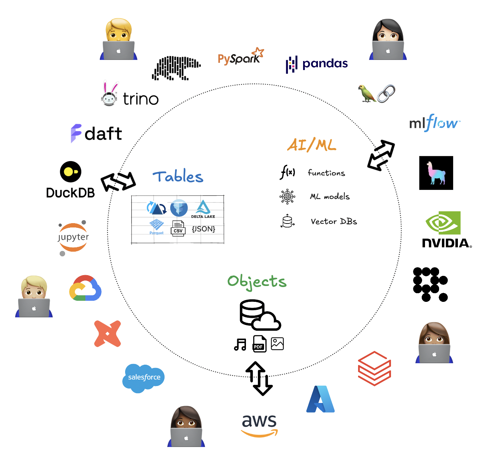

It can quickly become difficult to manage data assets stored in many different formats and locations. That's why it can be helpful to use a data catalog to organize your data assets and manage access and governance.

In addition to organizing your primary data assets, data catalogs also store important metadata about these assets.

## What Is Metadata?

Metadata is information that describes your data assets. You can think of it as "data about data."

Metadata includes important information like:

- Where the data is stored (path)
- Who can access the data (permissions)
- How the data is structured (schema)

Managing metadata well is critical for environments where large volumes of structured, semi-structured, and unstructured data are stored.

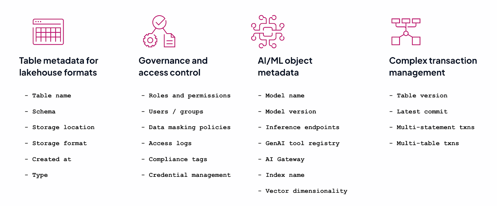

Data catalogs automatically collect and enrich metadata, providing context like data definitions, usage statistics, and information about relevant compliance regulations. This makes it easier for the data catalog to classify and organize your data assets.

## Why Use a Data Catalog?

Data catalogs make your life easier by helping you with efficient data discovery, secure data access management, and smooth collaboration, and by ensuring compliance with relevant data regulations.

You should consider using a data catalog when:

- You have lots of data, potentially stored in multiple formats and locations
- You need to control access to data assets per user/role
- Your data is accessed by many different users at the same time
- You need to ensure data governance compliance

It's helpful to know how data catalogs were developed, so you can understand exactly why they are the best solution to the problems they solve.

If you're already familiar with this context, you can also jump ahead to the [Modern Data Catalogs](#modern-data-catalogs) section below to look at each of the great features of data catalogs in more detail.

## The Origin of Data Catalogs

In the early days of data management, data was exclusively stored in databases. Almost all of this data was structured.

Data was written to data warehouses with a **schema-on-write** approach, which made sure that the data was in an optimized format for downstream Business Intelligence (BI) use. Analytical queries were then run directly on the data in the warehouse to provide business leaders with decision support. This is often referred to as the "first generation" of data analytics platforms.

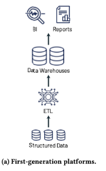

Attempts to organize and catalog data in these first-generation systems were limited to metadata repositories within the database or data warehouse itself. They provided basic metadata management but were often separated by data type or use case and were operated manually. This was fine for a long time because datasets were small, but the systems lacked the flexibility to scale.

In the early 2000s, datasets began to increase dramatically in size. At the same time, organizations started storing and processing massive amounts of both unstructured and semi-structured data, like audio, video, and text. This increase in both data volumes and data types made it more and more difficult for users to locate, understand, and trust their data.

There was a clear need for better data cataloging technologies that could manage large-scale and distributed datasets.

## Big Data and Data Lakes

The second generation of data analytics platforms was built around data lakes. Data lakes are low-cost storage systems that store data in generic and usually open file formats, such as Apache Parquet and ORC. Data lakes are great for storing large amounts of different kinds of data.

The first iterations of data lakes were built on Apache Hadoop and the Hadoop Distributed File System (HDFS). With the development of even cheaper cloud storage, organizations moved to cloud object stores like S3, GCS, and ADLS. In both cases, the overall architecture is the same: raw operational data is loaded into the data lake, and a subset of it is cleaned and transformed and then loaded into data warehouses to power BI and decision support.

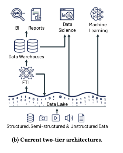

It's difficult to keep data organized when you're throwing everything onto one pile.

The Hive Metastore (HMS) was the most important effort to do so in the early data lake architectures. It was introduced in around 2010 as part of [Apache Hive](https://hive.apache.org/), a data warehousing solution built on top of [Apache Hadoop](https://hadoop.apache.org/). Today, this metastore is also used by other systems like Apache Spark, Presto, and Trino.

## The Hive Metastore

The Hive Metastore serves as a central repository where metadata for Hive tables and partitions is stored. This made it possible for developers to run SQL queries on these Hive tables stored in HDFS and other storage systems. This was a huge step forward.

The Hive Metastore gave developers a useful tool for metadata management at scale, but it also had some important limitations.

Specifically, with the HMS it was difficult to query data with multiple (non-Hadoop) processing engines. Because of technical differences between HDFS and cloud object store architectures, it also became challenging to store data across multiple locations, especially in the cloud. Other common performance bottlenecks were modifying data in place and scaling data to large numbers of partitions.

As data volumes continued to increase, developers needed a way to manage data across multiple formats, schemas, and multi-cloud environments—and they wanted the freedom to query it with whichever engine worked best. They needed a more scalable and flexible format.

## To the Lakehouse

Lakehouse platforms emerged in the early 2020s to address the need for both flexibility _and_ reliable data management. By building on open table formats like [Delta Lake](https://delta.io/), [Apache Iceberg](https://iceberg.apache.org/), and [Apache Hudi](https://hudi.apache.org/), the lakehouse architecture is able to provide features such as ACID transactions, data versioning, and schema enforcement and evolution to data stored in a traditional data lake.

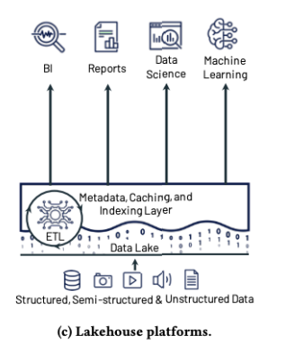

The lakehouse architecture was an important step forward, but it does not have a clearly defined solution for managing access and user permissions. Modern data catalogs provide the much-needed data management layer that makes it easy to find data, control access, and ensure compliance.

## The Benefits of Modern Data Catalogs

Modern data catalogs serve as the single source of truth for all your data. They achieve this by storing metadata about your data assets in a centralized metastore and by modeling users and their permissions.

This allows organizations to manage and track all their data assets consistently across different environments (such as data lakes, data warehouses, cloud stores, etc.).

Through efficient metadata management and permissions modeling, a modern data catalog will help you:

- Find your data
- Control data access
- Track data lineage
- Ensure data compliance

Let's take a look at the benefits of using a modern data catalog in more detail.

## Data Discovery and Organization

Data catalogs make it faster and easier to discover and retrieve the information you need.

Organizations store large amounts of data for analysis and decision making. But as these data stores grow, it can quickly become overwhelming to find the right assets when you need them. Without a clear system, data discovery can turn into a frustrating performance obstacle.

A data catalog solves this pain point by using metadata to automatically tag and organize your assets. No more sifting through local files or S3 buckets—all your data is registered in a central repository. You don't need to know where it's stored, just what it's called.

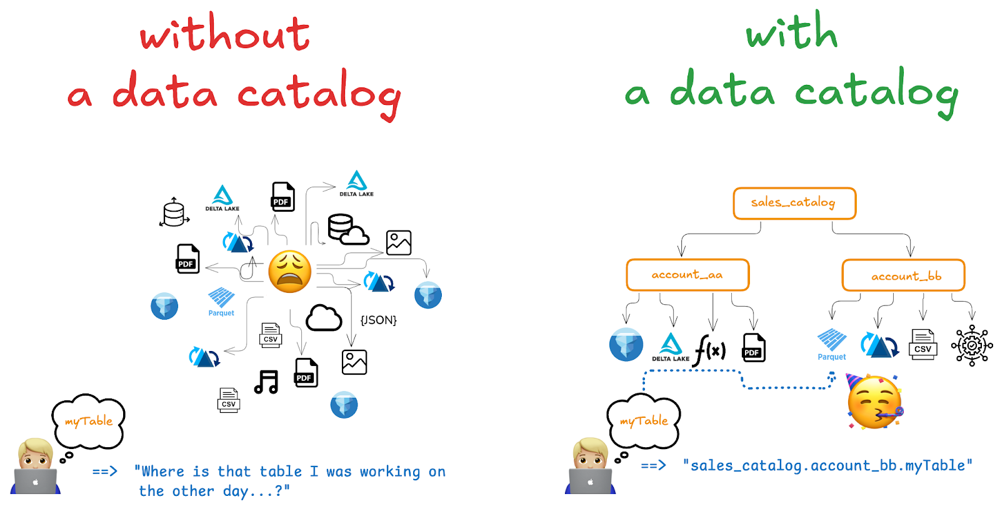

## Manage Data Governance

Data catalogs give you control to manage data access per user. This way, you can make sure that the right people have the right level of access.

Data catalogs centralize access to all your data assets. But not everyone should have the same access to all the data. With a data catalog, you can set access controls based on user roles and profiles, making it easier to manage who can view which data.

This is also useful when sharing data with external partners. Suppose you need to share a dataset with an external organization, but some columns contain sensitive information. Instead of creating a separate copy with those columns removed, you can use a data catalog tool like Unity Catalog to allow specific users to access only certain parts of your data.

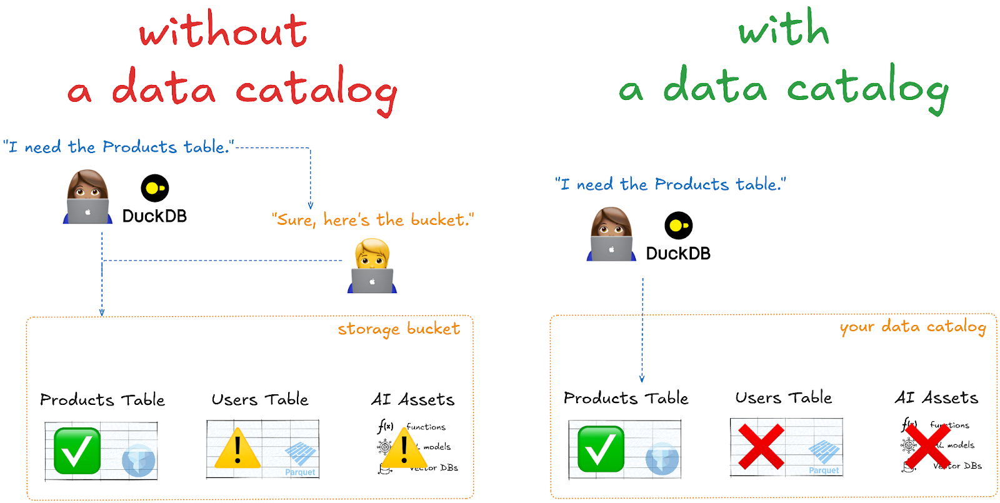

## Single Source of Truth for Collaboration

Data catalogs make it easier for teams to collaborate on the same data assets, both within and across organizations.

Data catalogs provide a central place from which to access your data assets, no matter where the actual files are stored. This allows multiple users to access the same table or model. This way, you avoid maintaining multiple versions scattered across different locations, reducing clutter and minimizing the risk of conflicts.

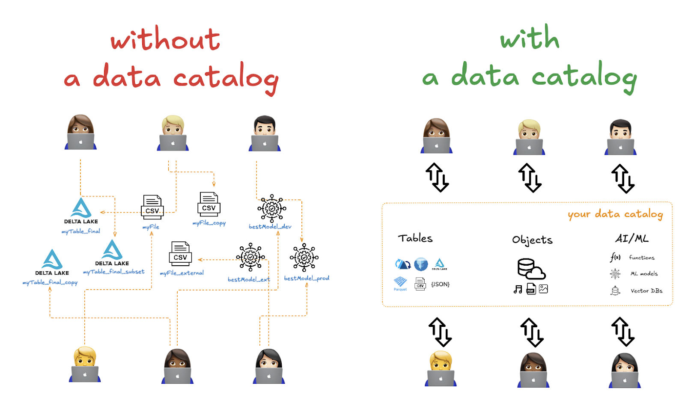

## Ensure Data Compliance

Data catalogs make it easy to comply with data regulations.

Managing compliance with data regulations is extremely complicated. There are many different international data regulations out there that may or may not apply to your individual data assets. Keeping track of this manually when you have millions of data assets that are changing every day is practically impossible. You need an automated system.

A data catalog can scan your data asset metadata and use ML and AI capabilities to classify your assets. Specific data assets can be automatically flagged for potential compliance issues and relevance.

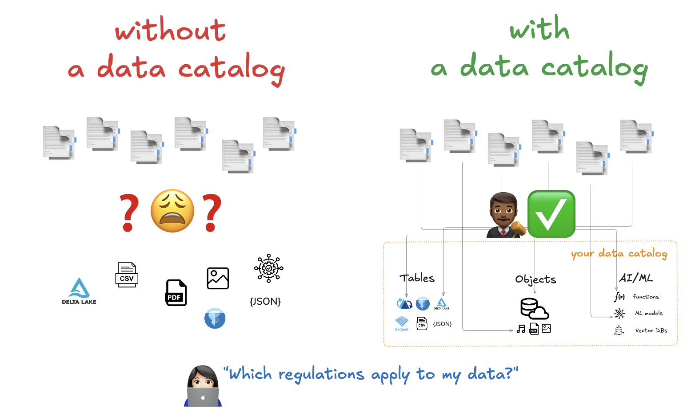

## Unity Catalog: A Catalog for All Your Data

Unity Catalog is a modern data catalog that helps you organize and manage all of your data and AI assets. It offers full interoperability for all your data objects, regardless of their formats.

Unity Catalog makes it easy to find your data, control data access, and ensure compliance—but it also goes beyond these basic data catalog features by providing full support for open data formats. This gives you even more great features, like ACID transactions, time travel, schema enforcement, and schema evolution.

What's more, unlike many other catalogs, Unity Catalog does not stop at managing structured, tabular data. Unity Catalog helps you organize and govern unstructured data too, including text, images, video and audio, AI and ML models, vector databases, and user-defined functions (UDFs).

This makes Unity Catalog the single source of truth for all of your data.

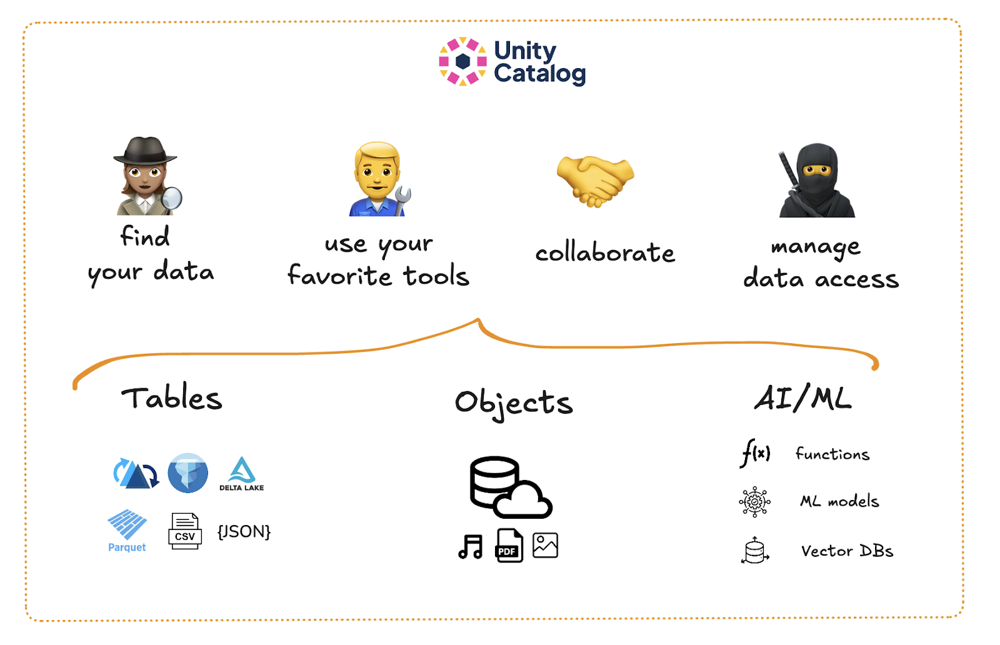

---

## Unity Catalog is:

- Fully open source
- Built on open data formats
- Interoperable with your favorite engines and tools

To learn more about Unity Catalog, check out the [Unity Catalog tutorial](/blogs/unity-catalog-oss).
