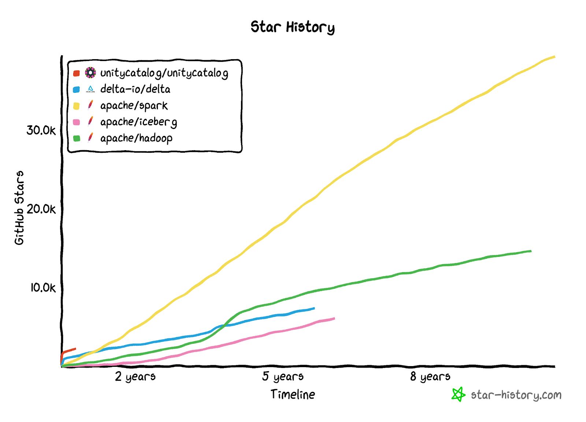
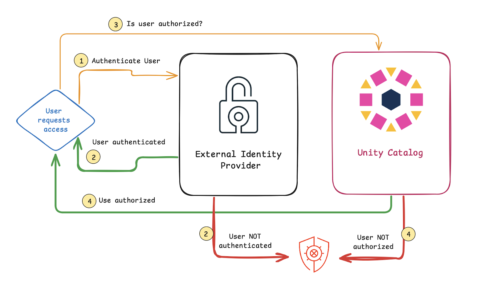
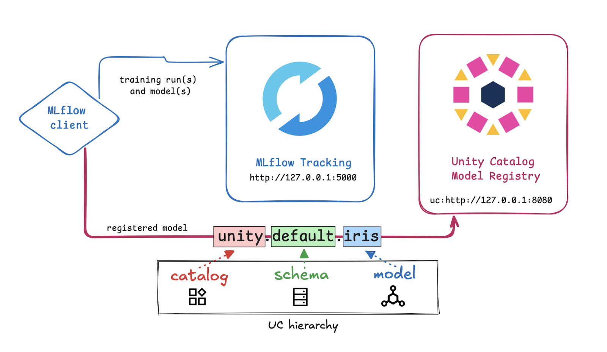
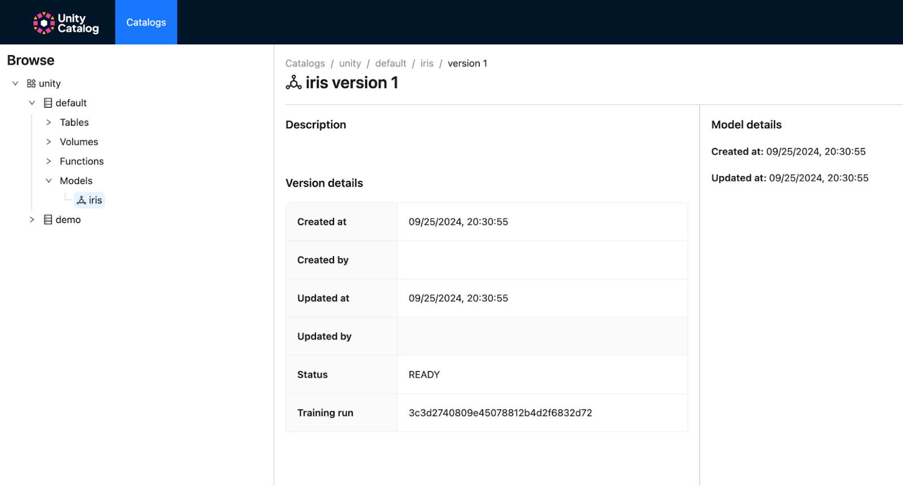
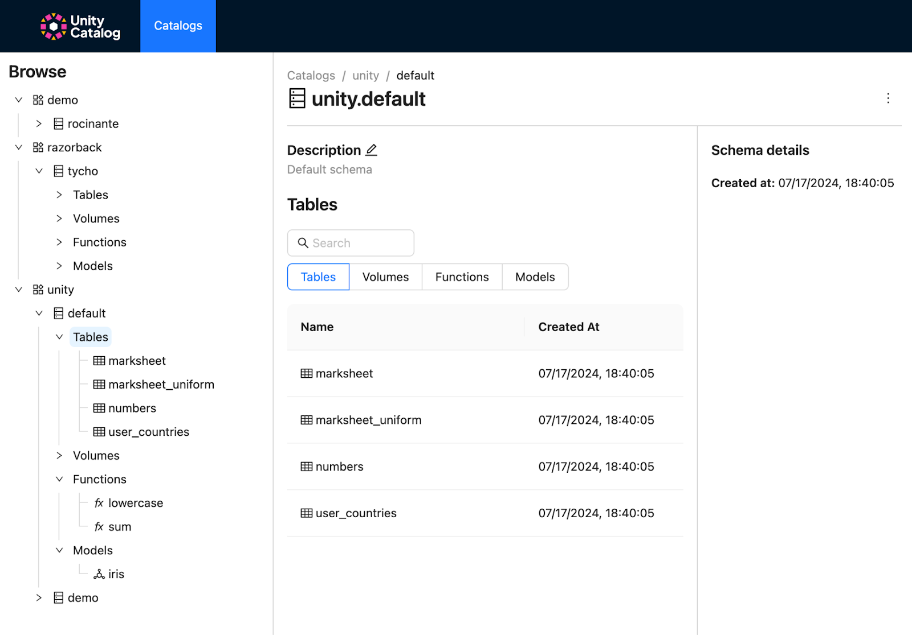

We're excited to announce the release of Unity Catalog v0.2, the single source of truth for all your data and ML/AI assets. This release includes some major upgrades.

Here are the hottest new features in v0.2:

- [Support for Authentication with External Identity Providers and Authorization](https://www.unitycatalog.io/blogs/unity-catalog-0-2-introduces-models-mlflow-and-spark-integration-and-support-for-external-identity-providers#authentication-and-authorization)
- [ML models support](https://www.unitycatalog.io/blogs/unity-catalog-0-2-introduces-models-mlflow-and-spark-integration-and-support-for-external-identity-providers#ml-models-support)
- [Apache Spark™ and Delta Lake integration](https://www.unitycatalog.io/blogs/unity-catalog-0-2-introduces-models-mlflow-and-spark-integration-and-support-for-external-identity-providers#apache-spark-and-delta-lake-integration)
- [Unity Catalog UI](https://www.unitycatalog.io/blogs/unity-catalog-0-2-introduces-models-mlflow-and-spark-integration-and-support-for-external-identity-providers#unity-catalog-gets-a-ui)

We'll provide details on each new feature below; you can also review the complete [change log](https://github.com/unitycatalog/unitycatalog/compare/v0.1.0...v0.2.0) for additional information on the updates in this new version.

## Build with the best

Since the launch of [Unity Catalog](https://youtu.be/lZbmBAxa3O4?si=PLVU5UMmijDAL238) during the [Data+AI Summit](https://www.databricks.com/dataaisummit) in July 2024, the project has grown fast. Folks are really excited about the ability to govern both data and AI applications in one catalog.

As of October 1, 2024, we now have:

- [70 contributors](https://github.com/unitycatalog/unitycatalog/graphs/contributors) to this [LF AI & Data sandbox project](https://lfaidata.foundation/blog/2024/06/20/welcoming-unity-catalog-to-the-lf-ai-data-foundation-a-milestone-in-open-data-and-ai-governance/)
- [2.3K+ stars](https://github.com/unitycatalog/unitycatalog/stargazers) on the GitHub repo
- [6K+ followers](https://www.linkedin.com/company/unitycatalog) on LinkedIn alone

These are great stats for an early-stage open source sandbox project. For comparison, it took the Apache Spark™ project more than a year to reach 2K stars. Unity Catalog is off to a great start!



This release has been made possible by 63 contributors, including 31 new contributors ([release notes](https://github.com/unitycatalog/unitycatalog/releases/tag/v0.2.0)). Thank you all for your support!

For this release, we would like to give a special shout-out to:

- Juan ([JuanPabloDiaz](https://github.com/JuanPabloDiaz)), Robert ([robertgv](https://github.com/robertgv)), Shingo ([ognis1205](https://github.com/ognis1205)), Jamie ([jamieknight-db](https://github.com/jamieknight-db)), Shawn ([yc-shawn](https://github.com/yc-shawn)), and Robert ([Romanize](https://github.com/Romanize)) for their amazing work on the new UI
- Jacek ([jaceklaskowski](https://github.com/jaceklaskowski)) and Teghan Nightengale ([tnightengale](https://github.com/tnightengale)) for their incredible effort on the Docker containers
- Mocker ([creechy](https://github.com/creechy)) for the authentication and authorization integration, Wenchen ([cloud-fan](https://github.com/cloud-fan)) for the Spark connector, Bijan ([bijanhoule](https://github.com/bijanhoule)) for the Spark integration, and Kris ([kriscon-db](https://github.com/kriscon-db)) for the models integration.

If you're interested in being involved in this project, there's lots more great work to be done. Check out the [instructions for joining the contributor's team](https://www.unitycatalog.io/blogs/unity-catalog-0-2-introduces-models-mlflow-and-spark-integration-and-support-for-external-identity-providers#join-the-team) below to come build with the best!

Now, let's dive into the hot new features that are here for you in v0.2.

## Authentication and Authorization

🔥 You can now configure Unity Catalog Access Control with an external identity provider.

Secure authentication and authorization are among the primary features of a modern data catalog. Access control allows you to provide reliable governance of your data and ML/AI assets.

With this new integration, you can authenticate users with an external identity provider (e.g. Google Auth, Okta, etc.) to confirm their identity. The authorization step will then be performed against the Unity Catalog database, to verify whether the user account is authorized to perform the requested task.

The following diagram illustrates how Unity Catalog and the external authentication provider work together to ensure secure authentication and authorization:



This process answers the questions "Is this user who they say they are?" (steps 1 and 2 in the diagram) and "Does this user have the necessary permissions to perform the requested task?" (steps 3 and 4 in the diagram). If authentication and authorization both succeed, the user can perform the desired task.

Here's what it looks like in action:

(TBD video)

The [docs](https://docs.unitycatalog.io/server/auth/) provide detailed instructions for setting up Access Control with Google authentication. In this example, each user must have a Google identity (e.g., email address) that is added to the local Unity Catalog database.

## ML Models Support

🔥 You can now use Unity Catalog as the backing resource for your MLflow model registry to store, access, and govern registered models and model versions.

ML workflows usually involve lots of experimentation. Using MLflow and Unity Catalog together allows you to experiment with training runs and models in MLflow and then easily register your final model(s) in Unity Catalog. Registered models can be accessed directly from Unity Catalog using the three-level namespace hierarchy

```
catalog.schema.model
```

The following diagram shows how Unity Catalog and MLflow work together:



Models registered to Unity Catalog will be accessible through the Unity Catalog server as well as the UI:



You can inspect details about your training run(s) and model(s) in the MLflow UI:

(TBD video)

The [docs](https://docs.unitycatalog.io/usage/models/) provide detailed instructions for configuring and testing the MLflow integration. You'll need to use MLflow [2.16.1](https://mlflow.org/releases/2.16.1) or later.

## Apache Spark and Delta Lake Integration

🔥 You can now use Apache Spark and Delta Lake to query and perform CRUD operations on tables registered in Unity Catalog.

Apache Spark and Delta Lake are state-of-the-art technologies for working with production data workloads. This new integration gives you the control and reliability of Unity Catalog and the ability to use your favorite trusted tools.

Using the Spark and Delta Lake integration also provides a secure solution to the antipattern of configuring your entire Spark application with one set of credentials that allows access to all your tables. Instead, the Spark integration will automatically acquire per-table credentials from Unity Catalog (assuming the user has the required permissions) when running your Spark jobs. This makes it much easier to write secure Spark code.

Here's what it looks like in PySpark:

(TBD video)

You'll find detailed instructions on using the Apache Spark and Delta Lake integration in the [docs](https://docs.unitycatalog.io/integrations/unity-catalog-spark/). You will need to work with minimum versions of Apache Spark 3.5.3 and Delta Lake 3.2.1.

## Unity Catalog Gets a UI

🔥 You can now interact with your Unity Catalog assets through an intuitive React-powered UI.

The Unity Catalog UI allows you to interact with a Unity Catalog server to view or create data and AI assets, giving you great insight and control over your assets stored in Unity Catalog. The UI runs locally and can be accessed through a browser window. It syncs seamlessly with the Unity Catalog CLI: changes made using the CLI are immediately reflected in the UI, and vice versa.

Here's what it looks like:



This feature started out in a separate repo but has now been [merged](https://github.com/unitycatalog/unitycatalog/discussions/349) into the main unitycatalog repository. You'll find instructions for launching the UI in the [docs](https://docs.unitycatalog.io/usage/ui/).

## Roadmap

There are lots of great features already in the works for v0.3. Specifically, the next Unity Catalog release will have a lot more focus on ML and AI assets. We're excited to collaborate with folks from these communities to build support for mission-critical ML and AI workloads with Unity Catalog.

Here are some of the things to look forward to and help us build:

- Managed assets
- ML integrations with advanced Python SDK
- More exciting ML features!

The [complete roadmap](https://github.com/unitycatalog/unitycatalog/discussions/411) is available in the GitHub repo discussions. The project is currently targeting a quarterly release cadence, starting with this 0.2 release. As always, features may move into/out of milestones depending on the available resources and priorities.

## Join the Team!

Unity Catalog is built and maintained by an open and friendly community that values kind communication and creates a productive environment for maximum collaboration and fun. We welcome contributions from all developers, regardless of their experience or programming background. You can write Java, Scala, or Python code, create documentation, submit bugs, or give talks to the community.

To join the Unity Catalog project:

- [Star the repo](https://github.com/unitycatalog/unitycatalog) on GitHub
- ‍[Join our Slack](https://go.unitycatalog.io/slack) to meet the team
- Check out the [Good First Issues](https://github.com/unitycatalog/unitycatalog/issues?q=is%3Aopen+is%3Aissue+label%3A%22good+first+issue%22) in the GitHub repo

You can also:

- Build integrations with your favorite engines and tools
- Contribute documentation pages to help other developers use Unity Catalog
- Write a blog about your Unity Catalog use case and publish it on [unitycatalog.io/blog](http://unitycatalog.io/blog) to share it with fellow developers and industry experts
