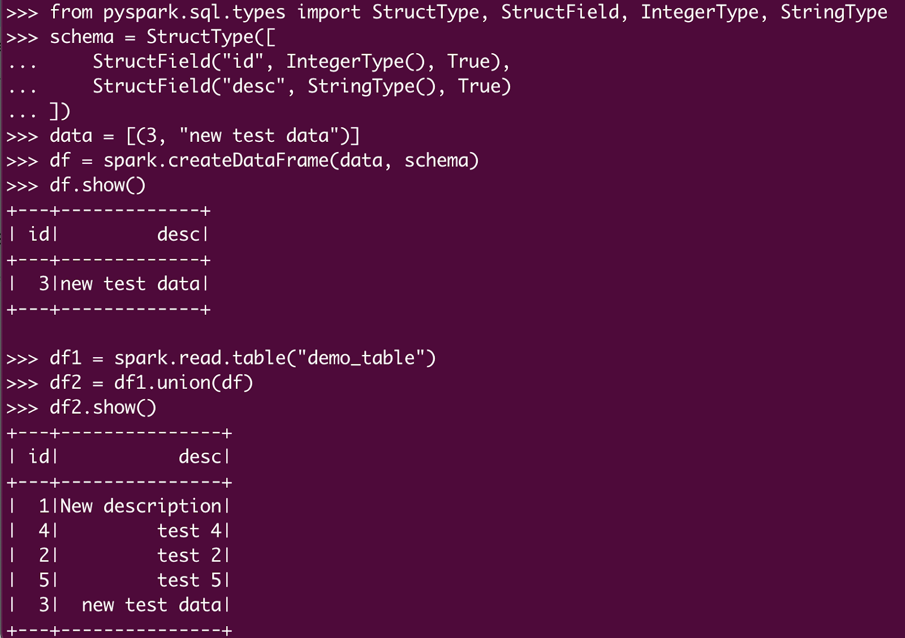
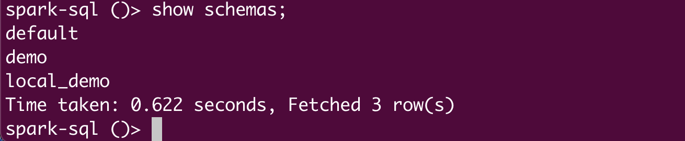

[Unity Catalog (UC)](https://www.unitycatalog.io/) is the industry’s first open source catalog for data and AI governance across clouds, data formats, and data platforms. It is built on the OpenAPI spec and an open source server implementation under Apache 2.0 license. It is also compatible with Apache Hive’s metastore API and Apache Iceberg’s REST catalog API. 

UC is extensible and supports Delta Lake, Apache Iceberg via UniForm, Apache Hudi, Apache Parquet, CSV, and many other data formats. It provides a multimodal interface that supports all your data and AI assets, including structured and unstructured data, files, functions, and AI models.

With its open APIs, data cataloged in UC can be read by virtually any compute engine. It is a [community effort](https://github.com/unitycatalog/unitycatalog/) supported by an extensive, vibrant ecosystem, including Amazon Web Services (AWS), Microsoft Azure, Google Cloud, Nvidia, Salesforce, DuckDB, LangChain, dbt Labs, Fivetran, Confluent, Unstructured, Onehouse, Immuta, Informatica, and many more.

The [v0.2.0 release](https://github.com/unitycatalog/unitycatalog/releases/tag/v0.2.0) of Unity Catalog added support for operating on tables using Apache Spark™ 3.5.3 and Delta Lake 3.2.1 from external processing engines. With this [integration](https://docs.unitycatalog.io/integrations/unity-catalog-spark/), you can now use [Spark SQL and DataFrame APIs](https://spark.apache.org/sql/) to operate on Unity Catalog tables without having to configure your entire Spark application with one set of credentials that allows access to all your tables. Instead, the Spark integration will automatically acquire [per-table credentials](https://docs.databricks.com/en/data-governance/unity-catalog/access-open-api.html#overview-of-credential-vending-and-granting-external-engine-access) from UC (assuming the user has the necessary permissions) when running your Spark jobs. 

In this blog, I’ll show you how you can use Apache Spark from an external (non-Databricks) processing engine to securely perform CRUD (Create, Read, Update, and Delete) operations on your tables registered in a Unity Catalog Open Source Software (UC OSS) metastore, using UC’s open source REST APIs. First, though, let's review the mechanism by which access to the tables’ data is secured and governed when external processing engines use Unity Catalog’s open APIs to process that data.

## Securing Access Requests from External Engines

When engines like Apache Spark, Fabric, Trino, or DuckDB (see [blog](https://xebia.com/blog/ducklake-a-journey-to-integrate-duckdb-with-unity-catalog/)) request access to data in a Delta table registered in a UC OSS metastore from an external processing engine, Unity Catalog issues short-lived credentials and URLs to control storage access based on the user’s specific IAM roles or managed identities, enabling data retrieval and query execution. The detailed steps are captured in the diagram below.


## Experiencing Apache Spark in Action with Unity Catalog’s Open APIs

In this section, we’ll look at how you can perform CRUD operations on tables registered in Unity Catalog using Spark SQL and PySpark DataFrame APIs. We’ll walk through the following steps:

1. Setting up Apache Spark on the local workstation
2. Setting up UC
3. Accessing UC from the local terminal
4. Performing CRUD operations on Delta tables whose data is stored on the local machine
5. Performing CRUD operations on Delta tables whose data is stored in cloud storage
6. Configuring user authentication and authorization in UC

### Step 1: Setting up Apache Spark on the local workstation

The first step is to download and configure Apache Spark. You can download the latest version of Spark (>= 3.5.3) using a command like the following

```
curl -O https://archive.apache.org/dist/spark/spark-3.5.3/spark-3.5.3-bin-hadoop3.tgz
```

Next, untar the package using the following command (for the rest of this tutorial, I’ll assume you’re using Spark 3.5.3):

```
tar xzf spark-3.5.3-bin-hadoop3.tgz
```

### Step 2: Setting up UC

The [quickstart guide](https://docs.unitycatalog.io/quickstart/) provides complete details on how to set up Unity Catalog on your local machine, but we’ll walk through it quickly here:

1. To start the Unity Catalog server, clone the [Git repository](https://github.com/unitycatalog/unitycatalog.git), change into the unitycatalog directory, and run bin/start-uc-server. (Note that you need to have Java 17 installed on your machine to run the UC server.) Open a new terminal window to perform all of the subsequent commands.
2. Configure server properties for cloud storage (_optional_). In this step, you’ll configure server properties that are required to perform CRUD operations on tables whose data is stored in the cloud. You can skip this step if you are only performing CRUD operations on tables whose data is stored locally:

   1. Open the etc/conf/server.properties file to add configuration. Change into the unitycatalog directory and run the following command:

   ```
   vi etc/conf/server.properties
   ```

   2. Update the storage configuration for cloud storage as follows (I've used AWS S3 for this example):

   ```
   # S3 storage config (multiple configs can be added by incrementing the index starting at 0)
   s3.bucketPath.0=s3://<<Your AWS S3 bucket>>
   s3.region.0=<<AWS region of your AWS S3 bucket>>
   s3.awsRoleArn.0=<<AWS IAM role that has PUT and GET permissions on your AWS S3 bucket>>
   # Optional (if blank, it will use DefaultCredentialsProviderChain)
   s3.accessKey.0=<<Your AWS access key>>
   s3.secretKey.1=<<Your AWS secret key>>
   # Test only (if you provide a session token, it will just use those session creds, no downscoping)
   s3.sessionToken.0=<<Your AWS session token>>
   ```

   Each index requires an AWS access key, secret key, and session token. For vending temporary credentials, the server matches the bucket path in the table storage_location with the bucket path in the configuration and returns the corresponding access key, secret key, and session token.

3. Restart the UC server. If the server was already running, you’ll need to restart it for the cloud storage server properties to take effect. Go into the unitycatalog directory and run bin/start-uc-server.

### Step 3: Accessing UC from the local terminal

You can access UC from Apache Spark via the terminal using the Spark SQL shell or the PySpark shell.

#### Accessing UC from the Spark SQL shell

To use the Spark SQL shell (bin/spark-sql), go into the bin folder inside the downloaded Apache Spark folder (spark-3.5.3-bin-hadoop3) in your terminal:

```
cd spark-3.5.3-bin-hadoop3/bin
```

Once you’re inside the bin folder, run the following command to launch the spark-sql shell (see below for a discussion of the packages and configuration options):

```
./spark-sql --name "local-uc-test" \
   --master "local[*]" \
   --packages "org.apache.hadoop:hadoop-aws:3.3.4,io.delta:delta-spark_2.12:3.2.1,io.unitycatalog:unitycatalog-spark_2.12:0.2.0" \
   --conf "spark.sql.extensions=io.delta.sql.DeltaSparkSessionExtension" \
   --conf "spark.sql.catalog.spark_catalog=io.unitycatalog.spark.UCSingleCatalog" \
   --conf "spark.hadoop.fs.s3.impl=org.apache.hadoop.fs.s3a.S3AFileSystem" \
   --conf "spark.sql.catalog.unity=io.unitycatalog.spark.UCSingleCatalog" \
   --conf "spark.sql.catalog.unity.uri=http://localhost:8080" \
   --conf "spark.sql.catalog.unity.token=" \
   --conf "spark.sql.defaultCatalog=unity"
```

Note the following items in this command:

- --packages points to the delta-spark and unitycatalog-spark packages.
- spark.sql.catalog.unity.uri points to your local development UC instance.
- spark.sql.catalog.unity.token is empty, indicating there is no authentication.
- spark.sql.defaultCatalog=unity must be filled out to indicate the default catalog (here, it’s named unity).
- spark.hadoop.fs.s3.impl=org.apache.hadoop.fs.s3a.S3AFileSystem must be set to access cloud object storage (in this case, AWS S3).

Now you’re ready to perform operations using Spark SQL in UC.

#### Accessing UC from the PySpark shell

To use the PySpark shell (bin/pyspark), go into the bin folder inside your downloaded Apache Spark folder (spark-3.5.3-bin-hadoop3) in your terminal:

```
cd spark-3.5.3-bin-hadoop3/bin
```

Once you’re inside the bin folder, run the following command to launch the pyspark shell (see the previous section for a discussion of the packages and configuration options):

```
./pyspark --name "local-uc-test" \
   --master "local[*]" \
   --packages "org.apache.hadoop:hadoop-aws:3.3.4,io.delta:delta-spark_2.12:3.2.1,io.unitycatalog:unitycatalog-spark_2.12:0.2.0" \
   --conf "spark.sql.extensions=io.delta.sql.DeltaSparkSessionExtension" \
   --conf "spark.sql.catalog.spark_catalog=io.unitycatalog.spark.UCSingleCatalog" \
   --conf "spark.hadoop.fs.s3.impl=org.apache.hadoop.fs.s3a.S3AFileSystem" \
   --conf "spark.sql.catalog.unity=io.unitycatalog.spark.UCSingleCatalog" \
   --conf "spark.sql.catalog.unity.uri=http://localhost:8080" \
   --conf "spark.sql.catalog.unity.token=" \
   --conf "spark.sql.defaultCatalog=unity"
```

Now you’re ready to perform operations using PySpark in UC.

### Step 4: Performing CRUD operations on Delta tables whose data is stored on the local machine

In this step, I’ll walk you through performing some CRUD operations on UC tables. 

#### Using the Spark SQL shell

Here are some of the commands you can run inside the spark-sql shell:

- See all the available schemas in the default catalog you specified when launching the spark-sql shell (in our example, unity):

  ```
  show schemas;
  ```

- Create a new schema:

  ```
  create schema local_demo;
  ```

- Use this new schema as the default schema:

  ```
  use local_demo;
  ```

- Create a new external table:

  ```
  create table demo_table (id int, desc string) using delta location "/tmp/tables/demo_table";
  ```

- Describe the newly created table:

  ```
  desc extended demo_table;
  ```

You can see the locally created delta log folder in your file explorer after the table is created:


- Insert some records into the newly created table and select from that table:

  ```sql
  INSERT INTO demo_table VALUES (1, "test 1");
  INSERT INTO demo_table VALUES (2, "test 2");
  INSERT INTO demo_table VALUES (3, "test 3");
  INSERT INTO demo_table VALUES (4, "test 4");
  INSERT INTO demo_table VALUES (5, "test 5");
  ```

  ```sql
  select * from demo_table;
  ```

The data is saved on the local machine, as shown below:


You can also perform upsert activities, like the following:

```sql
delete from demo_table where id = 3;
```

```sql
update demo_table set desc = 'New description' where id = 1;
```

And you can view a history of the changes in the table due to DML operations:

```sql
describe history demo_table;
```

You should see output like the following:


Next, we’ll perform some more operations using the PySpark shell.

#### Using the PySpark shell

In the PySpark shell, you can perform operations using Spark SQL and PySpark DataFrame APIs. Let's access the same UC Delta table from PySpark and perform some additional DML (Data Manipulation Language) operations. First, open the PySpark shell (following the directions in Step 3):


Then try out the following commands:

```py
spark.sql("show schemas").show()
```

```py
spark.sql("use local_demo")
```

```py
spark.sql("show tables").show()
```

```py
spark.sql("select * from demo_table order by id;").show()
```

You should see output like this:


Now, try entering these commands:

```py
df = spark.read.table("demo_table")
df.show()
from pyspark.sql.functions import lit
df = df.withColumn("comment", lit("newly created comment."))
df.show()
df.write.mode("overwrite").format("delta").option("path","/tmp/tables/demo_table_new").saveAsTable("new_demo_table")
df = spark.read.table("new_demo_table")
df.show()
```

You should see output like this:


Let’s try adding some rows in our Delta table:

```py
from pyspark.sql.types import StructType, StructField, IntegerType, StringType

schema = StructType([
...     StructField("id", IntegerType(), True),
...     StructField("desc", StringType(), True)
... ])
data = [(3, "new test data")]
df = spark.createDataFrame(data, schema)
df.show()
df1 = spark.read.table("demo_table")
df2 = df1.union(df)
df2.write.mode("overwrite").format("delta").option("path","/tmp/tables/demo_table").saveAsTable("demo_table")
spark.read.table("demo_table").show()
```

Here are the results:




### Step 5: Performing CRUD operations on Delta tables whose data is stored in cloud storage

In this section, we will perform similar DML operations to those in the previous section on table data stored in AWS S3.

Launch the spark-sql shell (as shown earlier), and perform the following operations:

```sql
show schemas;
use demo;
show tables;
select * from testtab_1;
desc extended testtab_1;
insert into testtab_1 values (2, 'test2'),(3,'test3'),(4,'test4'),(5,'test5');
select * from testtab_1;
update testtab_1 set desc = 'New test data' where id = 3;
select * from testtab_1;
delete from testtab_1 where id = 1;
select * from testtab_1;
desc history testtab_1;
```

You should see output like this:


Now let’s try a few more operations, such as creating a new external Delta table on AWS S3. Enter these commands in the Spark SQL shell:

```sql
CREATE external TABLE
table_on_s3 (id INT, desc STRING)
USING delta
LOCATION 's3://<<Your AWS S3 bucket>>/<<Your AWS S3 prefixes>>';
desc extended table_on_s3;
insert into table_on_s3 values (1,'a'),(2,'b'),(3,'c'),(4,'d'),(5,'e');
select * from table_on_s3;
```

You should see output like this:


And you will see Parquet data files and the delta log folder for the Delta table in your AWS S3 bucket (similar to what’s shown below):


### Step 6: Configuring user authentication and authorization in UC

Unity Catalog’s internal authorization mechanism ensures that each user can only interact with resources they are authorized to access. This means a non-[metastore admin](https://docs.databricks.com/en/data-governance/unity-catalog/manage-privileges/admin-privileges.html#metastore-admins) user (“non-admin” user) needs to have the proper UC authorizations to perform DML operations on UC objects. But before accessing UC objects, the users need to be authenticated in the UC server. Authentication is handled by an external provider, such as Google Auth, Okta, etc., via the Unity Catalog Access Control integration. You can find instructions on configuring an external identity provider and setting up admin and non-admin user accounts in the [documentation](https://docs.unitycatalog.io/server/auth/).

Let's look at some examples of UC authorizations. First, try authenticating as an admin user and running some basic SQL commands. Get the admin authentication token from etc/conf/token.txt and set a local environment variable in the terminal:

```
export admin_token='eyJraWQ...kJQb0Obg'
```

```
./spark-sql --name "local-uc-test" \
   --master "local[*]" \
   --packages "org.apache.hadoop:hadoop-aws:3.3.4,io.delta:delta-spark_2.12:3.2.1,io.unitycatalog:unitycatalog-spark_2.12:0.2.0" \
   --conf "spark.sql.extensions=io.delta.sql.DeltaSparkSessionExtension" \
   --conf "spark.sql.catalog.spark_catalog=io.unitycatalog.spark.UCSingleCatalog" \
   --conf "spark.hadoop.fs.s3.impl=org.apache.hadoop.fs.s3a.S3AFileSystem" \
   --conf "spark.sql.catalog.unity=io.unitycatalog.spark.UCSingleCatalog" \
   --conf "spark.sql.catalog.unity.uri=http://localhost:8080" \
   --conf "spark.sql.catalog.unity.token=$admin_token" \
   --conf "spark.sql.defaultCatalog=unity"
```

Note that spark.sql.catalog.unity.token is populated with the $admin_token environment variable.

Now, let’s look up all the schemas in the unity catalog:

```sql
show schemas;
```

This is successful and all available schemas are shown, as the admin user has the required privileges:



Next, let’s perform the same activities as a non-admin user. Use the CLI to get an access token for an already added non-admin user (see the [documentation](https://docs.unitycatalog.io/server/auth/#add-user-account-to-the-local-database) if you need instructions on adding user accounts to the UC local database), and save the returned access token in a local environment variable:

```
export non_admin_token='eyJraWQ...TCH7Z7XQ'
```

Use that environment variable in the command below to access the spark-sql shell:

```
./spark-sql --name "local-uc-test" \
   --master "local[*]" \
   --packages "org.apache.hadoop:hadoop-aws:3.3.4,io.delta:delta-spark_2.12:3.2.1,io.unitycatalog:unitycatalog-spark_2.12:0.2.0" \
   --conf "spark.sql.extensions=io.delta.sql.DeltaSparkSessionExtension" \
   --conf "spark.sql.catalog.spark_catalog=io.unitycatalog.spark.UCSingleCatalog" \
   --conf "spark.hadoop.fs.s3.impl=org.apache.hadoop.fs.s3a.S3AFileSystem" \
   --conf "spark.sql.catalog.unity=io.unitycatalog.spark.UCSingleCatalog" \
   --conf "spark.sql.catalog.unity.uri=http://localhost:8080" \
   --conf "spark.sql.catalog.unity.token=$non_admin_token" \
   --conf "spark.sql.defaultCatalog=unity"
```

Note that the spark.sql.catalog.unity.token is populated with the $non_admin_token environment variable.

Now, try looking up the schemas in the unity catalog—you’ll see that no schemas are visible to the non-admin user:


Using the following command in the CLI with the admin token, try granting the USE SCHEMA privilege on demo to the non-admin user:

```
bin/uc --auth_token $(cat etc/conf/token.txt) permission create  --securable_type schema --name unity.demo --privilege 'USE SCHEMA' --principal <<Your non-admin user>>
```


Now, the schema named demo is visible:


Next, let's try running select on a table that we created in the previous section. It fails with permission denied:

```sql
select * from table_on_s3 order by id;
```


But if we grant this user SELECT privileges on the table and rerun the select command on the same table, now it's successful:

```
bin/uc --auth_token $(cat etc/conf/token.txt) permission create  --securable_type table --name unity.demo.table_on_s3 --privilege 'SELECT' --principal <<Your non-admin user>>
```


Permission can be revoked using the following command, and the user will lose access to the table immediately:

```
bin/uc --auth_token $(cat etc/conf/token.txt) permission delete  --securable_type table --name unity.demo.table_on_s3 --privilege 'SELECT' --principal <<Your non-admin user>>
```

## Conclusion

This blog showed you how to use Apache Spark from an external (non-Databricks) processing engine to securely perform CRUD operations on your Delta tables registered in Unity Catalog, using UC’s open source REST APIs. Try out Unity Catalog’s open APIs today to access and process your data securely from any external engine using Apache Spark!
