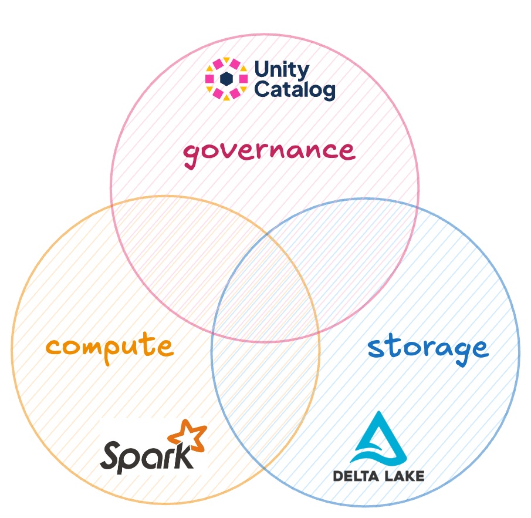
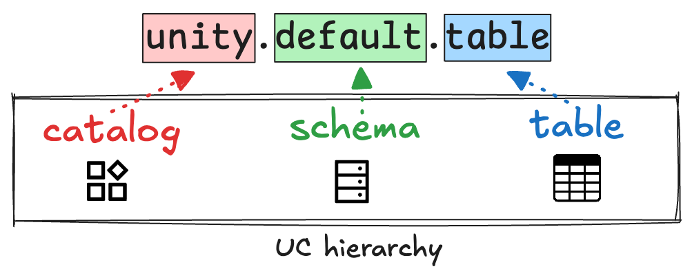
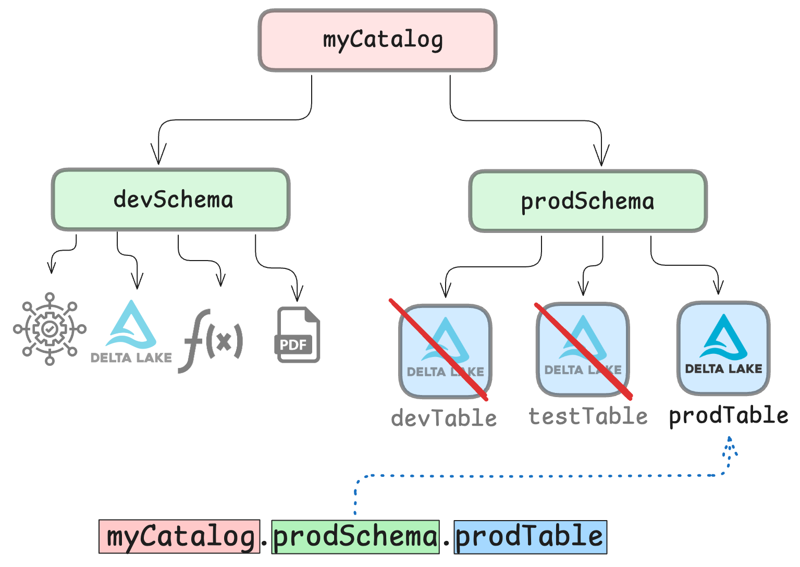
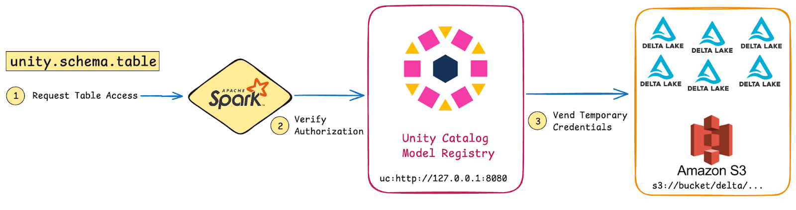

This article explains how to use Unity Catalog with Apache Spark™ and Delta Lake. You will learn how to use these popular open source technologies to store, query, transform, and govern tabular datasets at scale.

Managing data at scale means balancing performance, security, and ease of use. You’ll often need to compute large amounts of data as fast as possible, while also ensuring that workflows are reproducible and that only authorized users and applications have access to critical data. 

You can use Unity Catalog together with Apache Spark and Delta Lake to meet all of these needs. **Apache Spark** gives you fast, scalable compute power; **Delta Lake** gives you performant and reliable storage; and **Unity Catalog** gives you secure governance and an easy-to-use data and AI asset organization structure.



## Why Apache Spark and Delta Lake?

Apache Spark and Delta Lake are leading open source technologies for working with big data in production. [Apache Spark](http://spark.apache.org/) is a multi-language engine for executing data engineering, data science, and machine learning on single-node machines or clusters. [Delta Lake](https://delta.io/) is a robust storage framework for building performant and reliable [lakehouse](https://www.cidrdb.org/cidr2021/papers/cidr2021_paper17.pdf) architectures. 

_Unity Catalog support for Apache Iceberg tables is coming soon!_

Unity Catalog adds an important layer of security to the equation by enabling reliable data governance. If you’re new to Unity Catalog, you may want to start with the [Unity Catalog 101 tutorial](https://www.unitycatalog.io/blogs/unity-catalog-oss).

Using Apache Spark and Delta Lake with Unity Catalog lets you:

- Organize your data clearly using Unity Catalog’s hierarchical namespace.
- Define fine-grained access control, down to the column level.
- Decouple your business logic from file paths and formats.
- Centralize all metadata management in one place.

All of this makes it a lot easier to write clean, reliable Spark code.

## Centralized Data Organization

Unity Catalog makes it easy to organize all of your data using a single logical structure. This greatly simplifies organizing and finding your Delta tables.

Tables in Unity Catalog are registered using a three-level hierarchical namespace: `<catalog>.<schema>.<table>`. This is the same namespace architecture used for all of your data and ML/AI assets (models, volumes, functions, etc.).



_Unity Catalog organizes all of your data and ML/AI assets using a single logical structure._

## Secure, Granular Access Control 

Unity Catalog enables you to create secure governance structures that define access to your tables via user roles and permissions. This creates a layer of security to make sure that only users and applications (including query engines) with the right permissions can access your data.



_Unity Catalog helps you define and manage access to your tables._

## Credential Vending

One of the challenges when running Spark jobs is managing credentials. Spark jobs are often configured with a single set of credentials that grants access to all tables. For example, this could look like the code below, which gives a Spark session your AWS credentials to access an S3 bucket:

```py
from pyspark.sql import SparkSession
# Initialize Spark session with S3 configurations
spark = SparkSession.builder \
    .appName("SparkS3App") \
    .config("spark.hadoop.fs.s3a.access.key", "") \
    .config("spark.hadoop.fs.s3a.secret.key", "") \
    (...)
```

This antipattern—known as *over-permissioning*—can lead to unauthorized access or misuse of sensitive data. You want to avoid this.

Unity Catalog solves the problem of insecure over-permissioning. Instead of automatically being granted access to all tables, Spark jobs automatically acquire per-table, temporary credentials from Unity Catalog: a process known as **credential vending**. 



_Unity Catalog uses credential vending for secure per-table access with temporary credentials._

Credential vending ensures that Spark only retrieves and uses the exact credentials required for each table the user is authorized to access. This method provides two major benefits: it reduces the risk of unauthorized access to sensitive data and simplifies the security configuration for Spark jobs. This makes it much easier to write secure Spark code. 

You can read more about how Unity Catalog executes security protocols in the authorization and authentication tutorial.

## Business Logic Decoupled from File Paths and Formats

Another great benefit of using Unity Catalog to organize and access your tables is that you can decouple business logic from technical details related to file paths and data formats. Because of Unity Catalog’s namespace hierarchy, end users of the data assets don’t need to know anything about data paths or formats.

Tables can be accessed via supported query engines using the `<catalog>.<schema>.<table>` namespace hierarchy, and Unity Catalog will automatically locate the correct resource in the correct format for you. This makes it much easier to write clear, reproducible Spark code.

## How It Works: Using Spark and Delta Lake with Unity Catalog

Let’s see what this looks like in practice. We’ll use PySpark syntax in the examples below, but you can also use Spark SQL (see the [official documentation](https://docs.unitycatalog.io/integrations/unity-catalog-spark/#running-crud-operations-on-a-unity-catalog-table) for more information).

Suppose you are running a Spark job on a Delta table. Configuring your Spark session with access to Unity Catalog enables you to query your Delta tables in Unity Catalog just like any other Spark DataFrame. 

_You’ll need to be running at least Apache Spark version 3.5.3 and Delta Lake version 3.2.1 to leverage this integration._

Instead of initializing your Spark session with direct cloud storage access, you only provide access to Unity Catalog. Here’s what that might look like:

```
bin/pyspark --name "local-uc-test" \
    --master "local[*]" \
    --packages "io.delta:delta-spark_2.12:3.2.1,io.unitycatalog:unitycatalog-spark_2.12:0.2.0" \
    --conf "spark.sql.extensions=io.delta.sql.DeltaSparkSessionExtension" \
    --conf "spark.sql.catalog.spark_catalog=io.unitycatalog.spark.UCSingleCatalog" \
    --conf "spark.sql.catalog.unity=io.unitycatalog.spark.UCSingleCatalog" \
    --conf "spark.sql.catalog.unity.uri=http://localhost:8080" \
    --conf "spark.sql.catalog.unity.token=$token" \
    --conf "spark.sql.defaultCatalog=unity"
```

_You can set $token to work with an authorized environment. For more details, see the Authentication and Authorization blog._

From here, you can use standard Spark SQL syntax to access, query, and transform your Delta tables. 

You can show schemas and tables in schemas like this:

```
> # Show schemas (output = default)
> sql("SHOW SCHEMAS").show()

> # Show tables
> sql("SHOW TABLES IN default").show()

+---------+-----------------+-----------+
|namespace|        tableName|isTemporary|
+---------+-----------------+-----------+
|  default|        marksheet|      false|
|  default|marksheet_uniform|      false|
|  default|          numbers|      false|
|  default|   user_countries|      false|
+---------+-----------------+-----------+
```

*Note that you will need to set some additional configurations to work with tables stored in cloud object stores. The* [_documentation_](https://docs.unitycatalog.io/integrations/unity-catalog-spark/) *provides all the information you need.*

You can query rows from a table as follows:

```
> sql("SELECT * FROM default.marksheet LIMIT 5;").show()

+---+----------+-----+
| id|      name|marks|
+---+----------+-----+
|  1|nWYHawtqUw|  930|
|  2|uvOzzthsLV|  166|
|  3|WIAehuXWkv|  170|
|  4|wYCSvnJKTo|  709|
|  5|VsslXsUIDZ|  993|
+---+----------+-----+
```

Check out the documentation for extensive examples on [performing CRUD operations](https://docs.unitycatalog.io/integrations/unity-catalog-spark/#running-crud-operations-on-a-unity-catalog-table) on your Delta tables registered in Unity Catalog.

## Benefits of Using Spark and Delta Lake with Unity Catalog

Combining Spark and Delta Lake with Unity Catalog makes it easier to manage large datasets. You’ll maintain the performance and scalability of your Spark and Delta Lake workloads, while adding the ability to enforce access control and protect sensitive data throughout your data engineering, ML, and AI pipelines.

Using these three technologies together gives engineers:

1. **Unified governance:** Unity Catalog gives you reliable governance of all your data and ML/AI assets using a single logical structure.
2. **Granular access control:** Acquiring credentials from Unity Catalog at a table level ensures that Spark jobs remain secure. Users only have access to the data they are authorized to view or transform.
3. **Familiar APIs:** Whether you’re querying, updating, or deleting Delta tables, you can continue to use the familiar Spark SQL and DataFrame APIs while benefiting from the governance controls provided by Unity Catalog.
4. **Simple secure coding:** Eliminating the need to configure Spark jobs with a global set of credentials makes writing secure Spark applications much easier. Unity Catalog automates temporary credential management, reducing the risk of misconfigurations and security breaches.

To learn how to register and access ML and AI models with Unity Catalog, check out our tutorial on using Unity Catalog with MLflow.
