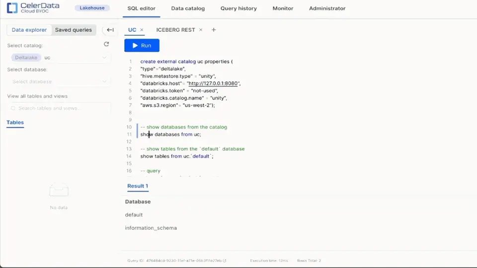

Whether for [business-facing martech](https://starrocks.medium.com/demandbase-ditches-denormalization-by-switching-off-clickhouse-44195d795a83), [real-time dashboards for content creators](https://medium.com/pinterest-engineering/delivering-faster-analytics-at-pinterest-a639cdfad374), or [real-time fraud detection](https://celerdata.com/blog/verisoul-enables-real-time-analytics-by-transitioning-off-bigquery), customer-facing analytics has become an ever-increasing priority for businesses everywhere. These use cases demand stringent performance service level agreements (SLAs), such as low latency and high concurrency, and to meet these performance needs, many organizations rely on proprietary data warehouses. This approach can deliver the desired speed and efficiency, but not without introducing a new set of costs and operational challenges.

In this article, we'll examine these unique challenges and explore a path forward toward greater agility and efficiency for customer-facing analytics.

## Challenges with Proprietary Data Warehouses in Customer-Facing Analytics

Many organizations rely on data warehouses to meet the high performance demands of customer-facing applications. While they address some performance needs, they also introduce notable complexities and limitations that can drive up costs, undermine data quality, and complicate data architecture for customer-facing analytics. These include:

- **High maintenance costs:** Data warehouses are inherently stateful systems that store large volumes of data and require substantial computing resources. Maintaining them is costly, both in terms of the infrastructure itself and the labor required for ongoing monitoring, scaling, and management.
- **Ingestion pipeline complexities:** To make data compatible with a data warehouse, it needs to be transformed into a proprietary format. This conversion process is time- and resource-intensive, particularly when dealing with high data volumes across multiple tables.
- **Data governance and data quality:** Storing data in proprietary formats often means creating additional copies whenever a new system or application needs access. This introduces data governance issues that can ultimately compromise data quality, as each copy must be tracked, managed, and kept consistent with the original source.

## How Can Unity Catalog Help?

Unity Catalog is an open source, unified governance layer that simplifies data management across diverse formats and compute engines, making it a powerful asset for customer-facing analytics. More specifically, Unity Catalog introduces two capabilities essential for modern analytics workloads:

- **Interoperability across formats:** Unity Catalog enables multiple data formats to coexist seamlessly, allowing organizations to choose the best format for each workload without sacrificing compatibility. This flexibility supports various data processing needs without forcing rigid transformations.
- **Unified data governance:** With support for both structured and unstructured data, Unity Catalog centralizes governance—an increasingly critical feature for AI and machine learning applications. This governance layer ensures data consistency and integrity, streamlining compliance and security across all data assets.

Unity Catalog's unified governance across formats permits strict control over data quality, a critical requirement for customer-facing analytics. It also enables multiple compute engines to access this data without added governance or maintenance overhead. This approach allows **specialized compute engines** to coexist, making high-performance customer-facing analytics feasible with minimal complexity overhead.

## CelerData Cloud: Further Enhancing Customer-Facing Analytics on Unity Catalog

Built on StarRocks, [CelerData Cloud](https://celerdata.com/) is a lakehouse query engine designed specifically for high-performance customer-facing analytics on open lakehouse architectures. Together with Unity Catalog, CelerData enables the best of both worlds: the performance and features of a data warehouse and the governance/data quality benefits of open data lakes. It achieves this through:

- **A native Unity Catalog integration:** CelerData Cloud seamlessly integrates with Unity Catalog, allowing organizations to utilize a single source of truth across data and AI applications.
- **Optimization for low latency and high concurrency:** Written in C++ with thorough SIMD optimizations on nearly all operators, CelerData Cloud is engineered specifically for superior query performance to meet your low-latency, high-concurrency SLAs. Features include:
  - **Lakehouse-optimized caching:** [CelerData Cloud's caching system](https://www.starrocks.io/blog/accelerate-customer-facing-analytics-on-open-lakehouses-with-caching) is purpose-built to tackle challenges unique to open data lakes, such as the small files problem and I/O amplification. This optimization reduces query latency, delivering fast and responsive analytics for users.
  - **Targeted optimizations for low latency:** In low-latency environments, unique challenges can arise, such as metadata retrieval becoming a bottleneck—an issue encountered only if query execution is fast enough. CelerData Cloud incorporates [specialized optimizations](https://celerdata.com/blog/how-to-accelerate-iceberg-metadata-retrieval) to overcome this bottleneck, along with other targeted optimizations to ensure consistently low latency for your lakehouse.
  - **Accelerating queries on demand:** CelerData Cloud offers [automatic materialized views](https://docs.celerdata.com/BYOC/docs/using_starrocks/auto_materialized_view/) (MVs) that are designed to be created on demand, accelerating slow queries without the need for external processing tools. Its automatic query rewrite capability enables MVs to be applied instantly without SQL modifications, simplifying and accelerating query optimization.

## Getting Started with Unity Catalog and CelerData Cloud

Integrating Unity Catalog with CelerData Cloud is a seamless process. For a step-by-step guide to setting up this integration, follow the instructions [here](https://docs.celerdata.com/BYOC/docs/data_source/catalog/deltalake_catalog/#databricks-unity-catalog).

Additionally, here's a simple [example](https://github.com/unitycatalog/unitycatalog/blob/main/docs/integrations/unity-catalog-celerdata.md) based on the open source Unity Catalog to help you get started:

Unity Catalog and CelerData Cloud together bring the best of both worlds to customer-facing analytics: the openness and interoperability of data lakes combined with the performance of a specialized query engine. With Unity Catalog's unified governance across open formats, organizations can leverage CelerData Cloud's strengths for low-latency, high-concurrency workloads without sacrificing flexibility. This powerful combination makes it possible to handle specialized analytics use cases on an open lakehouse architecture—giving teams the freedom to innovate on a unified, efficient, and scalable data platform.

Want to learn more about how Unity Catalog and CelerData Cloud can transform your analytics? Join the [StarRocks Slack](https://starrocks.io/redirecting-to-slack) and the [Unity Catalog Slack](https://go.unitycatalog.io/slack) for insights, support, and updates from our user community.
