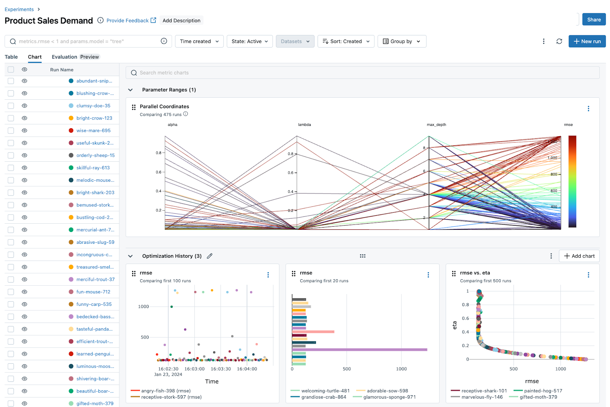
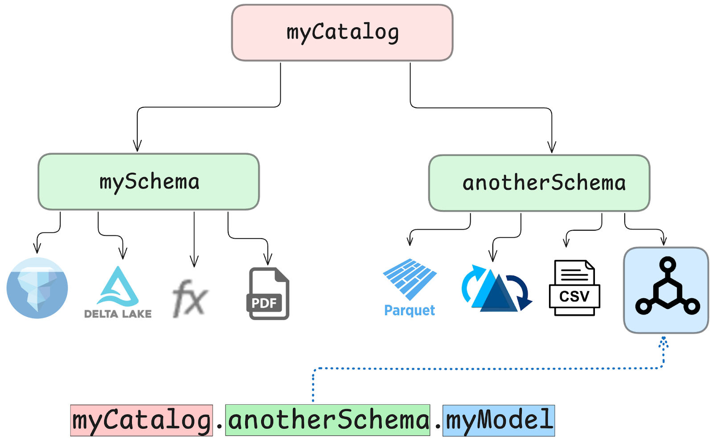
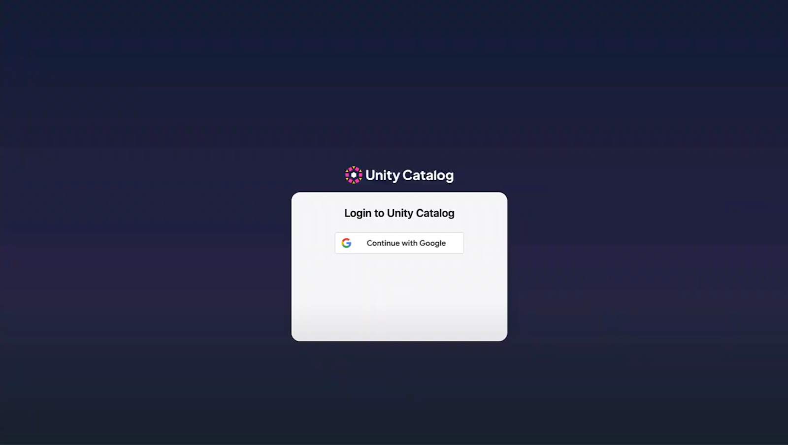
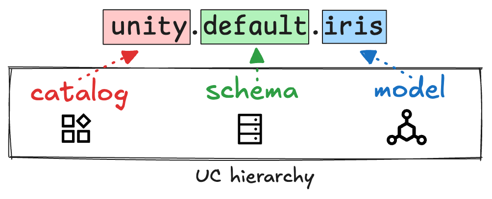
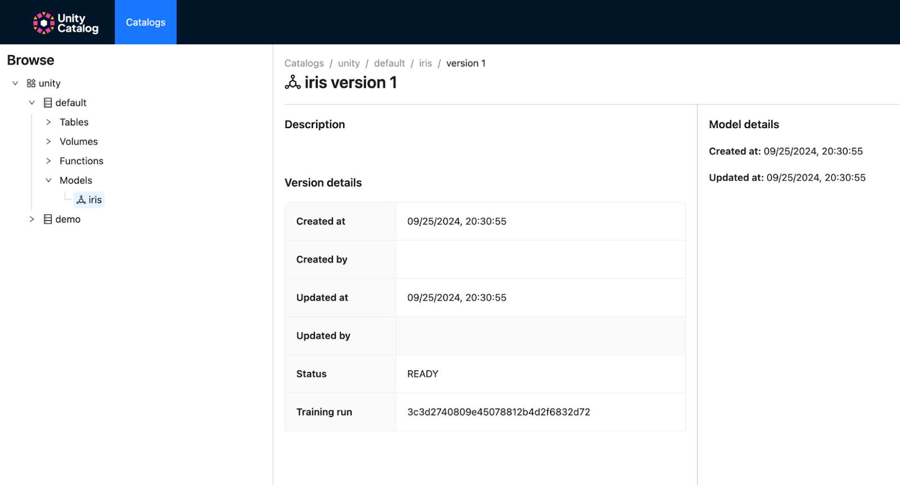

This article explains how to build an ML and AI data catalog. You will learn the importance of model governance in machine learning (ML), MLOps, and MLOps for large language models (LLMOps) workflows, as well as how to implement a governance architecture with Unity Catalog and MLflow.

Machine learning and AI pipelines involve a lot of experimentation. You need a clear overview of your model versions and a reliable tool to provide secure data governance. Your models should be easily accessible by downstream users, and they should *only* be accessible by users with the right permissions. 

You can use Unity Catalog and MLflow to build ML and AI model governance architectures that are secure and easy to use for everyone involved. This enables you to perform reliable MLOps and LLMOps at scale. →

🪂 Let’s jump in to see how this works!

## Model Governance in MLOps and LLMOps

Machine learning and AI workflows are inherently experimental. You often need to run multiple training sessions, fine-tune models, and compare different versions before arriving at the best-performing model. The fields of MLOps and LLMOps have evolved to manage the complexity of these tasks, and many MLOps engineers, LLMOps engineers, data scientists, and AI engineers use [MLflow](https://mlflow.org/) to manage the AI and ML model lifecycle. MLflow is a popular open source framework that allows you to track all of your models and experiments in one place.



MLflow helps you track, manage, and reproduce your machine learning workflows.

Not everyone in your organization needs access to all of the experimentation, though. Downstream teams and processes should only have access to the final model that gets put into production. Giving users unrestricted access to your models could lead to incorrect predictions if the wrong model is used for mission-critical analyses. You need a tool to ensure that the right models are accessible for deployment, and that they are only accessible to the right users or applications.

Unity Catalog is a universal data catalog for data and ML/AI assets. With Unity Catalog, you can create secure governance structures that determine access to your assets via user roles and permissions. While security functionality exists natively within MLflow, using Unity Catalog to define access control lets you use the same logical governance structure for all of your data and AI assets: your models, tables, functions, volumes, etc. (If you’re new to Unity Catalog, you may want to start with the [Unity Catalog 101 tutorial](https://www.unitycatalog.io/blogs/unity-catalog-oss).)


Unity Catalog helps you define and manage access to your ML models.

Registering your final MLflow model in Unity Catalog enables you to delegate access to downstream teams and inspect versions as needed. This integration combines the experimentation and tracking capabilities of MLflow with the governance and accessibility features of Unity Catalog.


Using Unity Catalog and MLflow together gives you complete governance over your ML workflows.

## How Unity Catalog and MLflow Work Together

The integration works by leveraging Unity Catalog’s established namespace architecture to store and access models from MLflow. Models are registered in Unity Catalog using a three-level namespace (<catalog>.<schema>.<model>), which makes it easy to organize and find your AI and ML assets. This is the same namespace architecture used for your data assets (tables, volumes, functions, etc.), so you can use the same logical structure to organize and retrieve all of your data and AI/ML assets.



Unity Catalog organizes all your data and ML/AI assets using a single logical structure.

Here’s what your workflow will look like:

1. **Experimentation in MLflow:** Build your training runs and models in MLflow as usual. During this phase, MLflow captures all relevant metrics, parameters, and artifacts.
2. **Registering models in Unity Catalog:** Once you’ve identified the best model, register it in Unity Catalog. This ensures the model lifecycle is tightly managed, versioned, and governed, allowing you to maintain a comprehensive record of all your production-ready models.
3. **Access and governance:** Registered models can be accessed through Unity Catalog using the <catalog>.<schema>.<model> format. Access control ensures that only authorized users can deploy or modify them.



## Example: Build Your ML and AI Data Catalog with Unity Catalog and MLflow

Let’s work through a hands-on example so you can build your own ML and AI data catalog using Unity Catalog and MLflow. 

In this example, you will:

- **Train** a scikit-learn model and track the results using MLflow.
- **Register** this model to Unity Catalog.
- **Load** the model from Unity Catalog.

All the instructions for setting up MLflow and Unity Catalog can be found in the [Unity Catalog documentation](https://docs.unitycatalog.io/usage/models/#inspecting-registered-models-and-model-versions). 

To run this example, you will need to use MLflow version >= 2.16.1 and Unity Catalog >= 0.2. 

### Setup and Configuration

We’ll keep things simple and use a local Unity Catalog server to get started. Spin up a local server using the bin/start-uc-server command from the root directory of your Unity Catalog repository. If this is your first time spinning up a Unity Catalog server, you might want to check out the [Quickstart](https://docs.unitycatalog.io/quickstart/) first.

The MLflow installation includes the MLflow CLI tool, so you can start a local MLflow server with a UI by running the mlflow ui command in your terminal. This command will generate logs with the IP address of the newly started tracking server. 

Set the tracking_uri using the IP address from the MLflow logs. For the registry_uri, use the default IP address of Unity Catalog’s local server. If you need more information on how this works, refer to the [Unity Catalog documentation](https://docs.unitycatalog.io/usage/models/#inspecting-registered-models-and-model-versions).

### Train and Register a Sample Model

Next, train a test model to validate that everything is working. 

The following code snippet creates a scikit-learn model and registers the model in Unity Catalog. It uses the Iris dataset that’s included in the scikit-learn library by default.

```py
import os
from sklearn import datasets
from sklearn.ensemble import RandomForestClassifier
from sklearn.model_selection import train_test_split
import pandas as pd

X, y = datasets.load_iris(return_X_y=True, as_frame=True) # load Iris dataset
X_train, X_test, y_train, y_test = train_test_split(X, y, test_size=0.2, random_state=42)

with mlflow.start_run():
    # Train a sklearn model on the Iris dataset.
    clf = RandomForestClassifier(max_depth=7) # define ML model
    clf.fit(X_train, y_train)  # train on training data

    # Take the first row of the training dataset as the model input example.
    input_example = X_train.iloc[[0]]

    # Log the model and register it as a new version in UC.
    mlflow.sklearn.log_model(
        sk_model=clf,
        artifact_path="model", # this is the model we just trained

        # The signature is automatically inferred from the input example
        # and its predicted output.
        input_example=input_example,
        registered_model_name="unity.default.iris", # this will register to Unity Catalog since we set the registry_uri above
    )
```

You should see the following output:

```
Successfully registered model 'unity.default.iris'.
```

This confirms that the model is registered in Unity Catalog using the `<catalog>.<schema>.<asset>` namespace hierarchy described earlier. 



You can also verify this by inspecting your newly registered model in the [Unity Catalog UI](https://docs.unitycatalog.io/usage/ui/).



### Load the Sample Model

In a new terminal, you can load your recently registered model using the following code snippet:

```py
from sklearn import datasets
from sklearn.ensemble import RandomForestClassifier
from sklearn.model_selection import train_test_split
import pandas as pd

import mlflow
import mlflow.sklearn
from mlflow.models import infer_signature

mlflow.set_tracking_uri("http://127.0.0.1:5000")
mlflow.set_registry_uri("uc:http://127.0.0.1:8080") # point MLflow to Unity Catalog

X, y = datasets.load_iris(return_X_y=True, as_frame=True)
X_train, X_test, y_train, y_test = train_test_split(X, y, test_size=0.2, random_state=42)

# Load model
loaded_model = mlflow.pyfunc.load_model(f"models:/unity.default.iris/1") # load version 1 of the registered Iris model
predictions = loaded_model.predict(X_test)
iris_feature_names = datasets.load_iris().feature_names
result = pd.DataFrame(X_test, columns=iris_feature_names)
result["actual_class"] = y_test
result["predicted_class"] = predictions
result[:4]
```

This code snippet uses version 1 of the trained and registered unity.default.iris model to predict the class (predicted_class) using the test dataset (X_test) and compares it to the actual class (actual_class) from the Iris dataset.

Your output should look like this:

```
    sepal length (cm)  sepal width (cm)  petal length (cm)  petal width (cm)  actual_class  predicted_class
73                 6.1               2.8                4.7               1.2             1                1
18                 5.7               3.8                1.7               0.3             0                0
118                7.7               2.6                6.9               2.3             2                2
78                 6.0               2.9                4.5               1.5             1                1
```

### How to Use MLflow

The UC CLI also supports interacting with models registered in Unity Catalog. It is recommended that you interact with the models using the MLflow client. Refer to the MLflow [getting started guides](https://mlflow.org/docs/latest/getting-started/index.html) and the [Python API documentation](https://mlflow.org/docs/latest/python_api/index.html) to learn how to use the MLflow client to train, register, and use models registered in Unity Catalog.

Great job! You’ve successfully used MLflow to track the training of your ML model and Unity Catalog to register and access this model. Next, try adding user permissions to your unity.default.iris model to restrict access. You can learn more about this in the [Authentication and Authorization tutorial](#link-to-auth-blog).

## ML and AI Data Catalog Benefits for Engineers

ML and AI data catalogs improve the way you manage your machine learning models. They make it a lot easier for engineers in MLOps and LLMOps to ensure that models are governed and secured at every stage of the lifecycle. You don’t have to worry about the wrong person or application accessing the wrong model when you’re using a modern ML and AI data catalog.

Using Unity Catalog as your ML and AI data catalog will make your life easier by giving you: 

1. **Unified model management:** By storing models in Unity Catalog, you can make sure that your organization’s ML assets are centrally managed with its data assets, with a clear hierarchy and version control. This makes it easier for teams to work together with clear access control definitions and without the risk of unauthorized model access.
2. **Scalability and security:** As your organization grows, so does the number of models you produce. Unity Catalog’s structured namespace and access control mechanisms ensure that scaling up your model registry doesn’t come at the cost of security or manageability.
3. **End-to-end visibility:** Unity Catalog and MLflow give you full visibility over the lifecycle of each model. This means you can easily audit changes, track model usage, trace model and data lineage, and ensure compliance with governance policies.

This empowers you to scale your ML and AI operations with confidence.
