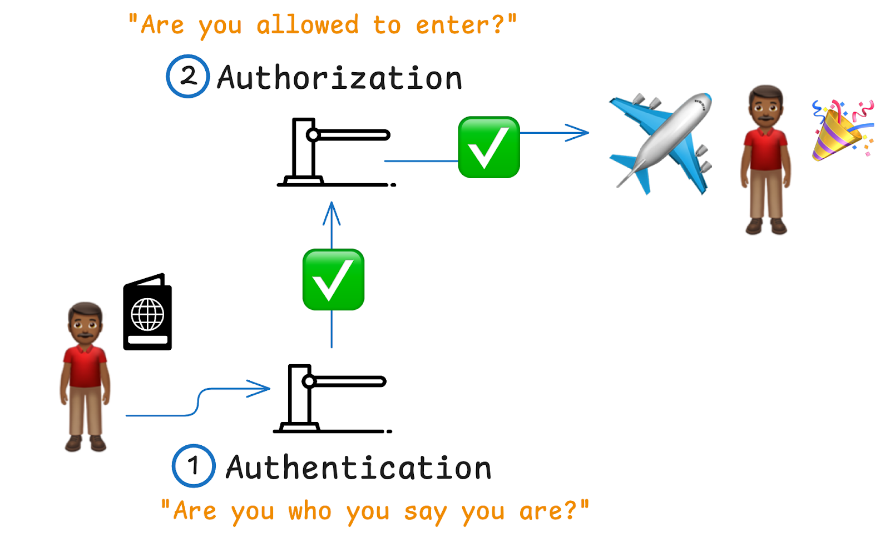
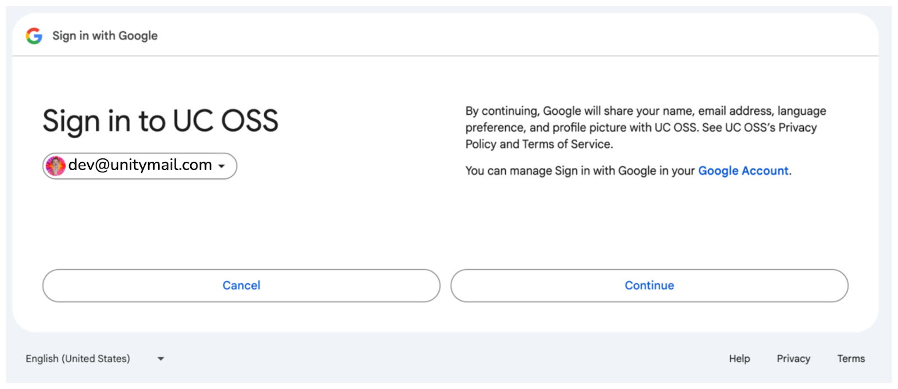

This article explains authentication and authorization in Unity Catalog. You will learn the fundamental importance of these two processes to modern data governance and how to implement them in Unity Catalog.

Data and ML/AI pipelines require secure data governance. You need to ensure that your data is only accessible by the right users and applications. The challenge of managing data permissions only gets bigger as organizations and workloads scale.

With Unity Catalog, you can use established authentication systems such as Google Auth and Okta to ensure that only authorized users get access to specific data and ML/AI assets.

🪂 Let’s jump in to see how this works!

## Authentication vs. Authorization

First things first: let’s break down the difference between these two terms.

Authentication and authorization represent two fundamentally different but complementary steps in the governance process. **Authentication** is the process by which a user’s identity is proven. **Authorization** is the process by which a user’s permission to access data and/or perform a specific task is verified. 

In simpler terms:

- **Authentication** asks, "Is this user who they say they are?"
- **Authorization** asks, "Does this user have permission to perform the requested action?"

Let’s look at a quick real-life example. When you board a plane, you first present your passport for *authentication*: does the name in the passport match the name on the boarding pass? Then your boarding pass is inspected for *authorization*: does this boarding pass give you the right to board this particular flight? You won’t make it on the plane if the answer to either question is “no.”



### Authentication and Authorization in Unity Catalog

The process of securing access with Unity Catalog follows a straightforward flow of (1)  **authentication** and then (2) **authorization**:

1. **Authentication:** A user attempts to access Unity Catalog (step 1 in the diagram below). Their identity is verified through an external provider, such as Google or Okta (step 2), using the appropriate credentials. For example, if Google Auth is used, the user must authenticate with their Google credentials. This is the first line of defense: ensuring that users are who they claim to be. 
2. **Authorization:** After a successful authentication, Unity Catalog checks the user’s permissions in its database (step 3). The system verifies whether the authenticated user is authorized to perform specific tasks (step 4), such as accessing sensitive datasets or running certain queries.

If both steps succeed, the user can proceed with their tasks. If either fails, access is denied, keeping your data secure.


### Example: Unity Catalog Access Control with Google Auth

Let’s take a specific example from the [Unity Catalog documentation](https://docs.unitycatalog.io/server/auth/). This example will use Google Auth as the external authentication provider.

When using Google Auth, every user must have a Google identity, typically a Google email address. This identity needs to be added to the local Unity Catalog database, and from there, the authentication and authorization process kicks in. If the user’s identity matches and they have the proper permissions, they gain access to the required assets.

Let’s work through this step-by-step.

### Configure Your External Identity Provider[¶](https://docs.unitycatalog.io/server/auth/#configure-your-external-identity-provider)

To set up authentication and authorization, you first need to configure your preferred external identity provider. [These instructions](https://docs.unitycatalog.io/server/google-auth/) will help you use Google as your external identity provider. 

You will need the client ID and client secret to use in the next section.

### Configure Unity Catalog Server 

You’re now ready to configure your Unity Catalog server to enable external authorization.

You will need to edit your etc/conf/server.properties file to correspond with the following:

```
  server.authorization=enable
  server.authorization-url=https://accounts.google.com/o/oauth2/auth
  server.token-url=https://oauth2.googleapis.com/token
  server.client-id=
  server.client-secret=
```

Now that you’ve configured Google authentication, restart the UC server with the following command:

```
	bin/start-uc-server
```

Behind the scenes, on startup, the UC server will automatically perform the following configuration steps:

1. Create internal signing keys and authentication files in etc/conf.
2. Create an admin access token in etc/conf/token.txt.
3. Create an admin account in the user database.
4. Grant the admin account the metastore admin role for the server.

### Test Admin Authentication[¶](#testing-user-and-admin-authentication)

Next, you’ll want to test your admin authentication. 

The following command uses the admin authentication token that Unity Catalog has generated at etc/conf/token.txt to view the user list:

```
	bin/uc --auth_token $(cat etc/conf/token.txt) user list
```

The output should look something like this:

```
┌────────────────────────────────────┬─────────┬────────────────────────┬───────────┬───────┬───────────┬─────────────┬─────────────┐
│                 ID                 │  NAME   │         EMAIL          │EXTERNAL_ID│ STATE │PICTURE_URL│ CREATED_AT  │ UPDATED_AT  │
├────────────────────────────────────┼─────────┼────────────────────────┼───────────┼───────┼───────────┼─────────────┼─────────────┤
│c6e354c9-ec27-4815-9212-4bdb4fdbfea4│Admin    │admin                   │null       │ENABLED│null       │1727198813231│1727220886536│
├────────────────────────────────────┼─────────┼────────────────────────┼───────────┼───────┼───────────┼─────────────┼─────────────┤
```

### Use Admin Account to Create Users

The admin can create users and give them specific permissions. These users are stored in Unity Catalog’s local database.

**Admins:**

- Use the admin token (in etc/conf/token.txt) to authenticate
- Have full permissions to access and transform assets
- Can create user accounts

**Users:**

- Use Google Auth to generate authentication tokens
- Have limited permissions
- Cannot create user accounts

Users log in using Google Auth, which you configured earlier, by running the bin/uc auth login command.

At this point, you have created an admin account, but no user accounts have been created yet. So, running the command above will fail.

Go ahead and test it out to see how Unity Catalog’s secure access control works in action. Your browser will open, and you will authenticate with your  Google identity (e.g., dev@unitymail.com). 

You will see an authentication screen like this: 



The user will authenticate successfully and your browser will output something like this:

```
User validated with identity provider.
```

However, since your user account has not been added to the local database, the UC command in your terminal will fail.

### Add User Account to the Local Database

To fix this, add your user account to the UC local database. Use the CLI with the admin token to add your account to the local database:

```
bin/uc --auth_token $(cat etc/conf/token.txt) user create --name "Epic Dev" --email dev@unitymail.com
```

### Try to Log In with Your User Account

Now use the CLI to authenticate and get an access token using the account you just added:

```
bin/uc auth login --output jsonPretty
```

Again, your browser will open and you will authenticate with the same Google identity (e.g., dev@unitymail.com). This time the login command should succeed, provided the Google identity you are authenticating with is the same one authorized in the Unity Catalog local database. 

The output should be similar to the following:

```
Listening on port: 51798
Attempting to open the authorization page in your default browser.
If the browser does not open, you can manually open the following URL:

https://accounts.google.com/o/oauth2/auth?client_id=$$.apps.googleusercontent.com&redirect_uri=http%3A%2F%2Flocalhost%3A51798&response_type=code&scope=openid+profile+email&state=$$

Received authentication response.
Received token response.
{
  "access_token" : "exJ...N8zt$w"
}
```

Save the returned token in an environment variable for later:

```
export token='exJ...N8zt$w'
```

### Authorize Users to Perform Tasks

Now that you have an *authenticated* user, the next step is to *authorize* this user to perform specific tasks in Unity Catalog.

The user you have just created does not yet have any permissions. Trying to perform an unauthorized action will return nothing.

Let’s look at an example. If you try to list catalogs:

- An unauthenticated user will fail.
- Your user account will return nothing, as it does not have permission to list.
- The admin account will succeed.

You can test this out yourself:

```
# Fails as the user is UNAUTHENTICATED (no token)
bin/uc catalog list

# Returns nothing (token is valid, but no permission)
bin/uc --auth_token $token catalog list

# Succeeds (admin has full permissions by default)
bin/uc --auth_token $(cat etc/conf/token.txt) catalog list
```

To authorize your user to list catalogs, add the USE CATALOG permission to your user account. You’ll need to use the admin token for this:

```
bin/uc --auth_token $(cat etc/conf/token.txt) permission create  --securable_type catalog --name unity --privilege 'USE CATALOG' --principal dev@unitymail.com
```

Now the following command will work:

```
# Succeeds
bin/uc --auth_token $token catalog list
```

```
┌─────┬────────────┬──────────┬─────┬─────────────┬──────────┬──────────┬──────────┬────────────────────────────────────┐
│NAME │  COMMENT   │PROPERTIES│OWNER│ CREATED_AT  │CREATED_BY│UPDATED_AT│UPDATED_BY│                 ID                 │
├─────┼────────────┼──────────┼─────┼─────────────┼──────────┼──────────┼──────────┼────────────────────────────────────┤
│unity│Main catalog│{}        │null │1721238005334│null      │null      │null      │f029b870-9468-4f10-badc-630b41e5690d│
└─────┴────────────┴──────────┴─────┴─────────────┴──────────┴──────────┴──────────┴────────────────────────────────────┘
```

Now that you have enabled Google authentication for your UC instance, you can use authenticated clients such as Spark, to access and transform your data. For example, you can [use Apache Spark SQL to query Unity Catalog schemas and tables](https://docs.unitycatalog.io/integrations/unity-catalog-spark/#using-spark-sql-to-query-unity-catalog-schemas-and-tables) and [run CRUD operations on a Unity Catalog table](https://docs.unitycatalog.io/integrations/unity-catalog-spark/#running-crud-operations-on-a-unity-catalog-table) with Spark.

### Using DuckDB with External Authentication

You can also configure DuckDB to work with your external authentication provider.

First, give your user account the USE CATALOG, USE SCHEMA, and SELECT permissions:

```
bin/uc --auth_token $(cat etc/conf/token.txt) permission create --securable_type catalog --name unity --privilege "USE CATALOG" --principal dev@unitymail.com

bin/uc --auth_token $(cat etc/conf/token.txt) permission create --securable_type schema --name unity.default --privilege "USE SCHEMA" --principal dev@unitymail.com

bin/uc --auth_token $(cat etc/conf/token.txt) permission create --securable_type table --name unity.default.numbers --privilege "SELECT" --principal dev@unitymail.com
```

Notice how we’re providing access using the three-part naming convention of <catalog>.<schema>.<table>. As we provide each level of permissions, we progress down through the three parts.

Now, start a new DuckDB session:

```
duckdb
```

Within the DuckDB session, try querying the unity.default.numbers table:

```
install uc_catalog from core_nightly;
load uc_catalog;
install delta;
load delta;

CREATE SECRET (
      TYPE UC,
      TOKEN 'exJ...N8zt$w',
      ENDPOINT 'http://127.0.0.1:8080',
      AWS_REGION 'us-east-2'
 );

ATTACH 'unity' AS unity (TYPE UC_CATALOG);

SHOW ALL TABLES;
SELECT * from unity.default.numbers;
```

Note that the CREATE SECRET statement uses the auth_token ($token), so you’ll need to fill in the TOKEN field with your saved $token value.

Great work!

### Benefits of External Authentication for Engineers

Integrating external authentication providers into Unity Catalog is a great way to ensure secure data governance. This strategy gives you:

1. **Centralized identity management:** By using a platform like Okta or Google Auth, you can centralize user management in one place.
2. **Enhanced security:** The combination of external authentication and Unity Catalog's internal authorization mechanism significantly improves the security of data catalogs. Even if a user’s credentials are compromised, unauthorized access is still prevented unless the user has the appropriate permissions.
3. **Scalability:** External authentication providers are built to scale, meaning as your organization grows, adding new users and managing permissions remains simple and secure.

## How to Get Started

For detailed instructions on how to set up external authentication for Unity Catalog, the [official documentation](https://docs.unitycatalog.io/server/auth/) provides step-by-step guidance.

## Come build with the best!

Unity Catalog is an open-source project with a growing community that loves to collaborate. We are continuously building out more exciting features, including on authentication and authorization capabilities. We welcome feedback from anyone interested in developing these features with us! 

To join the Unity Catalog project:

- [Star the repo](https://github.com/unitycatalog/unitycatalog) on GitHub
- [Join our Slack](https://go.unitycatalog.io/slack) to meet the team
- Check out the [Good First Issues](https://github.com/unitycatalog/unitycatalog/issues?q=is%3Aopen+is%3Aissue+label%3A%22good+first+issue%22) in the GitHub repo

Check out the [Good First Issues](https://github.com/unitycatalog/unitycatalog/issues?q=is%3Aopen+is%3Aissue+label%3A%22good+first+issue%22) in the GitHub repo
