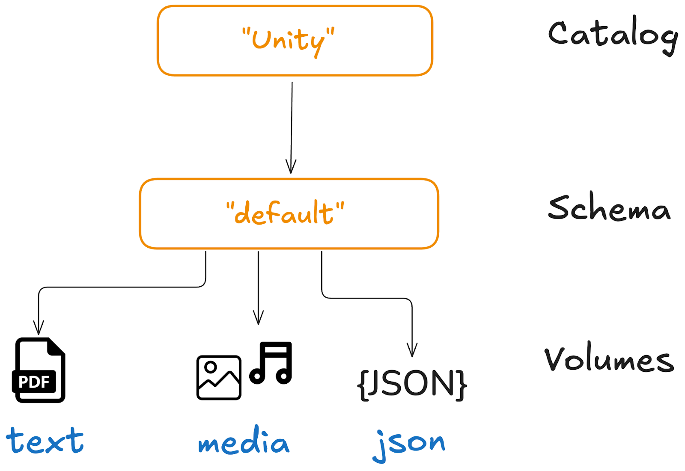
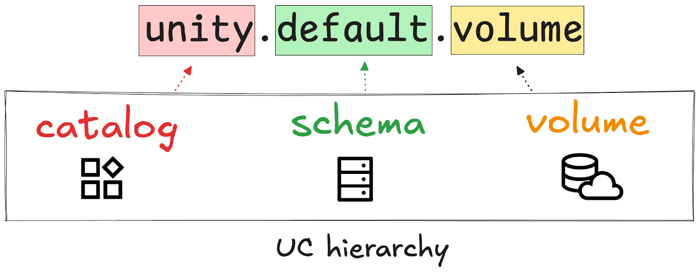
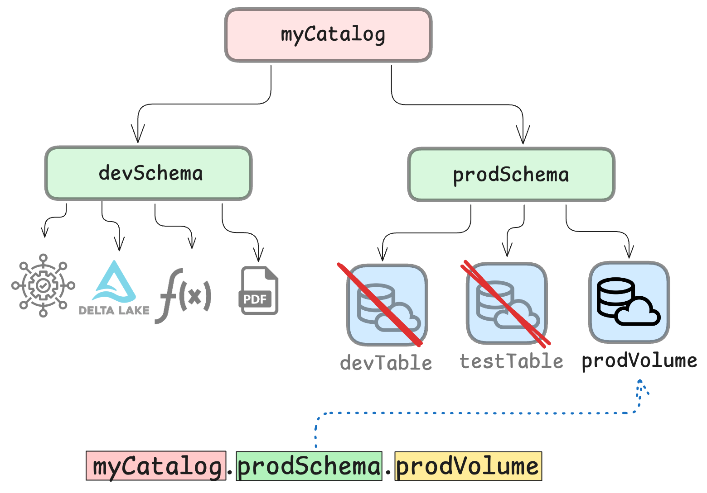
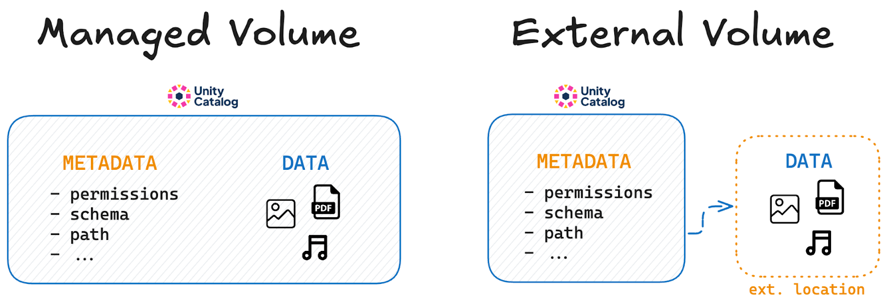
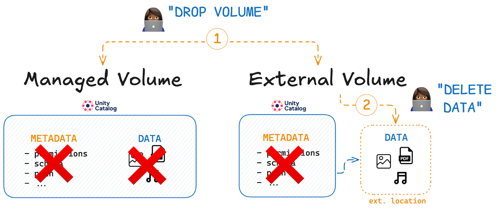

This article explains how to use Unity Catalog volumes.

Unity Catalog volumes are a great place to store all your non-tabular data. This can be structured, semi-structured, or unstructured data, such as free text, audio, video, JSON, Lance datasets, etc. This makes Unity Catalog volumes a great resource for ML and AI workloads.

Unity Catalog volumes provide reliable storage and secure access control for all of your non-tabular data in a single location. Let’s take a look at how this works.

## Centralized Data Organization

Unity catalog uses a universal hierarchical namespace to locate your data. The namespace has three levels:

1. Catalog name
2. Schema name
3. Asset name



This universal namespace means that you can access data stored in your Unity Catalog volume using the same Unity Catalog reference from any query engine: `<catalog>.<schema>.<volume_name>`.

This is great because users don’t need to know where the data is stored or remember the exact path.



Let’s now take a look at how you can create a Unity Catalog volume.

## Secure Access Control 

Unity Catalog helps you create secure governance structures that define access to your data. This creates a layer of security to make sure that only users and systems with the right permissions can access your data.



## How to create a Unity Catalog Volume

You can create a new Unity Catalog volume using the CLI.

We’ll run some examples using a local Unity Catalog server instance. To spin one up, clone the unitycatalog [Github repository](https://github.com/unitycatalog/unitycatalog), navigate to the root directory and run bin/start-uc-server. You can also follow the [Unity Catalog 101 tutorial](https://www.unitycatalog.io/blogs/unity-catalog-oss). You will need to have Java 17+ installed on your machine.

Once your Unity Catalog server is running, open a new terminal window to create your Unity Catalog volume. In this example, we will create a volume from a local directory that we have pre-populated with some sample files.

```
bin/uc volume create \   
--full_name unity.default.my_volume \  
--storage_location /tmp/my_volume
```

- full_name contains the three-level Unity Catalog reference to your volume: <catalog>.<schema>.<volume>
- storage_location contains the path to the data you want to store in your Unity Catalog volume.

Now you can add more files to the volume, for example:

```
mkdir /tmp/my_volume
touch /tmp/my_volume/some.txt
```

Next, let’s take a look at how to access and read data stored in Unity Catalog volumes.

# How to access data in a Unity Catalog Volume

There are different ways to access the data stored in your Unity Catalog volume. We will demonstrate how to read volumes using the Unity Catalog CLI in this section. You can also read data stored in Unity Catalog volumes using Apache Spark and other engines (see the next section).

## Reading data from Unity Catalog volumes

Use the CLI volume read command to read data stored in Unity Catalog volumes. For example, take a look at the data you’ve just written to your new volume created above:

```
> bin/uc volume read --full_name unity.default.my_volume
some.txt [file]
```

You should see the file you created above.

The [Unity Catalog CLI](https://docs.unitycatalog.io/usage/cli/) provides commands to perform many basic operations on your data stored in Unity Catalog. Let’s take a look at some of the other commands.

You can use the list command to list all volumes in a schema. For example, you can run the following command against your local Unity Catalog instance to list all volumes in the unity catalog under the default schema:

```
> bin/uc volume list --catalog unity --schema default‍

┌──────────┬──────────┬──────────┬──────────┬──────────┬──────
│CATALOG_NA│SCHEMA_NAM│   NAME   │ COMMENT  │  OWNER   │CREATE…
│    ME    │    E     │          │          │          │
├──────────┼──────────┼──────────┼──────────┼──────────┼──────
│unity     │default   │json_files│null      │null      │172123…
├──────────┼──────────┼──────────┼──────────┼──────────┼──────
│unity     │default   │my_volume │null      │null      │173807…
├──────────┼──────────┼──────────┼──────────┼──────────┼──────
│unity     │default   │txt_files │null      │null      │172123…
└──────────┴──────────┴──────────┴──────────┴──────────┴──────
```

Use the get command to fetch metadata about a particular volume:

```
bin/uc volume get --full_name unity.default.json_files‍
```

To list all the files in a volume, use the read command:‍

```
bin/uc volume read --full_name unity.default.json_files
```

You can also use the read command to view the contents of a file in your volume by specifying the path option:

```
bin/uc volume read --full_name unity.default.json_files --path c.json
```

## Managed vs. External Volumes

Unity Catalog supports both managed and external volumes.

A **managed volume** is a volume for which Unity Catalog manages both the metadata and the data itself, including creation, storage, and deletion. Data is stored at a pre-configured storage location to which Unity Catalog has full read and write access.

An **external volume** is a volume for which Unity Catalog manages *only* the metadata and not the lifecycle of the underlying data itself. The user is responsible for data creation, storage, and deletion at the external location.



### How to Create an External Volume

To create an external volume, use the uc/bin volume create command with a storage_location.

For example:

```
bin/uc volume create \ 
--full_name unity.default.new_files \  
--storage_location ~/tmp/
```

Which will output:

```
┌─────────────────────────────────┬──────────────────────────────────────────────────────────────────┐
│               KEY               │                              VALUE                               │
├─────────────────────────────────┼──────────────────────────────────────────────────────────────────┤
│CATALOG_NAME                     │unity                                                             │
├─────────────────────────────────┼──────────────────────────────────────────────────────────────────┤
│SCHEMA_NAME                      │default                                                           │
├─────────────────────────────────┼──────────────────────────────────────────────────────────────────┤
│NAME                             │new_files                                                         │
├─────────────────────────────────┼──────────────────────────────────────────────────────────────────┤
│COMMENT                          │null                                                              │
├─────────────────────────────────┼──────────────────────────────────────────────────────────────────┤
│CREATED_AT                       │1726135930624                                                     │
├─────────────────────────────────┼──────────────────────────────────────────────────────────────────┤
│UPDATED_AT                       │1726135930624                                                     │
├─────────────────────────────────┼──────────────────────────────────────────────────────────────────┤
│VOLUME_ID                        │369419a0-7f8b-496c-94e2-6bc363c139cc                              │
├─────────────────────────────────┼──────────────────────────────────────────────────────────────────┤
│VOLUME_TYPE                      │EXTERNAL                                                          │
├─────────────────────────────────┼──────────────────────────────────────────────────────────────────┤
│STORAGE_LOCATION                 │file:///Users/user/tmp/                                           │
├─────────────────────────────────┼──────────────────────────────────────────────────────────────────┤
│FULL_NAME                        │unity.default.new_files                                           │
└─────────────────────────────────┴──────────────────────────────────────────────────────────────────┘
```

The VOLUME_TYPE field confirms that you have created an EXTERNAL table.

The storage location can be a local path (absolute path) or an S3 path. When an S3 path is provided, the server will vend temporary credentials to access the S3 bucket.

### Dropping Managed vs. External Volumes

When you drop a managed volume from Unity Catalog, the underlying data is also removed.

By contrast, when you drop an external volume from Unity Catalog, the underlying data is not touched. If you want the data to be deleted, you will have to do so manually.



### When to use which volume type

Unity Catalog gives you the freedom to use both managed and external volumes, depending on your needs.

**You may want to use managed volumes when:**

- You prefer simplicity and easy data management.

- Your data lifecycle is tightly coupled with the volume definition.

- You don't want to worry about the details of data storage.

**You may want to use external volumes when:**

- You need to manage data storage locations explicitly.

- You require data persistence independent of volume definitions.

- You need external read or write access to your data.

## Using Unity Catalog Volumes with other tools

You can also read data stored in Unity Catalog with Apache Spark™. For a detailed guide, check out the [Using Unity Catalog with Delta Lake and Apache Spark tutorial](https://www.unitycatalog.io/blogs/unity-catalog-spark-delta-lake). 

Unity Catalog also integrates with many other query engines and platforms. Check the documentation for a complete list of [query engine integrations](https://docs.unitycatalog.io/integrations/) 

## Unity Catalog Volumes for AI workloads

Unity Catalog volumes are a great place to store your AI assets. Volumes can contain any kind of non-tabular data, which means you can store all of your ML and AI assets in one place: prompts, training material, generated output, graphs, etc.

Unity Catalog also integrates with MLflow. This means you can run and track your ML and AI experiments in one place together with your input and output data. Read more in the [Unity Catalog and MLflow article](https://www.unitycatalog.io/blogs/machine-learning-data-catalog).

Check the documentation for a complete list of [AI platform integrations](https://docs.unitycatalog.io/ai/integrations/), including LangChain, OpenAI, AutoGen, Anthropic, and others.

## Unity Catalog Volumes

Unity Catalog volumes let you store and manage non-tabular data in one place. They provide secure access control, a simple naming system, and integration with various tools like Apache Spark and MLflow.

Unity Catalog gives you the flexibility to organize your data the way you need. It’s a great solution for AI, ML, and other workloads that rely on structured or unstructured data. To learn more, check [the official documentation](https://docs.unitycatalog.io/usage/volumes/) and explore how Unity Catalog volumes can fit into your workflow.
