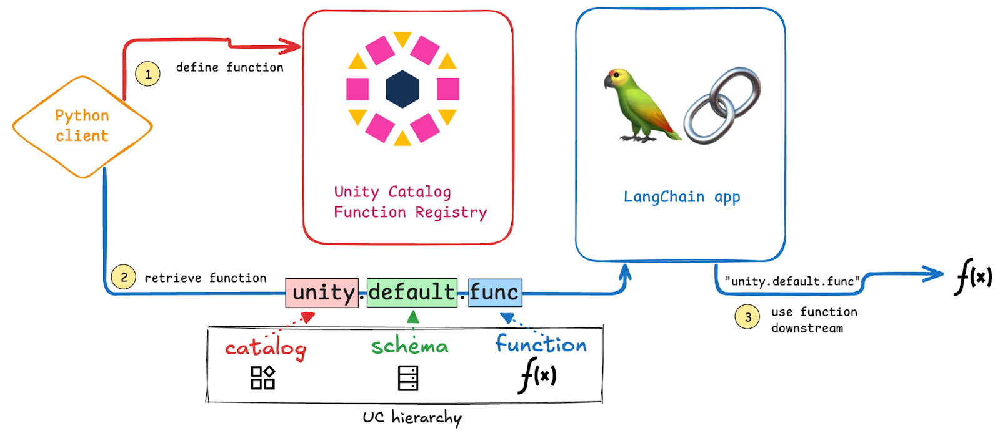

The Unity Catalog AI library is built to integrate Unity Catalog with popular GenAI tools like [LangChain](https://www.langchain.com/), [LlamaIndex](https://www.llamaindex.ai/enterprise), [OpenAI,](https://openai.com/) [Anthropic](https://www.anthropic.com/), and many others to make it easy to manage data, functions, and access control across AI platforms. This way you only have to define your functions, models, and security protocols once and then you can use them in multiple different AI applications and contexts.

LangChain is a framework for building AI agents and tools that can reason, plan, and take actions. It helps you connect large language models to your data and functions. When you use LangChain with Unity Catalog, you can control access, reuse data assets, and keep everything organized in one place.

Let’s take a look at how this works.

## Why should I use LangChain with Unity Catalog?

Using LangChain with Unity Catalog makes it easier to manage your AI functions, models, and data. Here’s why it’s a good idea to use them together:

**1. Central access for all data and AI assets**

With Unity Catalog, all your data, models, and AI functions are in one place. This means LangChain can access everything it needs without you having to move or duplicate data. No more scattered assets—just one centralized source of truth.**‍**

**2. Secure access control**

Unity Catalog makes sure only the right people and systems can access your data and AI functions. You set the rules once, and they apply everywhere. This keeps your work safe and ensures compliance without extra effort.\*\*

**3. Easily move work across GenAI platforms**

With Unity Catalog, you don’t have to rewrite functions or move data manually. Define your AI tools once and use them across all supported platforms like  LangChain, OpenAI, LlamaIndex, Anthropic, and more. This makes it easy to compare performance between AI models or to switch platforms when needed, e.g., for compliance with region-specific regulations.


## How to use LangChain with Unity Catalog

To get started using LangChain with Unity Catalog you will need to:

- Clone the Unity Catalog repository (Java 17+ required)
- Install the unitycatalog-ai library
- Install LangChain and the Unity Catalog LangChain extension

After finishing installation and configuration, we will walk through the following steps:

1. Define a Python function and register it to Unity Catalog
2. Retrieve the function from Unity Catalog
3. Use the function in a LangChain application



### Install Unity Catalog AI and LangChain

Follow the [Unity Catalog Quickstart](https://docs.unitycatalog.io/quickstart/) to clone the repository. Then launch a local Unity Catalog server:

```
bin/start-uc-server
```

Then install the necessary Python libraries from PyPi:

```sh
pip install unitycatalog-ai langchain_openai unitycatalog-langchain
```

Make sure to set your OpenAI API Key as an environment variable so LangChain can access the OpenAI API:

```
OPENAI_API_KEY = “your-api-key”
```

And set the following variables to complete configuration. Make sure to create the CATALOG and SCHEMA before running this code. See the [Unity Catalog documentation](https://docs.unitycatalog.io/usage/cli/#create-a-catalog) for instructions.

```py
config = Configuration(host="http://localhost:8080/api/2.1/unity-catalog")

api_client = ApiClient(configuration=config)

client = UnitycatalogFunctionClient(api_client=api_client)

CATALOG = "AICatalog"
SCHEMA = "AISchema"
```

Now you’re all set!

### Define a Python Function

Let’s define a Python function to test our LangChain integration. We’ll work with something simple to demonstrate the workflow. 

We’re going to simulate the Goblet of Fire from the Harry Potter fantasy series. Our function will take a list of names and a number of champions as input and perform the following:

- Deduplicate the entries
- Randomly select a subset
- Assign the selected names a magical challenge

Here’s the function:

```py
def goblet_of_fire(names: str, num_champions: int = 3) -> str:
    """Selects a random set of unique champions from a comma-separated string and assigns them a first magical challenge.

    This function takes a string of names separated by commas, removes duplicates,
    randomly selects a subset of names (simulating the Goblet choosing the bravest and most qualified),
    and formats the output as a readable string.

    Args:
        names (str): A comma-separated string of contestant names.
        num_champions (int, optional): The number of champions to select. Defaults to 3.

    Returns:
        str: A formatted string announcing the champions and their first challenge.

    Example:
        >>> goblet_of_fire("Harry, Cedric, Fleur, Viktor, Harry, Cedric", num_champions=2)
        'The champions are Cedric and Fleur, and the first challenge is Navigate an enchanted maze.'
    """
    import random

    challenges = [
        "Steal a golden egg from a dragon",
        "Outswim a lake full of merpeople",
        "Solve the riddle of the Sphinx",
        "Sing lullabies to a Giant",
        "Tame a wild Hippogriff",
        "Host a Centaur picnic in the Forbidden Forest"
    ]

    # Convert the string of names into a list and clean up whitespace
    name_list = [name.strip() for name in names.split(",") if name.strip()]
    unique_names = list(set(name_list))  # Remove duplicates
    selected_champions = sorted(random.sample(unique_names, min(num_champions, len(unique_names))))  # Pick and sort champions
    first_challenge = random.choice(challenges)  # Pick one challenge

    # Formatting the list of champions for readability
    if len(selected_champions) == 1:
        champions_str = selected_champions[0]
    elif len(selected_champions) == 2:
        champions_str = " and ".join(selected_champions)
    else:
        champions_str = ", ".join(selected_champions[:-1]) + f", and {selected_champions[-1]}"

    return f"The champions are {champions_str}! \n Their first challenge is: {first_challenge}."
```

Let’s run the function once with a list of names containing duplicates and with **num_champions** set to 3:

```
> contestants = "Harry, Cedric, Fleur, Viktor, Harry, Cedric"
> print(goblet_of_fire(contestants, num_champions=3))

The champions are Cedric, Fleur, and Harry!
Their first challenge is: Tame a wild Hippogriff.
```

There are some important criteria to keep in mind when defining your function:

- All arguments and the return of the function should be properly typed.
- The docstring should follow Google-style guidelines and include descriptions for the function, each argument, and the return of the function. These are required for proper interpretation of the function and output by the LLM. 
- Import statements for any packages not in the core Python library should be defined within the function body.

### Add Function to Unity Catalog

Great work. Now let’s add this function to Unity Catalog, specifying the catalog and schema it should be stored in:

```py
client.create_python_function(
    func=goblet_of_fire, catalog=CATALOG, schema=SCHEMA, replace=True
)
```

Excellent, now you’re all set to use this function in LangChain. You can confirm that the function has been logged to Unity Catalog by running the following CLI command:

```
> bin/uc function get --full_name AICatalog.AISchema.goblet_of_fire

┌────────────────────┬──────────────────────────────────────────────────────────────────────────────────────────┐
│        KEY         │                                          VALUE                                           │
├────────────────────┼──────────────────────────────────────────────────────────────────────────────────────────┤
│NAME                │goblet_of_fire                                                                            │
├────────────────────┼──────────────────────────────────────────────────────────────────────────────────────────┤
│CATALOG_NAME        │AICatalog                                                                                 │
├────────────────────┼──────────────────────────────────────────────────────────────────────────────────────────┤
│SCHEMA_NAME         │AISchema                                                                                  │
├────────────────────┼──────────────────────────────────────────────────────────────────────────────────────────┤
│INPUT_PARAMS        │{"parameters":[{"name":"names","type_text":"STRING","type_json":"{\"name\": \"names\",    │
│                    │\"type\": \"string\", \"nullable\": false, \"metadata\": {\"comment\": \"A comma-separated│
│                    │string of contestant                                                                      │
│                    │names.\"}}","type_name":"STRING","type_precision":null,"type_scale":null,"type_interval_ty│
│                    │pe":null,"position":0,"parameter_mode":null,"parameter_type":null,"parameter_default":null│
│                    │,"comment":"A comma-separated string of contestant                                        │
│                    │names."},{"name":"num_champions","type_text":"LONG","type_json":"{\"name\":               │
│                    │\"num_champions\", \"type\": \"long\", \"nullable\": true, \"metadata\": {\"comment\":    │
│                    │\"The number of champions to select. Defaults to                                          │
│                    │3.\"}}","type_name":"LONG","type_precision":null,"type_scale":null,"type_interval_type":nu│
│                    │ll,"position":1,"parameter_mode":null,"parameter_type":null,"parameter_default":"3","comme│
│                    │nt":"The number of champions to select. Defaults to 3."}]}                                │
├────────────────────┼──────────────────────────────────────────────────────────────────────────────────────────┤
│DATA_TYPE           │STRING                                                                                    │
├────────────────────┼──────────────────────────────────────────────────────────────────────────────────────────┤
│FULL_DATA_TYPE      │STRING                                                                                    │
├────────────────────┼──────────────────────────────────────────────────────────────────────────────────────────┤
│RETURN_PARAMS       │null                                                                                      │
├────────────────────┼──────────────────────────────────────────────────────────────────────────────────────────┤
│ROUTINE_BODY        │EXTERNAL                                                                                  │
├────────────────────┼──────────────────────────────────────────────────────────────────────────────────────────┤
│ROUTINE_DEFINITION  │import random challenges = [ "Steal a golden egg from a dragon", "Outswim a lake full of  │
│                    │merpeople", "Solve the riddle of the Sphinx", "Sing lullabies to a Giant", "Tame a wild   │
│                    │Hippogriff", "Host a Centaur picknick in the Forbidden Forest" ] # Convert the string of  │
│                    │names into a list and clean up whitespace name_list = [name.strip() for name in           │
│                    │names.split(",") if name.strip()] unique_names = list(set(name_list)) # Remove duplicates │
│                    │selected_champions = sorted(random.sample(unique_names, min(num_champions,                │
│                    │len(unique_names)))) # Pick and sort champions first_challenge = random.choice(challenges)│
│                    │# Pick one challenge # Formatting the list of champions for readability if                │
│                    │len(selected_champions) == 1: champions_str = selected_champions[0] elif                  │
│                    │len(selected_champions) == 2: champions_str = " and ".join(selected_champions) else:      │
│                    │champions_str = ", ".join(selected_champions[:-1]) + f", and {selected_champions[-1]}"    │
│                    │return f"The champions are {champions_str}, and the first challenge is {first_challenge}."│
├────────────────────┼──────────────────────────────────────────────────────────────────────────────────────────┤
│ROUTINE_DEPENDENCIES│null                                                                                      │
├────────────────────┼──────────────────────────────────────────────────────────────────────────────────────────┤
│PARAMETER_STYLE     │S                                                                                         │
├────────────────────┼──────────────────────────────────────────────────────────────────────────────────────────┤
│IS_DETERMINISTIC    │true                                                                                      │
├────────────────────┼──────────────────────────────────────────────────────────────────────────────────────────┤
│SQL_DATA_ACCESS     │NO_SQL                                                                                    │
├────────────────────┼──────────────────────────────────────────────────────────────────────────────────────────┤
│IS_NULL_CALL        │false                                                                                     │
├────────────────────┼──────────────────────────────────────────────────────────────────────────────────────────┤
│SECURITY_TYPE       │DEFINER                                                                                   │
├────────────────────┼──────────────────────────────────────────────────────────────────────────────────────────┤
│SPECIFIC_NAME       │goblet_of_fire                                                                            │
├────────────────────┼──────────────────────────────────────────────────────────────────────────────────────────┤
│COMMENT             │Selects a random set of unique champions from a comma-separated string and assigns them a │
│                    │first magical challenge. This function takes a string of names separated by commas,       │
│                    │removes duplicates, randomly selects a subset of names (simulating the Goblet choosing the│
│                    │bravest and most qualified), and formats the output as a readable string.                 │
├────────────────────┼──────────────────────────────────────────────────────────────────────────────────────────┤
│PROPERTIES          │null                                                                                      │
├────────────────────┼──────────────────────────────────────────────────────────────────────────────────────────┤
│FULL_NAME           │AICatalog.AISchema.goblet_of_fire                                                         │
├────────────────────┼──────────────────────────────────────────────────────────────────────────────────────────┤
│OWNER               │null                                                                                      │
├────────────────────┼──────────────────────────────────────────────────────────────────────────────────────────┤
│CREATED_AT          │1740403200986                                                                             │
├────────────────────┼──────────────────────────────────────────────────────────────────────────────────────────┤
│CREATED_BY          │null                                                                                      │
├────────────────────┼──────────────────────────────────────────────────────────────────────────────────────────┤
│UPDATED_AT          │1740403200986                                                                             │
├────────────────────┼──────────────────────────────────────────────────────────────────────────────────────────┤
│UPDATED_BY          │null                                                                                      │
├────────────────────┼──────────────────────────────────────────────────────────────────────────────────────────┤
│FUNCTION_ID         │cdfeb171-c78b-4f28-b3b3-d0e1c1b46882                                                      │
├────────────────────┼──────────────────────────────────────────────────────────────────────────────────────────┤
│EXTERNAL_LANGUAGE   │PYTHON                                                                                    │
└────────────────────┴──────────────────────────────────────────────────────────────────────────────────────────┘
```

### Create a Toolkit Instance

Next we need to create a Toolkit that stores our function. The Toolkit becomes especially helpful when you’re calling multiple functions from a single LangChain Agent. For now we’ll just use the one function we’ve defined above.

```py
from unitycatalog.ai.langchain.toolkit import UCFunctionToolkit

# Create a UCFunctionToolkit that includes the UC function
toolkit = UCFunctionToolkit(function_names=[goblet_func], client=client)

# Fetch the tools stored in the toolkit
tools = toolkit.tools
python_exec_tool = tools[0]
```

Now you can execute the function directly with:

```
> result = python_exec_tool.invoke({"names": ["Harry", "Cedric", "Fleur", "Viktor", "Harry", "Cedric"], "num_champions": 3})
> print(result)

{"format": "SCALAR", "value": "The champions are Cedric, Fleur, and Viktor! \nTheir first challenge is: Steal a golden egg from a dragon."}
```

The Toolkit makes sure that your function follows the correct format and can be properly executed on all platforms included in the Unity Catalog AI integrations. 

## Call Function from LangChain

Let’s now look at how to call this function from LangChain.

You’ll first need to import some LangChain modules:

```py
from langchain.agents import AgentExecutor, create_tool_calling_agent
from langchain_core.prompts import ChatPromptTemplate
from langchain_openai.chat_models import ChatOpenAI
```

And then build your agent by specifying the LLM and the prompt:

```py
llm = ChatOpenAI(model="gpt-4o-mini")
prompt = ChatPromptTemplate.from_messages(
    [
        (
            "system",
            "You are a helpful assistant for the Triwizard Tournament: a magical contest of bravery, wit and strength. When given a list of names, determine if there are relevant tools to process the list and assign the names a magical challenge.",
        ),
        ("placeholder", "{chat_history}"),
        ("human", "{input}"),
        ("placeholder", "{agent_scratchpad}"),
    ]
)
agent = create_tool_calling_agent(llm, tools, prompt)

agent_executor = AgentExecutor(agent=agent, tools=tools, verbose=True)
```

Now you can invoke your LangChain Agent with:

```
> agent_executor.invoke(
    {
        "input": "I have a list of contestants for this year's Triwizard Tournament: Harry, Cedric, Ron, Hermione, Dobby, Draco, Draco, Draco. Please choose 4 champions and assign them their first challenge."
    }
)

> Entering new AgentExecutor chain...

Invoking: `AICatalog__AISchema__goblet_of_fire5` with `{'names': 'Harry, Cedric, Ron, Hermione, Dobby, Draco', 'num_champions': 4}`

The champions chosen for this year's Triwizard Tournament are Cedric, Dobby, Harry, and Hermione. Their first challenge is to outswim a lake full of merpeople. Good luck, champions!

> Finished chain.

[16]:
{'input': "I have a list of contestants for this year's Triwizard Tournament: Harry, Cedric, Ron, Hermione, Dobby, Draco, Draco, Draco. Please choose 4 champions and assign them their first challenge.",
 'output': "The champions chosen for this year's Triwizard Tournament are Cedric, Dobby, Harry, and Hermione. Their first challenge is to outswim a lake full of merpeople. Good luck, champions!"}
```

Well done! Your LangChain Agent is calling the function stored in Unity Catalog under the hood to sort the list of names, pick random contestants, and assign them their first challenge!

## Using LangChain Functions on Other Platforms

Unity Catalog makes it easy to use functions on different platforms. This can be helpful for comparing performance between GenAI tools or to transport work over to another platform because of compliance or other factors.

For example, you can also use function stored with Unity Catalog AI in:

- LlamaIndex
- OpenAI
- Anthropic
- LiteLLM
- CrewAI
- AutoGen
- Gemini

Take a look at [the official documentation](https://docs.unitycatalog.io/ai/integrations/) for a complete list of supported platforms.

## Faster and Safer AI Workflows with Unity Catalog and LangChain

Using Unity Catalog with LangChain gives you a simple way to manage AI functions, models, and data in one place. It guarantees secure access control and makes it easy to switch between different GenAI platforms. With just a few steps, you can store, manage, and call functions from LangChain while keeping everything organized. This flexibility helps you experiment, compare AI models, and scale your projects without unnecessary extra work.
