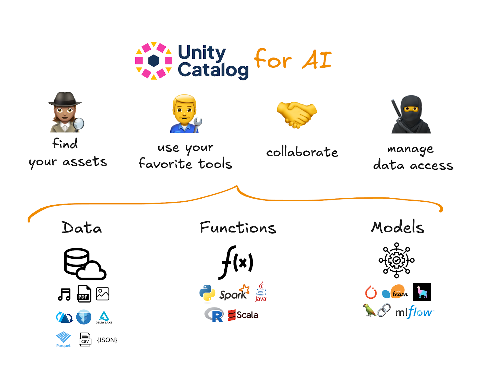
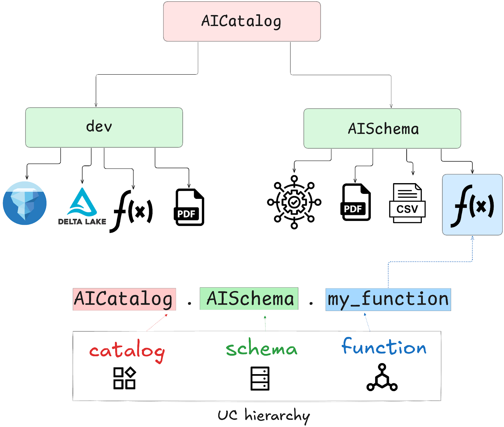

This article explains how you can use Unity Catalog for AI use cases. Unity Catalog integrates with popular GenAI tools like [LangChain](https://www.langchain.com/), [LlamaIndex](https://www.llamaindex.ai/), [OpenAI](https://openai.com/), [Anthropic](https://www.anthropic.com/), and many others to make it easy to manage data, functions, and access control across AI platforms.

Unity Catalog makes sure that your AI tools are secure, well-organized, and easily accessible across all supported AI platforms.

Here is a pseudocode example that shows how you can define an AI function once in Unity Catalog with Python and use it across two different GenAI platforms, LangChain and LlamaIndex:

```python
# create Python function
def your_function:

    return important_data

# register in Unity Catalog
toolkit = UCFunctionToolkit(function_names=[your_function])

# use function in LangChain
from langchain.agents import create_tool_calling_agent
agent = create_tool_calling_agent(llm, tools, prompt)

# use function in LlamaIndex
from llama_index.core.agent import ReActAgent
agent = ReActAgent.from_tools(tools, llm=llm, verbose=True)
```

Additionally, this article will show you how to get started with Unity Catalog AI. You will also learn about all the great benefits of using Unity Catalog's native integrations with popular GenAI tools.

## Why do I need Unity Catalog AI?

Unity Catalog AI is a great tool for your GenAI use cases because it makes it easier to:

- Create and manage AI agents
- Secure your AI applications with robust access control mechanisms
- Test workflows across different GenAI platforms



Let's take a look at each one of these benefits in detail.

### Create and Manage Agents

Creating and managing AI agents can get very complicated, especially if you are using multiple GenAI tools. Each tool uses its own syntax and protocols and getting these to work together smoothly can be painful. This is especially relevant when you're trying to compare performance of agents across different AI platforms or when you need to switch GenAI platform because of availability or compliance reasons.

Unity Catalog AI simplifies this for you with **a single function definition** in standard Python. This makes it much easier to create and manage AI agents.

For example, here's how to create a Unity Catalog function that counts the characters (excl. whitespaces) in a given string:

```python
# define Python function
def count_chars(input_text: str) -> str:
    """Counts the number of characters in a string, ignoring whitespace.

    This function removes all spaces from the input string and counts only the non-whitespace characters.

    Args:
        input_text (str): The input text to analyze.

    Returns:
        str: A formatted string with the total character count.

    Example:
        >>> count_chars("Hello World!")
        'The total character count (excluding spaces) is 11.'
    """
    char_count = len(input_text.replace(" ", ""))  # Remove spaces and count characters
    return f"The total character count (excluding spaces) is {char_count}."

# register in Unity Catalog
client.create_python_function(
    func=count_chars, catalog=CATALOG, schema=SCHEMA, replace=True
)
your_UC_func = f"{CATALOG}.{SCHEMA}.count_chars"

# create Toolkit for using function across AI platforms
toolkit = UCFunctionToolkit(function_names=[your_UC_func, client=client)
```

Your function needs to meet the following criteria:

- All arguments and the return of the function should be properly typed.
- The docstring should follow Google-style guidelines and include descriptions for the function, each argument, and the return of the function. These are required for proper interpretation of the function and output by the LLM.
- Import statements for any packages not in the core Python library should be defined within the function body.

Once your function is defined in Unity Catalog, you can call it directly from any of the supported AI platforms without having to worry about compatibility or rewriting code to match the platform's syntax.

### Secure your AI applications

Unity Catalog is built to provide robust and granular [access control](https://www.unitycatalog.io/blogs/authentication-authorization-unity-catalog) for all your data and AI assets. This same security architecture extends to Unity Catalog's AI integrations.

Here is how Unity Catalog AI helps you to secure your AI applications:

- Only authorized users and agents can access and execute UC Functions.
- You can define precise permissions at the catalog, schema and function levels.
- You can track and audit function usage for compliance and monitoring purposes.



### Smooth interoperability

Once you have defined your function in Unity Catalog, you can use this same code logic in any supported GenAI tool.

For example, let's say you create an agent in LangChain to help you parse lengthy text documents. You may spend a couple of hours writing the code to get this agent to do exactly what you want and to return the desired output in the correct format. The next day, your colleague shows you a cool new agent capability in LlamaIndex that could perform the same task and claims it will be faster. To test this new tool, you will now have to rewrite all your code logic to match the LlamaIndex protocols.

Unity Catalog supports full interoperability between all supported platforms. You don't need to worry about translating syntax. Unity Catalog AI handles all of that for you under the hood.

## How to Install Unity Catalog AI

Follow the steps below to install Unity Catalog with support for GenAI integrations. You will need to have Python installed on your machine. For simplified type hinting, we strongly recommend using Python 3.10+.

1. Install the unitycatalog-ai library from PyPi:

```bash
pip install unitycatalog-ai
```

2. Clone the unity-catalog Github repository:

```bash
git clone git@github.com:unitycatalog/unitycatalog.git
```

3. Launch a local Unity Catalog server by navigating to the root directory of the cloned Unity Catalog repository and running:

```bash
bin/start-uc-server
```

You will need Java 17+ installed on your machine to run the Unity Catalog server.

4. Verify that the Unity Catalog server is running and that you are able to create catalogs, schemas, and functions by running the following commands:

```bash
bin/uc table list --catalog unity --schema default

bin/uc catalog create \
  --name my_catalog \
  --comment "My First Catalog"

bin/uc schema create \
  --catalog my_catalog \
  --name my_schema \
  --comment "My Schema"

bin/uc table create \
  --full_name my_catalog.my_schema.my_table \
  --columns "id INT, name STRING" \
  --storage_location "/path/to/storage"
```

Great job, you're all set up to launch your AI integrations.

## Unity Catalog AI with LangChain

You will need to install these additional packages to use Unity Catalog with LangChain:

```bash
pip install langchain_openai unitycatalog-langchain
```

After defining your Python function and registering it to Unity Catalog, you can call it from within your LangChain agent by using the **create_tool_calling_agent** module and the **AgentExecutor**:

```python
# Create a UCFunctionToolkit that includes the UC function
toolkit = UCFunctionToolkit(function_names=[your_func], client=client)

# Fetch the tools stored in the toolkit
tools = toolkit.tools

# Create LangChain agent that can call your function
agent = create_tool_calling_agent(llm, tools, prompt)
agent_executor = AgentExecutor(agent=agent, tools=tools, verbose=True)
```

## Unity Catalog AI with LlamaIndex

You will need to install these additional packages to use Unity Catalog with LangChain:

```bash
pip install llama-index unitycatalog-llamaindex
```

After defining your Python function and registering it to Unity Catalog, you can call it from within your LangChain agent by using the ReActAgent module:

```python
# Create a UCFunctionToolkit that includes the UC function
toolkit = UCFunctionToolkit(function_names=[your_func], client=client)

# Fetch the tools stored in the toolkit
tools = toolkit.tools

# Create LlamaIndex agent that can call your function
from llama_index.core.agent import ReActAgent
agent = ReActAgent.from_tools(tools, llm=llm, verbose=True)
```

For a more involved example check out the [documentation](https://docs.unitycatalog.io/ai/integrations/llamaindex/#using-the-tool-in-a-llamaindex-reactagent).

## Unity Catalog AI with OpenAI

You will need to install these additional packages to use Unity Catalog with LangChain:

```bash
pip install openai unitycatalog-openai
```

After defining your Python function and registering it to Unity Catalog, you can call it from within your LangChain agent by using the **openai.chat.completions** module:

```python
# Create a UCFunctionToolkit that includes the UC function
toolkit = UCFunctionToolkit(function_names=[your_func], client=client)

# Fetch the tools stored in the toolkit
tools = toolkit.tools

# Create OpenAI model that can call your function
response = openai.chat.completions.create(
                model="gpt-4o-mini",
                messages=messages,
                tools=tools,
            )
```

For a more involved example check out the [documentation](https://docs.unitycatalog.io/ai/integrations/openai/) and the [example notebook on Github](https://github.com/unitycatalog/unitycatalog/blob/main/ai/integrations/openai/openai_example.ipynb).

## Which integrations are supported?

The community is super excited about the interoperability and features of Unity Catalog AI. New integrations are constantly being built.

Here is a selection of supported integrations at the time of publication:

- LangChain
- LlamaIndex
- OpenAI
- Gemini
- Anthropic
- LiteLLM
- CrewAI
- AutoGen

Take a look at the [AI Integrations documentation](https://docs.unitycatalog.io/ai/integrations/) for an updated and comprehensive list of supported integrations.

## Who should use Unity Catalog AI?

Unity Catalog AI is a great tool for teams working with Generative AI who need a secure, scalable, and efficient way to manage AI functions. It simplifies development, guarantees security, and reduces development time and costs. Use cases include:

- **Data Scientists & AI Engineers**: Manage AI functions centrally across multiple GenAI platforms.
- **Enterprises with Compliance Needs**: Enforce security and governance across AI tools.
- **Teams Using Multiple AI Platforms**: Avoid rewriting code when switching between AI frameworks.
- **Cost-Conscious Organizations**: Easily compare cost and performance between GenAI platforms and reduce development and infrastructure costs.
- **MLOps and IT Administrators**: Streamline AI function deployment and monitoring with centralized access and auditing.

## Unity Catalog for AI workloads

Unity Catalog AI makes working with Generative AI easier, more secure, and cost-effective. It helps teams manage AI functions across multiple platforms without extra effort. Start using it today to streamline your AI development and operations.

Check out the [Unity Catalog documentation](https://docs.unitycatalog.io/ai/quickstart/) for detailed instructions on working with each of the supported integrations. We recently released Unity Catalog-AI 0.3.0 with new features. Take a read to learn how you can benefit from it, along with the above features.
