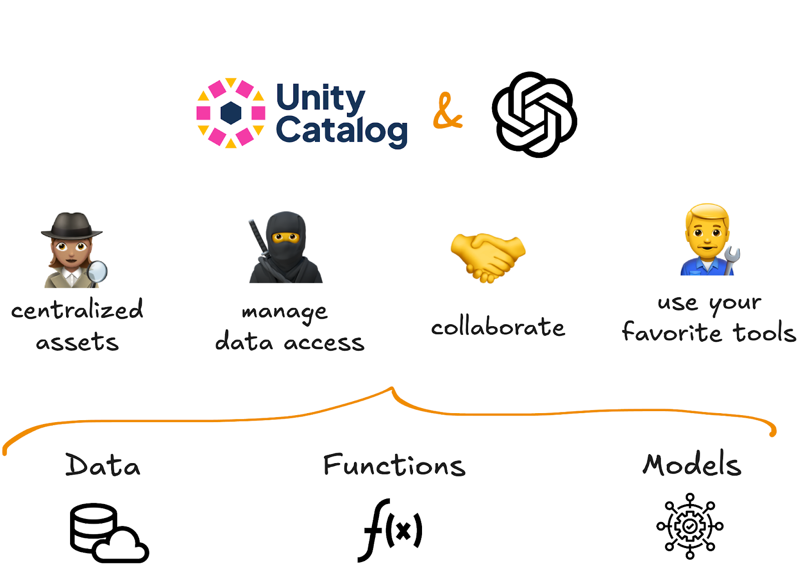
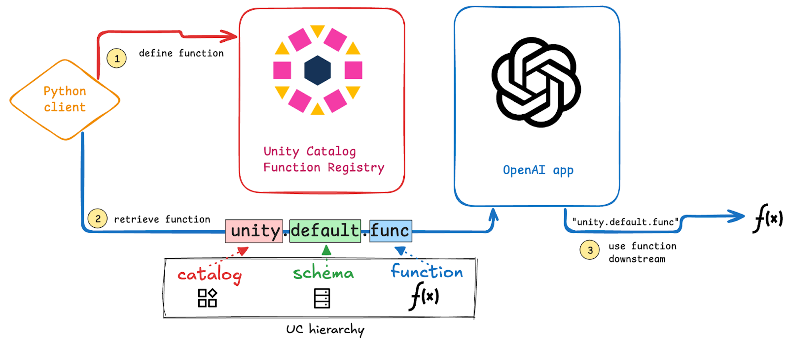

This article explains how you can use Unity Catalog with [OpenAI](https://openai.com/) to build faster and safer AI workflows.

If you're building AI applications with OpenAI, you've probably noticed how tricky it can be to keep track of all your data, models, and functions. They're often spread across different storage locations, with different rules for access and security.

Unity Catalog gives you one place to manage all of your data and AI assets. You can access, update, and delete assets from a single location and easily control who has access. With Unity Catalog, OpenAI models can securely call your custom functions and access trusted data, without lots of manual code rewrites. You can build smarter, more reliable AI agents that are easier to maintain and scale.

Let's take a look at how this works.

## Why should I use OpenAI with Unity Catalog?

Using Unity Catalog with OpenAI gives you:

- **Central Access**: All your data, models, and AI functions are in one place. OpenAI can access everything it needs without moving or duplicating data. Users don't need to remember complex paths.

- **Secure Access Control**: Unity Catalog guarantees that only authorized users and systems can access your data and AI functions. You set the rules once, and they apply everywhere.

- **Cross-Platform Flexibility**: Define your AI tools once and use them across other platforms like [LangChain](https://www.langchain.com/), [LlamaIndex](https://www.llamaindex.ai/), and many more. This is great for benchmarking performance or building multi-platform pipelines.



## How to use OpenAI with Unity Catalog

Let's demonstrate how you can use OpenAI with Unity Catalog with a hands-on coding example. Take a look at [this Jupyter Notebook on Github](https://github.com/unitycatalog/unitycatalog/blob/main/ai/integrations/openai/openai_example.ipynb) to run the code yourself.

Here's what we'll do:

1. Define a Python function and register it to Unity Catalog
2. Retrieve the function from Unity Catalog
3. Use the function in an OpenAI application



### Install Unity Catalog AI and OpenAI

To get started using OpenAI with Unity Catalog you will need to:

- Have Python 3.10+ installed on your machine
- Clone the Unity Catalog repository (Java 17+ required)
- Install the **`unitycatalog-ai`** library
- Install OpenAI and the Unity Catalog OpenAI extension

Follow the [Unity Catalog Quickstart](https://docs.unitycatalog.io/quickstart/) to clone the repository. Then launch a local Unity Catalog server using:

```bash
bin/start-uc-server
```

In a separate Python session, install the necessary Python libraries from PyPi:

```bash
pip install unitycatalog-ai unitycatalog-openai
```

Make sure to set your OpenAI API Key as an environment variable so you can access the OpenAI API:

```ini
OPENAI_API_KEY = "your-api-key"
```

Then set the following variables to complete configuration. Make sure to create the `CATALOG` and `SCHEMA` before running this code. See the [Unity Catalog documentation](https://docs.unitycatalog.io/usage/cli/#create-a-catalog) for instructions.

```ini
config = Configuration(host="http://localhost:8080/api/2.1/unity-catalog")

api_client = ApiClient(configuration=config)

client = UnitycatalogFunctionClient(api_client=api_client)

CATALOG = "AICatalog"
SCHEMA = "AISchema"
```

### Define a Function

Let's define our function. We will build an AI agent that is able to answer complex physics questions about the impact of interstellar objects striking Earth.

First we will build the Python function to define the equation. Our function will:

- Take the object's mass, velocity and composition as input
- Match the composition with a dictionary of energy transmission coefficients
- Calculate the amount of energy upon impact with Earth

This is the function:

```python
def interstellar_impact(mass: float, velocity: float, composition: str) -> float:
    """
    Calculates the amount of energy transmitted to Earth by an interstellar body upon impact.

    Args:
        mass (float): Mass of the body in kilograms.
        velocity (float): Velocity of the body in meters per second.
        composition (str): Elemental composition of the body (e.g., 'iron', 'stone', 'ice', 'diamond', 'uranium', 'gold', 'titanium', 'lithium').

    Returns:
        Energy transmitted to Earth in joules.
    """
    if mass <= 0:
        raise ValueError("Mass must be positive.")
    if velocity <= 0:
        raise ValueError("Velocity must be positive.")

    energy_transmission = {
        "iron": 0.9,  # High survival rate through atmosphere
        "stone": 0.5,  # Moderate survival rate
        "ice": 0.1,  # Low survival rate due to ablation
        "diamond": 0.8,  # High melting point and thermal conductivity
        "uranium": 0.85,  # High density and melting point
        "gold": 0.7,  # High density but lower melting point
        "titanium": 0.75,  # High strength and melting point
        "lithium": 0.2,  # Low density and melting point
    }

    transmission_coefficient = energy_transmission.get(composition.lower())

    if transmission_coefficient is None:
        raise ValueError(
            f"Unknown composition: {composition}. Must be one of: {list(energy_transmission.keys())}"
        )

    kinetic_energy = 0.5 * mass * velocity**2

    energy_transmitted = kinetic_energy * transmission_coefficient

    return energy_transmitted
```

There are some **important criteria** to keep in mind when defining your function:

- All arguments and the return of the function should be properly typed.
- The docstring should follow Google-style guidelines and include descriptions for the function, each argument, and the return of the function. These are required for proper interpretation of the function and output by the LLM.
- Import statements for any packages not in the core Python library should be defined within the function body.

### Register Function to Unity Catalog

Great work. Now let's add this function to Unity Catalog, specifying the catalog and schema it should be stored in:

```graphql
client.create_python_function(
    func=interstellar_impact,
    catalog=CATALOG,
    schema=SCHEMA
)
```

Now you're all set to use this function in OpenAI. You can confirm that the function has been logged to Unity Catalog by running the following CLI command in a terminal:

```bash
bin/uc function get --full_name="AICatalog.AISchema.interstellar_impact"
```

### Create a Toolkit

Next, we need to create a Unity Catalog Toolkit that stores our function. The Toolkit becomes especially helpful when you're calling multiple functions from a single Agent. For now we'll just use the one function we've defined above. Run the code below in a Python shell or Jupyter notebook.

```python
from unitycatalog.ai.openai.toolkit import UCFunctionToolkit

# Create a UCFunctionToolkit that includes the UC function
toolkit = UCFunctionToolkit(function_names=[func_name], client=client)
```

You can extract the tools from the toolkit to confirm everything is in order:

```rust
> tools = toolkit.tools
> tools

[{'type': 'function',
  'function': {'name': 'AICatalog__AISchema__impact_energy',
   'strict': True,
   'parameters': {'additionalProperties': False,
    'properties': {'mass': {'description': 'Mass of the body in kilograms.',
      'title': 'Mass',
      'type': 'number'},
     'velocity': {'description': 'Velocity of the body in meters per second.',
      'title': 'Velocity',
      'type': 'number'},
     'composition': {'description': 'Elemental composition of the body (e.g., "iron", "stone", "ice", "diamond", "uranium", "gold", "titanium", "lithium").',
      'title': 'Composition',
      'type': 'string'}},
    'title': 'AICatalog__AISchema__impact_energy__params',
    'type': 'object',
    'required': ['mass', 'velocity', 'composition']},
   'description': 'Calculates the amount of energy transmitted to Earth by an interstellar body upon impact.'}}]
```

### Use Function in OpenAI Application

Now you can call the function from any OpenAI application.

Start by importing the OpenAI library into your Python session:

```cpp
import openai
```

Then define your initial system prompt and ask your question:

```ini
initial_messages = [
    {
        "role": "system",
        "content": "You are a helpful assistant that provides realistic, verbose, and hightly technical responses to abstract 'what if?' "
        "questions that curious users ask. When responding to a question, utilize tools that are available to you to provide the most"
        "accurate answers possible. After getting a response to a tool call, use that to explain in full detail the contextual "
        "information to provide a full accounting of what the real-world effects would be for the question being posed and include "
        "a thorough explanation that covers the topic in as much detail as you can.",
    },
    {
        "role": "user",
        "content": "What would happen if a sphere of iron with a mass of 64008.5kg struck the Earth traveling at 773542.99 m/s?",
    },
]
```

We then construct our OpenAI application using the **`chat`** module and supply the Unity Catalog toolkit with our predefined functions using the **`tools`** keyword:

```lua
response = openai.chat.completions.create(
    model="gpt-4o-mini",
    messages=initial_messages,
    tools=tools,
)
```

You can print the response in your Python shell:

```python
> print(response)

ChatCompletion(id='chatcmpl-Bdzh9stVJaDoR1kIYhtYi40BRJy9w', choices=[Choice(finish_reason='tool_calls', index=0, logprobs=None, message=ChatCompletionMessage(content=None, refusal=None, role='assistant', audio=None, function_call=None, tool_calls=[ChatCompletionMessageToolCall(id='call_kBL3xfFzxocxYyBaLU8dasAa', function=Function(arguments='{"mass":64008.5,"velocity":773542.99,"composition":"iron"}', name='AICatalog__AISchema__impact_energy'), type='function')], annotations=[]))], created=1748871647, model='gpt-4o-mini-2024-07-18', object='chat.completion', service_tier='default', system_fingerprint='fp_34a54ae93c', usage=CompletionUsage(completion_tokens=35, prompt_tokens=281, total_tokens=316, completion_tokens_details=CompletionTokensDetails(accepted_prediction_tokens=0, audio_tokens=0, reasoning_tokens=0, rejected_prediction_tokens=0), prompt_tokens_details=PromptTokensDetails(audio_tokens=0, cached_tokens=0)))
```

This message contains the response but is not yet human-readable.

We'll use a Unity Catalog utilities tool to post-process the response into a readable result:

```java
from unitycatalog.ai.openai.utils import generate_tool_call_messages

messages = generate_tool_call_messages(response=response, client=client)

final_messages = initial_messages + messages

response = openai.chat.completions.create(
    model="gpt-4o-mini",
    messages=final_messages,
    tools=tools,
)
```

Now let's take a look at the message contents:

```css
> response.choices[0].message.content

"If a sphere of iron with a mass of 64,008.5 kg were to strike the Earth at an incredibly high velocity of approximately 773,543 m/s, it would release an enormous amount of energy upon impact. The calculated energy transmitted to Earth would be approximately **1.72 x 10^16 joules**."
```

Excellent work! Your OpenAI application has successfully leveraged a function stored in Unity Catalog to give the user the correct answer.

## Using OpenAI Functions on Other Platforms

Unity Catalog lets you easily use functions across multiple AI platforms. This saves a lot of time and manual rewrites when you're comparing performance between GenAI tools. It also makes it simpler to transport work over to another platform because of compliance or other factors.

For example, you can also use function stored with Unity Catalog AI in:

- LangChain
- LlamaIndex
- Anthropic
- LiteLLM
- CrewAI
- AutoGen
- Gemini

Take a look at [the official documentation](https://docs.unitycatalog.io/ai/integrations/) for a complete list of supported platforms.

## Better AI Workflows with Unity Catalog and OpenAI

Using Unity Catalog with OpenAI helps you keep all your AI tools, models, and data in one place. You get built-in access control, so your work stays secure. The integration also works across different GenAI platforms, so you don't need to start from scratch when switching tools. You can store and call functions from OpenAI in just a few steps and without the need for time-consuming code rewrites. This makes it easier to test ideas, compare models, and grow your project without extra work.
