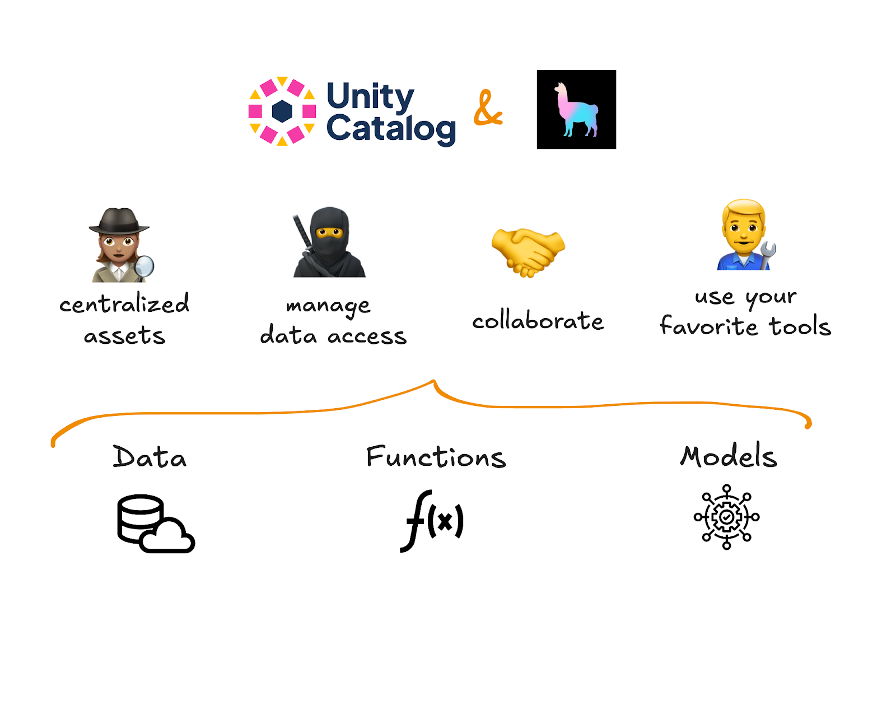
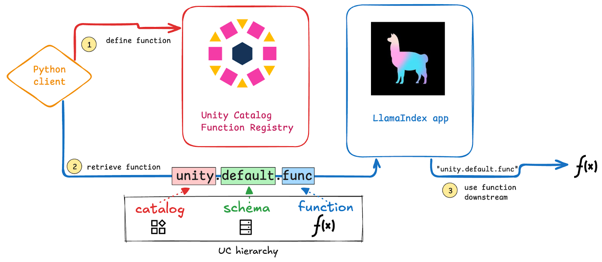

This article will explain how to use [Unity Catalog](https://www.unitycatalog.io/) with [LlamaIndex](https://www.llamaindex.ai/).

Using Unity Catalog with LlamaIndex helps you organize and use your data with AI. You can build LLM-powered systems while keeping your data safe and easy to manage. Unity Catalog controls access and LlamaIndex helps you find the right information fast. Whether you're powering a chatbot, summarizing documents, or exploring large datasets, this setup makes it simple.

You can use Unity Catalog with LlamaIndex using the [Unity Catalog AI library](https://docs.unitycatalog.io/ai/usage/). This library is built to integrate Unity Catalog with popular GenAI tools like LlamaIndex, LangChain, OpenAI, Anthropic and many others to make it easy to manage data, functions, and access control across AI platforms. With this integration, you can define your functions, models, and security protocols once and use them in multiple different AI applications without having to worry about translating the syntax.

Let's take a look at how this works.

## Why should I use LlamaIndex with Unity Catalog?

Using LlamaIndex with Unity Catalog helps you manage your AI functions, models, and data efficiently. Here's why they work well together:

1. **Central access for all data and AI assets**

With Unity Catalog, all of your data, models, and AI functions are stored in one place. LlamaIndex can connect to this centralized source, so you don't need to move or duplicate data. This keeps everything organized and easily accessible.

2. **Secure access control**

Unity Catalog makes sure that only authorized users and systems can access your AI assets. Set your security rules once, and they apply everywhere. This keeps your data safe and helps you stay compliant with ease.

3. **Easily move work across GenAI platforms**

With Unity Catalog, you don't have to manually transfer data or translate functions across AI platforms with different syntaxes. Store your functions once and use them across LlamaIndex, OpenAI, LangChain, Anthropic, and more. This makes it easy to compare AI models, switch platforms, and meet compliance requirements.



## How to use LlamaIndex with Unity Catalog

To get started using LangChain with Unity Catalog you will need to:

- Have Python 3.10+ installed on your machine
- Clone the Unity Catalog repository (Java 17+ required)
- Install the **`unitycatalog-ai`** library
- Install LangChain and the Unity Catalog LangChain extension

After installation, here's what we'll do:

1. Define a Python function and register it to Unity Catalog
2. Retrieve the function from Unity Catalog
3. Use the function in a LlamaIndex application



### Install Unity Catalog AI and LlamaIndex

Follow the [Unity Catalog Quickstart](https://docs.unitycatalog.io/quickstart/) to clone the repository. Then launch a local Unity Catalog server:

```bash
bin/start-uc-server
```

In a separate Python session, install the necessary Python libraries from PyPi:

```bash
pip install unitycatalog-ai unitycatalog-llamaindex
```

Make sure to set your OpenAI API Key as an environment variable so LlamaIndex can access the OpenAI API:

```ini
OPENAI_API_KEY = "your-api-key"
```

And set the following variables to complete configuration. Make sure to create the CATALOG and SCHEMA before running this code. See the [Unity Catalog documentation](https://docs.unitycatalog.io/usage/cli/#create-a-catalog) for instructions.

```ini
config = Configuration(host="http://localhost:8080/api/2.1/unity-catalog")
api_client = ApiClient(configuration=config)
client = UnitycatalogFunctionClient(api_client=api_client)

CATALOG = "AICatalog"
SCHEMA = "AISchema"
```

Now you're all set!

### Define a Python Function

Let's define a Python function to test our LlamaIndex integration. We'll work with something simple and fun to demonstrate the workflow.

We're going to build an AI agent that will simulate a Game of Thrones Grand Meister who can interpret dreams of characters from the main houses of Westeros.

First we will build a Python function to generate the dream. Our function will:

- Take a first and last name as input
- Match the name to the corresponding house animal
- Generate a prophetic dream using randomized elements

Here's the function:

```python
def prophetic_dream(first_name: str, last_name: str) -> str:
    """Generates a prophetic dream based on the character's house animal.

    The dream is inspired by the house's animal and foretells a mystical or
fateful vision involving the character's future or destiny. If the last name doesn't belong to a known house, it returns a message indicating the house doesn't believe in dreams.

    Args:
        first_name (str): The first name of the character.
        last_name (str): The last name (house) of the character.

    Returns:
        str: A prophetic dream or a message if the house is unknown.

    Example:
        >>> generate_prophetic_dream("Arya", "Stark")
        "You walk through the snow, the wind biting at your face. A Direwolf appears before you, its fur glistening under the pale moon. It howls into the night, calling to something in the distance. The ground shakes, and you know this is the sign of the coming winter. The Direwolf's eyes lock with yours, and it beckons you to follow."
    """

    import random

    # House to animal reference dictionary
    house_animal_dict = {
        "Stark": "Direwolf",
        "Lannister": "Lion",
        "Targaryen": "Dragon",
        "Baratheon": "Stag",
        "Greyjoy": "Kraken",
        "Tyrell": "Rose",
        "Martell": "Sand Snake",
        "Arryn": "Eagle"
    }

    # Check if the last name corresponds to a known house
    animal = house_animal_dict.get(last_name, None)

    if not animal:
        return "This house does not believe in dreams."

    # Randomly select dream elements
    environment = random.choice(["snow", "fire", "golden fields", "dark forest", "ancient ruins"])
    animal_action = random.choice(["howls", "stalks", "flies", "roars", "watches silently"])
    fate_warning = random.choice(["the ground shakes with the coming storm.",
                                  "the air is thick with fire and smoke.",
                                  "you hear the whispers of lost souls.",
                                  "the winds speak of a great battle ahead."])
    dream_ending = random.choice(["The animal's eyes meet yours, and you know the future is sealed.",
                                  "The animal speaks, revealing a cryptic prophecy.",
                                  "As the dream fades, the animal's roar echoes in your soul."])

    # Construct the dream message
    dream = (
        f"You are walking through {environment}, the air thick with an unsettling silence. "
        f"A {animal} {animal_action} in the distance, its presence commanding the space. "
        f"As you approach, {fate_warning} {dream_ending}"
    )

    return dream
```

Let's run the function once to generate a prophetic dream for Arya of House Stark:

```vbnet
> print(prophetic_dream("Arya", "Stark"))

You are walking through dark forest, the air thick with an unsettling silence. A Direwolf flies in the distance, its presence commanding the space. As you approach, the air is thick with fire and smoke. As the dream fades, the animal's roar echoes in your soul.
```

There are some important criteria to keep in mind when defining your function:

- All arguments and the return of the function should be properly typed.
- The docstring should follow Google-style guidelines and include descriptions for the function, each argument, and the return of the function. These are required for proper interpretation of the function and output by the LLM.
- Import statements for any packages not in the core Python library should be defined within the function body.

### Add Function to Unity Catalog

Great work. Now let's add this function to Unity Catalog, specifying the catalog and schema it should be stored in:

```graphql
client.create_python_function(
    func=prophetic_dream,
    catalog=CATALOG,
    schema=SCHEMA
)
```

Excellent, now you're all set to use this function in LlamaIndex. You can confirm that the function has been logged to Unity Catalog by running the following CLI command:

```swift
> bin/uc function get --full_name="AIcatalog.AIschema.prophetic_dream"

┌────────────────────┬──────────────────────────────────────────────────────────────────────────────────────────┐
│        KEY         │                                          VALUE                                           │
├────────────────────┼──────────────────────────────────────────────────────────────────────────────────────────┤
│NAME                │prophetic_dream                                                                           │
├────────────────────┼──────────────────────────────────────────────────────────────────────────────────────────┤
│CATALOG_NAME        │AIcatalog                                                                                 │
├────────────────────┼──────────────────────────────────────────────────────────────────────────────────────────┤
│SCHEMA_NAME         │AIschema                                                                                  │
├────────────────────┼──────────────────────────────────────────────────────────────────────────────────────────┤
│INPUT_PARAMS        │{"parameters":[{"name":"first_name","type_text":"STRING","type_json":"{\"name\":          │
│                    │\"first_name\", \"type\": \"string\", \"nullable\": false, \"metadata\": {\"comment\":    │
│                    │\"The first name of the                                                                   │
│                    │character.\"}}","type_name":"STRING","type_precision":null,"type_scale":null,"type_interva│
│                    │l_type":null,"position":0,"parameter_mode":null,"parameter_type":null,"parameter_default":│
│                    │null,"comment":"The first name of the                                                     │
│                    │character."},{"name":"last_name","type_text":"STRING","type_json":"{\"name\":             │
│                    │\"last_name\", \"type\": \"string\", \"nullable\": false, \"metadata\": {\"comment\":     │
│                    │\"The last name (house) of the                                                            │
│                    │character.\"}}","type_name":"STRING","type_precision":null,"type_scale":null,"type_interva│
│                    │l_type":null,"position":1,"parameter_mode":null,"parameter_type":null,"parameter_default":│
│                    │null,"comment":"The last name (house) of the character."}]}                               │
├────────────────────┼──────────────────────────────────────────────────────────────────────────────────────────┤
│DATA_TYPE           │STRING                                                                                    │
├────────────────────┼──────────────────────────────────────────────────────────────────────────────────────────┤
│FULL_DATA_TYPE      │STRING                                                                                    │
├────────────────────┼──────────────────────────────────────────────────────────────────────────────────────────┤
│RETURN_PARAMS       │null                                                                                      │
├────────────────────┼──────────────────────────────────────────────────────────────────────────────────────────┤
│ROUTINE_BODY        │EXTERNAL                                                                                  │
├────────────────────┼──────────────────────────────────────────────────────────────────────────────────────────┤
│ROUTINE_DEFINITION  │import random # House to animal reference dictionary house_animal_dict = { "Stark":       │
│                    │"Direwolf", "Lannister": "Lion", "Targaryen": "Dragon", "Baratheon": "Stag", "Greyjoy":   │
│                    │"Kraken", "Tyrell": "Rose", "Martell": "Sand Snake", "Arryn": "Eagle" } # Check if the    │
│                    │last name corresponds to a known house animal = house_animal_dict.get(last_name, None) if │
│                    │not animal: return "This house does not believe in dreams." # Randomly select dream       │
│                    │elements environment = random.choice(["snow", "fire", "golden fields", "dark forest",     │
│                    │"ancient ruins"]) animal_action = random.choice(["howls", "stalks", "flies", "roars",     │
│                    │"watches silently"]) fate_warning = random.choice(["the ground shakes with the coming     │
│                    │storm.", "the air is thick with fire and smoke.", "you hear the whispers of lost souls.", │
│                    │"the winds speak of a great battle ahead."]) dream_ending = random.choice(["The animal's  │
│                    │eyes meet yours, and you know the future is sealed.", "The animal speaks, revealing a     │
│                    │cryptic prophecy.", "As the dream fades, the animal's roar echoes in your soul."]) #      │
│                    │Construct the dream message dream = ( f"You are walking through {environment}, the air    │
│                    │thick with an unsettling silence. " f"A {animal} {animal_action} in the distance, its     │
│                    │presence commanding the space. " f"As you approach, {fate_warning} {dream_ending}" )      │
│                    │return dream                                                                              │
├────────────────────┼──────────────────────────────────────────────────────────────────────────────────────────┤
│ROUTINE_DEPENDENCIES│null                                                                                      │
├────────────────────┼──────────────────────────────────────────────────────────────────────────────────────────┤
│PARAMETER_STYLE     │S                                                                                         │
├────────────────────┼──────────────────────────────────────────────────────────────────────────────────────────┤
│IS_DETERMINISTIC    │true                                                                                      │
├────────────────────┼──────────────────────────────────────────────────────────────────────────────────────────┤
│SQL_DATA_ACCESS     │NO_SQL                                                                                    │
├────────────────────┼──────────────────────────────────────────────────────────────────────────────────────────┤
│IS_NULL_CALL        │false                                                                                     │
├────────────────────┼──────────────────────────────────────────────────────────────────────────────────────────┤
│SECURITY_TYPE       │DEFINER                                                                                   │
├────────────────────┼──────────────────────────────────────────────────────────────────────────────────────────┤
│SPECIFIC_NAME       │prophetic_dream                                                                           │
├────────────────────┼──────────────────────────────────────────────────────────────────────────────────────────┤
│COMMENT             │Generates a prophetic dream based on the character's house animal. The dream is inspired  │
│                    │by the house's animal and foretells a mystical or fateful vision involving the character's│
│                    │future or destiny. If the last name doesn't belong to a known house, it returns a message │
│                    │indicating the house doesn't believe in dreams.                                           │
├────────────────────┼──────────────────────────────────────────────────────────────────────────────────────────┤
│PROPERTIES          │null                                                                                      │
├────────────────────┼──────────────────────────────────────────────────────────────────────────────────────────┤
│FULL_NAME           │AIcatalog.AIschema.prophetic_dream                                                        │
├────────────────────┼──────────────────────────────────────────────────────────────────────────────────────────┤
│OWNER               │null                                                                                      │
├────────────────────┼──────────────────────────────────────────────────────────────────────────────────────────┤
│CREATED_AT          │1743170418768                                                                             │
├────────────────────┼──────────────────────────────────────────────────────────────────────────────────────────┤
│CREATED_BY          │null                                                                                      │
├────────────────────┼──────────────────────────────────────────────────────────────────────────────────────────┤
│UPDATED_AT          │1743170418768                                                                             │
├────────────────────┼──────────────────────────────────────────────────────────────────────────────────────────┤
│UPDATED_BY          │null                                                                                      │
├────────────────────┼──────────────────────────────────────────────────────────────────────────────────────────┤
│FUNCTION_ID         │c9d109f3-ec2a-46ff-893b-e2d762843a60                                                      │
├────────────────────┼──────────────────────────────────────────────────────────────────────────────────────────┤
│EXTERNAL_LANGUAGE   │PYTHON                                                                                    │
└────────────────────┴──────────────────────────────────────────────────────────────────────────────────────────┘
```

### Create a Toolkit Instance

Next we need to create a Toolkit that stores our function. The Toolkit becomes especially helpful when you're calling multiple functions from a single Agent. For now we'll just use the one function we've defined above.

```makefile
from unitycatalog.ai.llama_index.toolkit import UCFunctionToolkit

# Create a UCFunctionToolkit that includes the UC function
toolkit = UCFunctionToolkit(function_names=[func_name], client=client)

# Fetch the tools stored in the toolkit
tools = toolkit.tools
python_exec_tool = tools[0]
```

Now you can execute the function directly with:

```javascript
> result = python_exec_tool.call(first_name="Arya", last_name="Stark")
> print(result)

{"format": "SCALAR", "value": "You are walking through dark forest, the air thick with an unsettling silence. A Direwolf howls in the distance, its presence commanding the space. As you approach, the air is thick with fire and smoke. The animal speaks, revealing a cryptic prophecy."}
```

The Toolkit makes sure that your function follows the correct format and can be properly executed on all platforms included in the Unity Catalog AI integrations.

### Call Function from LlamaIndex

Let's now look at how to call this function from LlamaIndex

You'll first need to import some LlamaIndex modules:

```javascript
from llama_index.llms.openai import OpenAI
from llama_index.core.agent import ReActAgent
```

And then build your agent by specifying the LLM and the tools to use:

```ini
llm = OpenAI()
agent = ReActAgent.from_tools(tools, llm=llm, verbose=True)
```

Now you can chat with your LlamaIndex agent:

```python
> agent.chat("You are a wise Meister who assists Game of Thrones characters with interpreting their dreams. Given the name Arya Stark, determine if there are any tools to find out what their dreams was and use your wisdom to interpret its meaning.")

Running step 825c388c-5eb3-4290-b527-b77c0e21dda7. Step input: You are a wise Meister who assists Game of Thrones characters with interpreting their dreams. Given the name Arya Stark, determine if there are any tools to find out what their dreams was and use your wisdom to interpret its meaning.


Thought: The character's last name is Stark, which is a known house in Game of Thrones. I can use the prophetic dream tool to generate a dream for Arya Stark.
Action: AIcatalog__AIschema__prophetic_dream
Action Input: {'first_name': 'Arya', 'last_name': 'Stark'}


Observation: {"format": "SCALAR", "value": "You are walking through golden fields, the air thick with an unsettling silence. A Direwolf howls in the distance, its presence commanding the space. As you approach, the winds speak of a great battle ahead. The animal's eyes meet yours, and you know the future is sealed."}


> Running step 0712cc63-6aea-4489-8bc0-1a6e4a06fa67. Step input: None


Thought: I have the dream generated for Arya Stark. Now, I will use my wisdom to interpret its meaning.


Answer: Arya Stark's dream of walking through golden fields with a commanding Direwolf howling in the distance foretells a great battle ahead. The unsettling silence and the sense of the future being sealed indicate that Arya may face significant challenges or conflicts in her path. The presence of the Direwolf, a symbol of House Stark, suggests that Arya's Stark heritage will play a crucial role in the events to come. It is a warning to be prepared for the battles and trials that lie ahead, with the assurance that her Stark roots will guide her through the darkness.


AgentChatResponse(response="Arya Stark's dream of walking through golden fields with a commanding Direwolf howling in the distance foretells a great battle ahead. The unsettling silence and the sense of the future being sealed indicate that Arya may face significant challenges or conflicts in her path. The presence of the Direwolf, a symbol of House Stark, suggests that Arya's Stark heritage will play a crucial role in the events to come. It is a warning to be prepared for the battles and trials that lie ahead, with the assurance that her Stark roots will guide her through the darkness.", sources=[ToolOutput(content='{"format": "SCALAR", "value": "You are walking through golden fields, the air thick with an unsettling silence. A Direwolf howls in the distance, its presence commanding the space. As you approach, the winds speak of a great battle ahead. The animal\'s eyes meet yours, and you know the future is sealed."}', tool_name='AIcatalog__AIschema__prophetic_dream', raw_input={'args': (), 'kwargs': {'first_name': 'Arya', 'last_name': 'Stark'}}, raw_output='{"format": "SCALAR", "value": "You are walking through golden fields, the air thick with an unsettling silence. A Direwolf howls in the distance, its presence commanding the space. As you approach, the winds speak of a great battle ahead. The animal\'s eyes meet yours, and you know the future is sealed."}', is_error=False)], source_nodes=[], is_dummy_stream=False, metadata=None)
```

Well done! Your LlamaIndex Agent is calling the function stored in Unity Catalog under the hood to generate the dream. Your agent is then using its LLM wisdom to interpret the dream's meaning.

## Using LlamaIndex Functions on Other Platforms

Unity Catalog makes it easy to use functions on different platforms. This can be helpful for comparing performance between GenAI tools or to transport work over to another platform because of compliance or other factors.

For example, you can also use function stored with Unity Catalog AI in:

- LangChain
- OpenAI
- Anthropic
- LiteLLM
- CrewAI
- AutoGen
- Gemini

Take a look at [the official documentation](https://docs.unitycatalog.io/ai/integrations/) for a complete list of supported platforms.

## Better AI Workflows with Unity Catalog and LlamaIndex

Using Unity Catalog with LlamaIndex makes it easy to manage your AI functions, models, and data in one place. It ensures secure access control and makes it simple to switch between different GenAI platforms. In just a few steps, you can store, manage, and call functions from LlamaIndex while keeping everything organized. This flexibility helps you experiment, compare AI models, and scale your projects with less effort.
