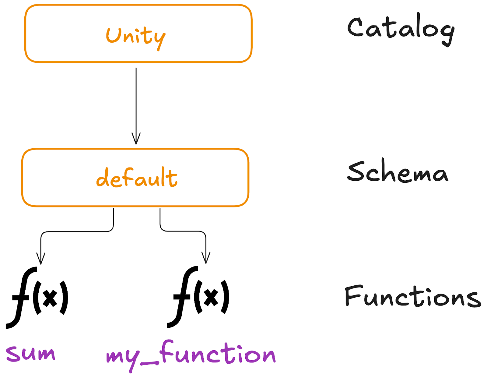
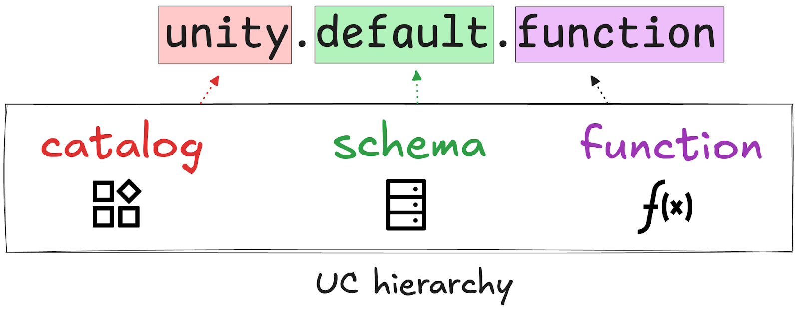

This article explains how to work with functions in Unity Catalog.

Functions are units of saved logic. Unity Catalog lets you store functions in your data catalog for secure access and management. This makes it easy to guarantee reliability and reproducible code and makes Unity Catalog functions a great resource for ML and AI workloads.

Let's take a look at how this works.

### Why should I store functions in Unity Catalog?

Unity Catalog is a great tool because it lets you store all your data and AI assets in one place. While many platforms let you store tabular data, Unity Catalog adds support for storing and managing your functions.

Store your functions in Unity Catalog to make it easy to:

1. reuse code without rewriting
2. applying permissions or filters to restrict access

### Central Data Management

Unity Catalog is a data catalog for managing all your data and AI assets easily and securely. You can use Unity Catalog to organize your data assets, collaborate, manage data access, and ensure compliance with data regulations. Unity Catalog uses a universal hierarchical namespace to locate your data.

The namespace has three levels:

1. Catalog name
2. Schema name
3. Asset name



This universal namespace means that you can use a function stored in Unity Catalog using the same reference from any query engine: **`< catalog >`** . **`< schema >`** . **`< function_name >`**.

This is useful because multiple users can use the same function without having to rewrite or needing to know where the function is stored.



### Secure Access Control

Unity Catalog helps you create governance structures that define access to your data. This creates a layer of security to make sure that only users and systems with the right permissions can access your data.

For example, you can define a **`devSchema`** and a **`prodSchema`** and store different assets in each. The access controls for each schema can be defined separately so that only authorized engineers have access to the production data and workflows. This will prevent unauthorized access.


You can read more about authorization in the [Authentication and Authorization tutorial](/blogs/authentication-authorization-unity-catalog).

Let's now take a look at how you can create a Unity Catalog function.

### How to work with Functions in Unity Catalog

You can work with Unity Catalog functions using the CLI.

We'll run some examples using a local Unity Catalog server instance. To spin one up, clone the unitycatalog [Github repository](https://github.com/unitycatalog/unitycatalog), navigate to the root directory, and run **`bin/start-uc-server`**. You can also follow the [Unity Catalog 101 tutorial](/blogs/unity-catalog-oss). You will need to have Java 17+ installed on your machine.

Once your Unity Catalog server is running, open a new terminal window to create your Unity Catalog function.

The default local server comes with some sample data that we'll use for the following examples.

## How to create a Function

Use the **`bin/uc function create`** CLI command to create a new function and register it in Unity Catalog.

You will need to specify:

- The function's **`full_name`** following the 3-level namespace: **`catalog.schema.function`**
- The output **`data_type`**
- The input parameters with their data types
- The logic definition

For example, let's create a simple function that multiplies two integers:

```bash
bin/uc function create --full_name unity.default.my_function \
--data_type INT --input_params "a int, b int" --def "c=a*b\nreturn c"
```

This will output something like:

```
┌────────────────────┬────────────────────────────────────────────────────────────────────────────────────────────────────┐
│        KEY         │                                               VALUE                                                │
├────────────────────┼────────────────────────────────────────────────────────────────────────────────────────────────────┤
│NAME                │myFunction                                                                                          │
├────────────────────┼────────────────────────────────────────────────────────────────────────────────────────────────────┤
│CATALOG_NAME        │unity                                                                                               │
├────────────────────┼────────────────────────────────────────────────────────────────────────────────────────────────────┤
│SCHEMA_NAME         │default                                                                                             │
├────────────────────┼────────────────────────────────────────────────────────────────────────────────────────────────────┤
│INPUT_PARAMS        │{"parameters":[{"name":"a","type_text":"int","type_json":"{\"name\":\"a\",\"type\":\"integer\",\"nul│
│                    │lable\":true,\"metadata\":{}}","type_name":"INT","type_precision":null,"type_scale":null,"type_inter│
│                    │val_type":null,"position":0,"parameter_mode":null,"parameter_type":null,"parameter_default":null,"co│
│                    │mment":null},{"name":"b","type_text":"int","type_json":"{\"name\":\"b\",\"type\":\"integer\",\"nula│
│                    │ble\":true,\"metadata\":{}}","type_name":"INT","type_precision":null,"type_scale":null,"type_interva│
│                    │l_type":null,"position":1,"parameter_mode":null,"parameter_type":null,"parameter_default":null,"comm│
│                    │ent":null}]}                                                                                        │
├────────────────────┼────────────────────────────────────────────────────────────────────────────────────────────────────┤
│DATA_TYPE           │INT                                                                                                 │
├────────────────────┼────────────────────────────────────────────────────────────────────────────────────────────────────┤
│FULL_DATA_TYPE      │INT                                                                                                 │
├────────────────────┼────────────────────────────────────────────────────────────────────────────────────────────────────┤
│RETURN_PARAMS       │null                                                                                                │
├────────────────────┼────────────────────────────────────────────────────────────────────────────────────────────────────┤
│ROUTINE_BODY        │EXTERNAL                                                                                            │
├────────────────────┼────────────────────────────────────────────────────────────────────────────────────────────────────┤
│ROUTINE_DEFINITION  │c=a*b\nreturn c                                                                                     │
├────────────────────┼────────────────────────────────────────────────────────────────────────────────────────────────────┤
│ROUTINE_DEPENDENCIES│null                                                                                                │
├────────────────────┼────────────────────────────────────────────────────────────────────────────────────────────────────┤
│PARAMETER_STYLE     │S                                                                                                   │
├────────────────────┼────────────────────────────────────────────────────────────────────────────────────────────────────┤
│IS_DETERMINISTIC    │true                                                                                                │
├────────────────────┼────────────────────────────────────────────────────────────────────────────────────────────────────┤
│SQL_DATA_ACCESS     │NO_SQL                                                                                              │
├────────────────────┼────────────────────────────────────────────────────────────────────────────────────────────────────┤
│IS_NULL_CALL        │true                                                                                                │
├────────────────────┼────────────────────────────────────────────────────────────────────────────────────────────────────┤
│SECURITY_TYPE       │DEFINER                                                                                             │
├────────────────────┼────────────────────────────────────────────────────────────────────────────────────────────────────┤
│SPECIFIC_NAME       │myFunction                                                                                          │
├────────────────────┼────────────────────────────────────────────────────────────────────────────────────────────────────┤
│COMMENT             │null                                                                                                │
├────────────────────┼────────────────────────────────────────────────────────────────────────────────────────────────────┤
│PROPERTIES          │null                                                                                                │
├────────────────────┼────────────────────────────────────────────────────────────────────────────────────────────────────┤
│FULL_NAME           │unity.default.myFunction                                                                            │
├────────────────────┼────────────────────────────────────────────────────────────────────────────────────────────────────┤
│CREATED_AT          │1720516826170                                                                                       │
├────────────────────┼────────────────────────────────────────────────────────────────────────────────────────────────────┤
│UPDATED_AT          │null                                                                                                │
├────────────────────┼────────────────────────────────────────────────────────────────────────────────────────────────────┤
│FUNCTION_ID         │012545ee-2a89-4534-b8e9-f41b09f4b2eb                                                                │
├────────────────────┼────────────────────────────────────────────────────────────────────────────────────────────────────┤
│EXTERNAL_LANGUAGE   │python                                                                                              │
└────────────────────┴────────────────────────────────────────────────────────────────────────────────────────────────────┘
```

Your function is now registered in Unity Catalog and can be called by other authorized users and applications.

Take a look at [the documentation](https://docs.unitycatalog.io/usage/functions/) for an example of how to create a more complex Python function that also calls external libraries.

## How to call a Function

Use the **`bin/uc function call`** command and the 3-level namespace reference to your function to call it.

For example, let's call one of the pre-loaded functions **`sum`** stored in the **`default`** schema of the **`unity`** catalog:

```bash
bin/uc function call --full_name unity.default.sum --input_params "1,2,3"
```

This is a simple summing function that takes any number of integers as input. Calling this function with the specified input parameters should return:

```
6
```

This is of course a simple toy example. Unity Catalog has full support for more complicated functions as well. Take a look at the [Unity Catalog 101 tutorial](/blogs/unity-catalog-oss).

## How to List Functions

You can list all functions in a catalog schema using:

```bash
bin/uc function list --catalog unity --schema default
```

This will output the two functions that are pre-loaded with the local Unity Catalog server:

```
┌────────────┬────────┬────────┬────────┬────────┬────────┬────────┬────────┬────────┬────────┬────────┬────────┬────────┬────────┬────────┬────────┬────────┬────────┬────────┬────────┬────────┬────────┬────────┐
│    NAME    │CATALOG_│SCHEMA_N│INPUT_PA│DATA_TYP│FULL_DAT│RETURN_P│ROUTINE_│ROUTINE_│ROUTINE_│PARAMETE│IS_DETER│SQL_DATA│IS_NULL_│SECURITY│SPECIFIC│COMMENT │PROPERTI│FULL_NAM│CREATED_│UPDATED_│FUNCTION│EXTERNAL│
│            │  NAME  │  AME   │  RAMS  │   E    │ A_TYPE │ ARAMS  │  BODY  │DEFINITI│DEPENDEN│R_STYLE │MINISTIC│_ACCESS │  CALL  │ _TYPE  │ _NAME  │        │   ES   │   E    │   AT   │   AT   │  _ID   │_LANGUAG│
│            │        │        │        │        │        │        │        │   ON   │  CIES  │        │        │        │        │        │        │        │        │        │        │        │        │   E    │
├────────────┼────────┼────────┼────────┼────────┼────────┼────────┼────────┼────────┼────────┼────────┼────────┼────────┼────────┼────────┼────────┼────────┼────────┼────────┼────────┼────────┼────────┼────────┤
│sum         │unity   │default │{"par...│INT     │INT     │null    │EXTERNAL│t = x...│null    │S       │true    │NO_SQL  │false   │DEFINER │sum     │Adds ...│null    │unity...│17183...│null    │8e83e...│python  │
├────────────┼────────┼────────┼────────┼────────┼────────┼────────┼────────┼────────┼────────┼────────┼────────┼────────┼────────┼────────┼────────┼────────┼────────┼────────┼────────┼────────┼────────┼────────┤
│lowercase   │unity   │default │{"par...│STRING  │STRING  │null    │EXTERNAL│g = s...│null    │S       │true    │NO_SQL  │false   │DEFINER │lower...│Conve...│null    │unity...│17183...│null    │33d81...│python  │
└────────────┴────────┴────────┴────────┴────────┴────────┴────────┴────────┴────────┴────────┴────────┴────────┴────────┴────────┴────────┴────────┴────────┴────────┴────────┴────────┴────────┴────────┴────────┘
```

## How to get Function Metadata

You can inspect all the available metadata of a specific function using:

```bash
bin/uc function get --full_name unity.default.sum
```

This will output metadata like this:

```
┌────────────────────┬────────────────────────────────────────────────────────────────────────────────────────────────────┐
│        KEY         │                                               VALUE                                                │
├────────────────────┼────────────────────────────────────────────────────────────────────────────────────────────────────┤
│NAME                │sum                                                                                                 │
├────────────────────┼────────────────────────────────────────────────────────────────────────────────────────────────────┤
│CATALOG_NAME        │unity                                                                                               │
├────────────────────┼────────────────────────────────────────────────────────────────────────────────────────────────────┤
│SCHEMA_NAME         │default                                                                                             │
├────────────────────┼────────────────────────────────────────────────────────────────────────────────────────────────────┤
│INPUT_PARAMS        │{"parameters":[{"name":"x","type_text":"int","type_json":"{\"name\":\"x\",\"type\":\"integer\",\"nul│
│                    │lable\":false,\"metadata\":{}}","type_name":"INT","type_precision":null,"type_scale":null,"type_inte│
│                    │rval_type":null,"position":0,"parameter_mode":"IN","parameter_type":"PARAM","parameter_default":null│
│                    │,"comment":null},{"name":"y","type_text":"int","type_json":"{\"name\":\"y\",\"type\":\"integer\",\"n│
│                    │ullable\":false,\"metadata\":{}}","type_name":"INT","type_precision":null,"type_scale":null,"type_in│
│                    │terval_type":null,"position":1,"parameter_mode":"IN","parameter_type":"PARAM","parameter_default":nu│
│                    │ll,"comment":null},{"name":"z","type_text":"int","type_json":"{\"name\":\"z\",\"type\":\"integer\",\│
│                    │"nullable\":false,\"metadata\":{}}","type_name":"INT","type_precision":null,"type_scale":null,"type_│
│                    │interval_type":null,"position":2,"parameter_mode":"IN","parameter_type":"PARAM","parameter_default":│
│                    │null,"comment":null}]}                                                                              │
├────────────────────┼────────────────────────────────────────────────────────────────────────────────────────────────────┤
│DATA_TYPE           │INT                                                                                                 │
├────────────────────┼────────────────────────────────────────────────────────────────────────────────────────────────────┤
│FULL_DATA_TYPE      │INT                                                                                                 │
├────────────────────┼────────────────────────────────────────────────────────────────────────────────────────────────────┤
│RETURN_PARAMS       │null                                                                                                │
├────────────────────┼────────────────────────────────────────────────────────────────────────────────────────────────────┤
│ROUTINE_BODY        │EXTERNAL                                                                                            │
├────────────────────┼────────────────────────────────────────────────────────────────────────────────────────────────────┤
│ROUTINE_DEFINITION  │t = x + y + z\nreturn t                                                                             │
├────────────────────┼────────────────────────────────────────────────────────────────────────────────────────────────────┤
│ROUTINE_DEPENDENCIES│null                                                                                                │
├────────────────────┼────────────────────────────────────────────────────────────────────────────────────────────────────┤
│PARAMETER_STYLE     │S                                                                                                   │
├────────────────────┼────────────────────────────────────────────────────────────────────────────────────────────────────┤
│IS_DETERMINISTIC    │true                                                                                                │
├────────────────────┼────────────────────────────────────────────────────────────────────────────────────────────────────┤
│SQL_DATA_ACCESS     │NO_SQL                                                                                              │
├────────────────────┼────────────────────────────────────────────────────────────────────────────────────────────────────┤
│IS_NULL_CALL        │false                                                                                               │
├────────────────────┼────────────────────────────────────────────────────────────────────────────────────────────────────┤
│SECURITY_TYPE       │DEFINER                                                                                             │
├────────────────────┼────────────────────────────────────────────────────────────────────────────────────────────────────┤
│SPECIFIC_NAME       │sum                                                                                                 │
├────────────────────┼────────────────────────────────────────────────────────────────────────────────────────────────────┤
│COMMENT             │Adds two numbers.                                                                                   │
├────────────────────┼────────────────────────────────────────────────────────────────────────────────────────────────────┤
│PROPERTIES          │null                                                                                                │
├────────────────────┼────────────────────────────────────────────────────────────────────────────────────────────────────┤
│FULL_NAME           │unity.default.sum                                                                                   │
├────────────────────┼────────────────────────────────────────────────────────────────────────────────────────────────────┤
│CREATED_AT          │1718315581372                                                                                       │
├────────────────────┼────────────────────────────────────────────────────────────────────────────────────────────────────┤
│UPDATED_AT          │null                                                                                                │
├────────────────────┼────────────────────────────────────────────────────────────────────────────────────────────────────┤
│FUNCTION_ID         │8e83e2d9-e523-46a1-b69c-8fe9212f1057                                                                │
├────────────────────┼────────────────────────────────────────────────────────────────────────────────────────────────────┤
│EXTERNAL_LANGUAGE   │python                                                                                              │
└────────────────────┴────────────────────────────────────────────────────────────────────────────────────────────────────┘
```

### Using the Unity Catalog REST API

You can also use the Unity Catalog REST API to work with functions.

Use the **`/functions`** endpoint to work with functions registered in Unity Catalog. You will need to supply the names of the relevant catalog and schema.

| Method | Description                              | Example                                   |
| ------ | ---------------------------------------- | ----------------------------------------- |
| GET    | Retrieve a list of functions             | GET /functions                            |
| GET    | Retrieve metadata of a specific function | GET /functions/catalog.schema.function    |
| POST   | Create a new function                    | POST /functions                           |
| PATCH  | Partially update an existing function    | PATCH /functions/catalog.schema.function  |
| DELETE | Remove a function                        | DELETE /functions/catalog.schema.function |

Read more in the [Unity Catalog REST API](https://github.com/unitycatalog/unitycatalog/tree/main/api) guide.

### Using Unity Catalog Functions with AI tools

Additionally, you can use the [unitycatalog-ai library](https://docs.unitycatalog.io/ai/quickstart/) to build advanced AI workflows with your functions. This library integrates with all popular AI platforms like LangChain, OpenAI, LlamaIndex and others.

Here is a pseudocode example that shows how you can define an AI function once in Unity Catalog with Python and use it across two different GenAI platforms, LangChain and LlamaIndex:

```python
# create Python function
def your_function:

    return important_data

# register in Unity Catalog
toolkit = UCFunctionToolkit(function_names=[your_function])

# use function in LangChain
from langchain.agents import create_tool_calling_agent
agent = create_tool_calling_agent(llm, tools, prompt)

# use function in LlamaIndex
from llama_index.core.agent import ReActAgent
agent = ReActAgent.from_tools(tools, llm=llm, verbose=True)
```

Read the [Unity Catalog AI guide](/blogs/unity-catalog-for-ai) for more on syntax and semantics.

### Unity Catalog Functions

Storing your functions in Unity Catalog is a simple way to keep your logic organized, reusable, and secure. It helps teams avoid duplicating code, apply access controls easily, and build smarter AI and ML workflows Whether you're working in the CLI, using the API, or integrating with tools like LangChain and LlamaIndex, Unity Catalog makes it easy to share and scale your code.
