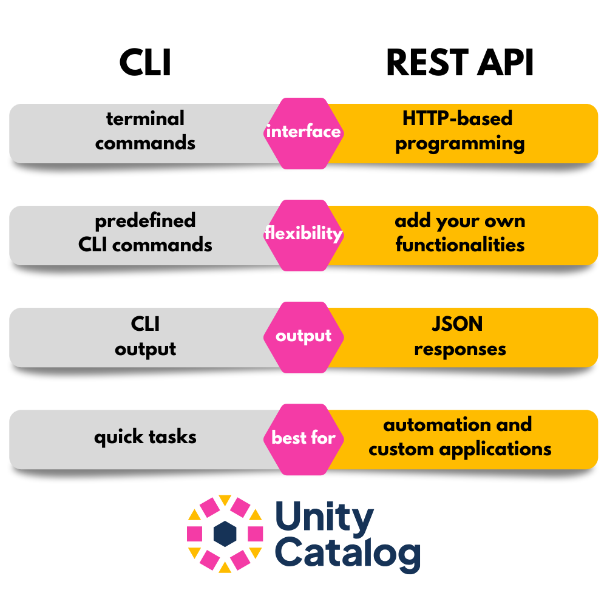
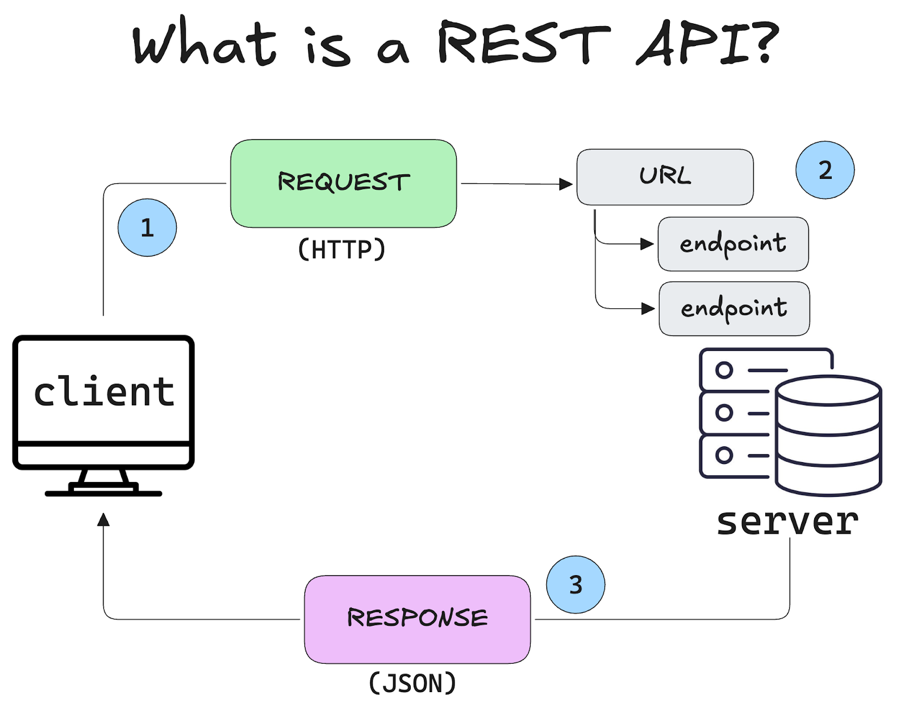
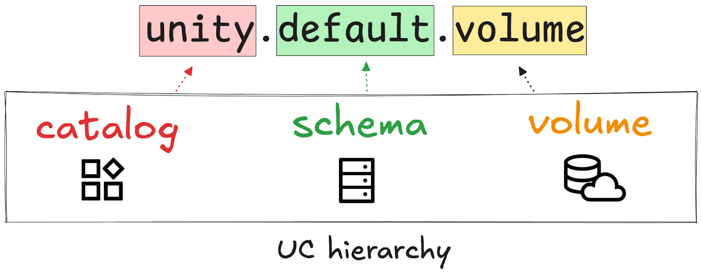

This article explains how you can use the Unity Catalog REST API to store and manage your data and AI assets.

There are two ways to use Unity Catalog:

1. the built-in [Command Line Interface](https://docs.unitycatalog.io/usage/cli/),
2. the [REST API.](https://github.com/unitycatalog/unitycatalog/tree/main/api)

The Unity Catalog REST API is a great alternative to using the Command Line Interface. It can give you more flexibility, it's less verbose, and it gives you the freedom to use your own IDE and easily add new functionalities. In fact, the CLI uses the REST API under the hood, with some limitations in place. If you want access to all Unity Catalog features, use the REST API.



If you're new to Unity Catalog, you may want to check out the [Unity Catalog 101 tutorial](/blogs/unity-catalog-oss) first to understand what Unity Catalog is and how its basic architecture works. The 101 tutorial uses the Unity Catalog CLI, while this tutorial focuses on the REST API. If you're new to data catalogs in general, consider reading the article [What is a data catalog and why do I need one?](/blogs/data-catalog) first.

This tutorial will first explain what a REST API is. Then we will demonstrate how to use the Unity Catalog REST API to perform common operations like listing and creating catalogs, tables and volumes. We will end with a comparison of the REST API and CLI and an example of how you can add your own functionality to the existing REST API.

### What is a REST API?

A Representational State Transfer (REST) API is a standardized way for computer systems to communicate over HTTP using simple, stateless requests. A stateless request contains all the information needed to fulfill the requested operation. This means that the server receiving the request does not need to remember anything about previous requests.

This is important for:

- **`Scalability`**: Servers don't need to store session data in memory so it's easier to distribute and scale.
- **`Consistency`**: Any request can be routed to any server, they will all respond the same way.
- **`Debugging`**: Each request is isolated, so issues are easier to trace.

REST APIs are a popular way for developers to interact with cloud services and data platforms, because they are lightweight, scalable and easy to test and debug.

At the heart of any REST API are **`five core HTTP methods`**, each with a specific purpose:

| Method | Description                                  |
| ------ | -------------------------------------------- |
| GET    | Retrieve a resource (read-only)              |
| POST   | Create a new resource                        |
| PUT    | Update a resource by overwriting it entirely |
| PATCH  | Update a resource with a partial overwrite   |
| DELETE | Remove a resource                            |

Unity Catalog follows the OpenAPI standard for defining its REST API.

### What is the OpenAPI standard?

The [OpenAPI standard](https://www.openapis.org/) is a machine-readable specification for describing REST APIs. The spec is usually written in YAML or JSON and it allows developers to generate documentation, client SDKs, and perform automated testing. This improves interoperability and speeds up development.

The Unity Catalog REST API follows the OpenAPI standard. You can take a look at the YAML file with the entire API [here on Github](https://github.com/unitycatalog/unitycatalog/blob/85964eac1416f6acdc2a086ff6a5cace2427bd67/api/all.yaml). Don't worry if it looks overwhelming, we'll break it down into simple steps below!

```yaml
openapi: 3.0.0
servers:
  - url: http://localhost:8080/api/2.1/unity-catalog
    description: Localhost reference server
tags:
    …
paths:
  /catalogs:
    post:
      …
      summary: Create a catalog
       …
    get:
    …
  /schemas:
    post:
    …
  /tables
  …
  /volumes
…
```

For now all you need to know is that a REST API sends requests for operations to a _server_ at specific _endpoints_. The **`server`** is the system or application that receives HTTP requests, processes them, and returns responses. The **`endpoint`** is a subsection within a web service to which a client can send requests to interact with a particular resource.

For example, if you were building a webshop with a REST API, then your server might be the backend database containing the inventory data and it would have an endpoint for each item category, e.g. /books, /clothing, /food, etc. Clients can then list, add or delete items for specific inventory categories using the HTTP methods.



Having the API available in this standardized, lightweight, and machine-readable format makes it easy for any developer to incorporate the API into their existing workflows and to add new functionality to it. We'll take a look at adding functionality to the Unity Catalog REST API at the end of the article.

### What should I use the REST API for?

The Unity Catalog REST API is designed for [metadata operations](/blogs/metadata-and-data-catalogs) like listing catalogs, schemas, and tables, or managing access controls. It is not meant for querying or viewing the actual data stored in your assets. To query and manipulate data, [use a query engine](/blogs/unity-catalog-spark-delta-lake) like Apache Spark ™.

Read more about managing access controls and credentials vending in [the Authentication and Authorization tutorial](/blogs/authentication-authorization-unity-catalog).

### Unity Catalog Architecture

Unity Catalog stores all of your data assets in a three-level namespace:

- Catalog
- Schema
- Data asset

This universal namespace means that you can access data stored in your Unity Catalog using the same Unity Catalog reference from any query engine. For example, to access data stored in a Unity Catalog volume, use: `< catalog >`.<`schema`>.<`volume_name`>. This is great because users don't need to know where the data is stored or remember the exact path.



The local Unity Catalog server comes preloaded with some sample data for testing and experimentation. It includes one catalog **`unity`** with one schema **`default`** and a number of sample **`tables`** and other sample data.

```
/catalogs
unity
  /schemas
  default
    /tables
    marksheet
    marksheet_uniform
    ...
    /volumes
    ...
```

We'll take a look at using these assets in a moment.

### How do I use a REST API?

A REST API sends messages over HTTP. The most common way to do this is with **`curl`** or the **`requests`** library if you're working in Python. For this tutorial we will use **`requests`**. You can install this library using:

```bash
pip install requests
```

Once you have it installed, you can use the REST API to perform data operations using a Python script, Jupyter Notebook, or any other method for running Python code.

First import the **`requests`** library:

```python
import requests
```

Then define your Base URL. This is the URL to which all requests will be sent. It should point to the system, application or server with which you want to communicate. In our case, that will be the local Unity Catalog server running at:

```ini
BASE_URL = "http://localhost:8080/api/2.1/unity-catalog/"
```

Next, define the endpoint to which you want to send your request. For this example, let's communicate with the **`catalogs`** endpoint.

```ini
ENDPOINT = "catalogs"
URL = f"{BASE_URL}{ENDPOINT}"
```

You can include additional metadata, like content type and credentials, in the **`headers`**. For working with the local Unity Catalog server you will not need any credentials by default. Read the [Authentication and Authorization tutorial](/blogs/authentication-authorization-unity-catalog) to learn more.

```cpp
headers = {
    "Content-Type": "application/json",
    # "Authorization": "Bearer "  # Uncomment if needed
}
```

Now build a simple Python script using a **`try/except`** clause to execute the request. The **`requests`** library has methods that correspond to the 5 core HTTP methods listed above: **`get`**, **`put`**, **`post`**, **`patch`** and **`delete`**.

Let's start with a **`get`** operation:

```python
try:
    response = requests.get(URL, headers=headers)
    response.raise_for_status()

    data = response.json()
    catalogs = data.get("catalogs", [])

    if catalogs:
        print("Available Catalogs:")
        for catalog in catalogs:
            print(f"• {catalog['name']}")
    else:
        print("No catalogs found.")

except requests.exceptions.HTTPError as e:
    print(f"HTTP error {response.status_code}: {response.text}")
except requests.exceptions.RequestException as e:
    print(f"Request failed: {e}")
```

This REST request will list all available catalogs registered in your local Unity Catalog server. You can run it anywhere you can run Python code, provided you have a local Unity Catalog server [up and running](/blogs/unity-catalog-oss). The server will then return something like this:

```yaml
Available Catalogs:
• unity
```

You can also implement the same operation using curl commands in your terminal:

```makefile
curl -X POST "http://localhost:8080/api/2.1/unity-catalog/catalogs" \
-H "Content-Type: application/json" \
-d '{
    "name": "my_new_catalog",
    "comment": "This is a new catalog created via API."
}'
```

Great job! Let's now take a look at how to use the REST API to perform common operations in Unity Catalog.

### Working with Catalogs

Use the **`/catalogs`** endpoint to work with catalogs.

| Method | Endpoint    | Description                       |
| ------ | ----------- | --------------------------------- |
| GET    | /users      | Retrieve a list of users          |
| POST   | /users      | Create a new user                 |
| PUT    | /users/{id} | Update an existing user entirely  |
| PATCH  | /users/{id} | Partially update an existing user |
| DELETE | /users/{id} | Delete a user                     |

## How to list catalogs

Use the **`GET`** command at the **`/catalogs`** endpoint to retrieve a list of all available catalogs on the server.

```makefile
BASE_URL = "http://localhost:8080/api/2.1/unity-catalog"
ENDPOINT = "/catalogs"
URL = f"{BASE_URL}{ENDPOINT}"

response = requests.get(URL, headers=headers)
data = response.json()
catalogs = data.get("catalogs", [])
for catalog in catalogs:
   print(f"• {catalog['name']}")
```

This will output:

```
• unity
```

Here we use a second **`GET`** command and a **`for`** loop to fetch only the catalog names from the return **`data`** JSON response. Note that there is no guarantee of a specific ordering of the elements in the list.

## How to retrieve catalog metadata

To retrieve metadata about a specific catalog, use the **`GET`** command at the **`/catalogs/<catalog-name`** endpoint. For example:

```makefile
BASE_URL = "http://localhost:8080/api/2.1/unity-catalog"
ENDPOINT = "/catalogs/unity"
URL = f"{BASE_URL}{ENDPOINT}"

response = requests.get(URL, headers=headers)
data = response.json()
data
```

This will output:

```python
{'name': 'unity',
 'comment': 'Main catalog',
 'properties': {},
 'owner': None,
 'created_at': 1721238005334,
 'created_by': None,
 'updated_at': None,
 'updated_by': None,
 'id': 'f029b870-9468-4f10-badc-630b41e5690d'}
```

This returns all available metadata for the specified catalog.

## How to create a catalog

Use the **`POST`** command at the **`/catalogs`** endpoint to create a new catalog:

```makefile
BASE_URL = "http://localhost:8080/api/2.1/unity-catalog"
ENDPOINT = "/catalogs"
URL = f"{BASE_URL}{ENDPOINT}"

data = {
    "name": "my_new_catalog",
    "comment": "Created via REST API"
}

response = requests.post(URL, headers=headers, json=data)
response.json()
```

This will output:

```python
{'name': 'my_new_catalog',
 'comment': 'Created via REST API',
 'properties': {},
 'owner': None,
 'created_at': 1745157750562,
 'created_by': None,
 'updated_at': 1745157750562,
 'updated_by': None,
 'id': '08601e1a-d940-419c-8bfe-7667ea9bcab8'}
```

Well done, you've created a new catalog! You can verify by running the **`GET`** command again to list all available catalogs. This should now return:

```
• my_new_catalog
• unity
```

## How to update a catalog

Use the **`PATCH`** command at the **`/catalogs/<catalog-name>`** endpoint to partially update an existing catalog. Include the fields to update in a dictionary and send this with the **`PATCH`** request. For example, to update the **`comment`** field of the catalog we just created above:

```makefile
BASE_URL = "http://localhost:8080/api/2.1/unity-catalog"
ENDPOINT = "/catalogs/my_new_catalog"
URL = f"{BASE_URL}{ENDPOINT}"

data = {
    "comment": "This is the updated catalog description"
}

response = requests.patch(URL, json=data, headers=headers)
response.json()
```

This will output:

```python
{'name': 'my_new_catalog',
 'comment': 'This is the updated catalog description',
 'properties': {},
 'owner': None,
 'created_at': 1745158805225,
 'created_by': None,
 'updated_at': 1745158807128,
 'updated_by': None,
 'id': 'aeb72f8b-9d4b-4128-be97-639e914e785c'}
```

This has successfully updated only the **`comment`** field without having to rewrite the entire catalog.

## How to delete a catalog

Use the **`DELETE`** command at the**` /catalogs/<catalog-name>`** endpoint to delete a specific catalog. You can add the **`force`** parameter to force a delete even if the catalog is not empty.

```makefile
BASE_URL = "http://localhost:8080/api/2.1/unity-catalog"
ENDPOINT = "/catalogs/my_new_catalog"
URL = f"{BASE_URL}{ENDPOINT}"

params = {"force": "true"}
response = requests.delete(URL, headers=headers, params=params)

if response.status_code == 200:
    print("✅ The catalog was successfully deleted.")
else:
    print("❌ Failed to delete catalog:", response.text)

✅ The catalog was successfully deleted.
```

You can confirm by using the **`GET`** command to list available catalogs. This should now return:

```
• unity
```

### Working with Tables

Use the **`/tables`** endpoint to work with tables registered in Unity Catalog.

| Method | Description                           | Example                             |
| ------ | ------------------------------------- | ----------------------------------- |
| GET    | Retrieve a list of tables             | GET /tables                         |
| GET    | Retrieve metadata of a specific table | GET /tables/catalog.schema.table    |
| POST   | Create a new table                    | POST /tables                        |
| DELETE | Remove a table                        | DELETE /tables/catalog.schema.table |

## How to list tables

Use the **`GET`** command at the **`/tables`** endpoint to retrieve a list of all available tables on the server. You will need to specify the **`catalog`** and **`schema`** names using the **`params`** keyword argument.

```makefile
BASE_URL = "http://localhost:8080/api/2.1/unity-catalog"
ENDPOINT = "/tables"
URL = f"{BASE_URL}{ENDPOINT}"

params = {
    "catalog_name": "unity",
    "schema_name": "default"
}

response = requests.get(URL, headers=headers, params=params)
data = response.json()
tables = data.get("tables", [])
for table in tables:
   print(f"• {table['name']}")
```

This will output:

```
• marksheet
• marksheet_uniform
• numbers
• user_countries
```

Here we use a second **`GET`** command and a **`for`** loop to fetch only the table names from the return **`data`** JSON response. Note that there is no guarantee of a specific ordering of the elements in the list.

## How to retrieve table metadata

To retrieve metadata about a specific table, use the **`GET`** command at the **`/tables/<full-table-name>`** endpoint. The full name means the 3-level namespace reference in the standard Unity Catalog format: **`catalog.schema.table`**. For example:

```makefile
BASE_URL = "http://localhost:8080/api/2.1/unity-catalog"
ENDPOINT = "/tables/unity.default.marksheet"
URL = f"{BASE_URL}{ENDPOINT}"

response = requests.get(URL)
data = response.json()
data
```

This will output:

```python
{'name': 'marksheet',
 'catalog_name': 'unity',
 'schema_name': 'default',
 'table_type': 'MANAGED',
 'data_source_format': 'DELTA',
 'columns': [{'name': 'id',
  ...
 'comment': 'Managed table',
 'properties': {'key1': 'value1', 'key2': 'value2'},
 'owner': None,
 'created_at': 1721238005595,
 'created_by': None,
 'updated_at': 1721238005595,
 'updated_by': None,
 'table_id': 'c389adfa-5c8f-497b-8f70-26c2cca4976d'}
```

This returns all available metadata for the specified table (truncated here for legibility).

## How to create a table

Use the **`POST`** command at the **`/tables`** endpoint to create a new table. You will need to supply a dictionary containing the table, catalog and schema names as well as the Table Type, Data Source Format, and Storage Location.

```makefile
BASE_URL = "http://localhost:8080/api/2.1/unity-catalog"
ENDPOINT = "/tables"
URL = f"{BASE_URL}{ENDPOINT}"

data = {
    "name": "my_new_table",
    "catalog_name": "unity",
    "schema_name": "default",
    "table_type": "EXTERNAL",
    "data_source_format": "DELTA",
    "storage_location": "file:///Users/my_user/tmp", # or use "s3://my-bucket/..." for s3 tables
    "comment": "External table pointing to local directory"
}

headers = {"Content-Type": "application/json"}
response = requests.post(URL, json=data, headers=headers)
response.json()
```

This will output:

```python
{'name': 'my_new_table',
 'catalog_name': 'unity',
 'schema_name': 'default',
 'table_type': 'EXTERNAL',
 'data_source_format': 'DELTA',
 'columns': [],
 'storage_location': 'file:///Users//tmp', #change to your local directory or use "s3://my-bucket/..." for s3 tables
 'comment': 'External sales table pointing to local directory',
 'properties': {},
 'owner': None,
 'created_at': 1745235186765,
 'created_by': None,
 'updated_at': 1745235186765,
 'updated_by': None,
 'table_id': '53b8c66f-01c8-41bc-a762-edbe20aa7813'}
```

Well done, you've created a new external table in Delta Lake format, stored in the **`tmp`** folder of your local user. You can verify by running the **`GET`** command again to list all available catalogs. This should now return:

```
• marksheet
• marksheet_uniform
• my_new_table
• numbers
• user_countries
```

Note that currently only external tables are supported. Read more about external tables in the [Managed vs External tables](/blogs/unity-catalog-managed-vs-external-tables) blog.

## How to delete a table

Use the **`DELETE`** command at the **`/tables/<full-table-name>`** endpoint to delete a specific table. The full name is the 3-level namespace reference to your table: **`catalog.schema.table`**. Let's delete the table we just created:

```makefile
BASE_URL = "http://localhost:8080/api/2.1/unity-catalog"
ENDPOINT = "/tables/unity.default.my_new_table"
URL = f"{BASE_URL}{ENDPOINT}"

response = requests.delete(URL)

if response.status_code == 200:
    print("✅ The table was successfully deleted.")
else:
    print("❌ Failed to delete table:", response.text)

✅ The table was successfully deleted.
```

You can confirm by using the GET command to list available tables. This should now return:

```
• marksheet
• marksheet_uniform
• numbers
• user_countries
```

### Working with Schemas

Use the **`/schemas`** endpoint to work with schemas registered in Unity Catalog. You will need to supply the name of the relevant catalog.

| Method | Description                            | Example                        |
| ------ | -------------------------------------- | ------------------------------ |
| GET    | Retrieve a list of schemas             | GET /schemas                   |
| GET    | Retrieve metadata of a specific schema | GET /schemas/catalog.schema    |
| POST   | Create a new schema                    | POST /schemas                  |
| PATCH  | Partially update an existing schema    | PATCH /schemas/catalog.schema  |
| DELETE | Remove a schema                        | DELETE /schemas/catalog.schema |

### Working with Volumes

Use the **`/volumes`** endpoint to work with volumes registered in Unity Catalog. The commands for Volumes follow the same convention as those for working with Tables: you will need to supply the names of the relevant catalog and schema.

| Method | Description                            | Example                               |
| ------ | -------------------------------------- | ------------------------------------- |
| GET    | Retrieve a list of volumes             | GET /volumes                          |
| GET    | Retrieve metadata of a specific volume | GET /volumes/catalog.schema.volume    |
| POST   | Create a new volume                    | POST /volumes                         |
| PATCH  | Partially update an existing volume    | PATCH /volumes/catalog.schema.volume  |
| DELETE | Remove a table                         | DELETE /volumes/catalog.schema.volume |

You can also read more about working with volumes in the [Unity Catalog Volumes](/blogs/how-to-use-unity-catalog-volumes) tutorial.

### Working with Functions

Use the **`/functions`** endpoint to work with functions registered in Unity Catalog. You will need to supply the names of the relevant catalog and schema.

| Method | Description                              | Example                                   |
| ------ | ---------------------------------------- | ----------------------------------------- |
| GET    | Retrieve a list of functions             | GET /functions                            |
| GET    | Retrieve metadata of a specific function | GET /functions/catalog.schema.function    |
| POST   | Create a new function                    | POST /functions                           |
| PATCH  | Partially update an existing function    | PATCH /functions/catalog.schema.function  |
| DELETE | Remove a function                        | DELETE /functions/catalog.schema.function |

### Working with Models

Use the **`/models`** endpoint to work with schemas registered in Unity Catalog. You will need to supply the names of the relevant catalog and schema.

| Method | Description                           | Example                             |
| ------ | ------------------------------------- | ----------------------------------- |
| GET    | Retrieve a list of models             | GET /models                         |
| GET    | Retrieve metadata of a specific model | GET /models/catalog.schema.model    |
| POST   | Create a new model                    | POST /models                        |
| PATCH  | Partially update an existing model    | PATCH /models/catalog.schema.model  |
| DELETE | Remove a model                        | DELETE /models/catalog.schema.model |

### Unity Catalog REST API

The Unity Catalog REST API is a flexible and efficient way to manage your data assets and manage metadata operations. It lets you interact with catalogs, schemas, and tables in a simple, scalable way. You can easily automate tasks and integrate it into your workflows, making your metadata management easy and streamlined. Consider using the REST API when you want to build production-grade, reproducible workflows that integrate with other applications or that incorporate new custom functionality you've created.

If you'd like to learn more about how Unity Catalog handles metadata, check out the dedicated [Metadata and Data Catalogs](/blogs/metadata-and-data-catalogs) tutorial.
