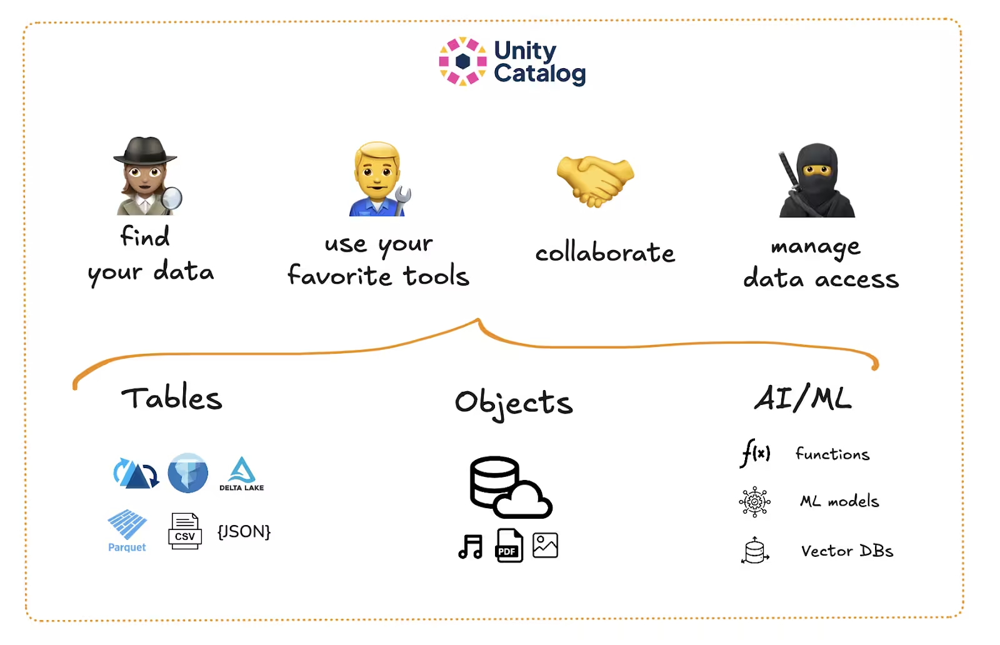
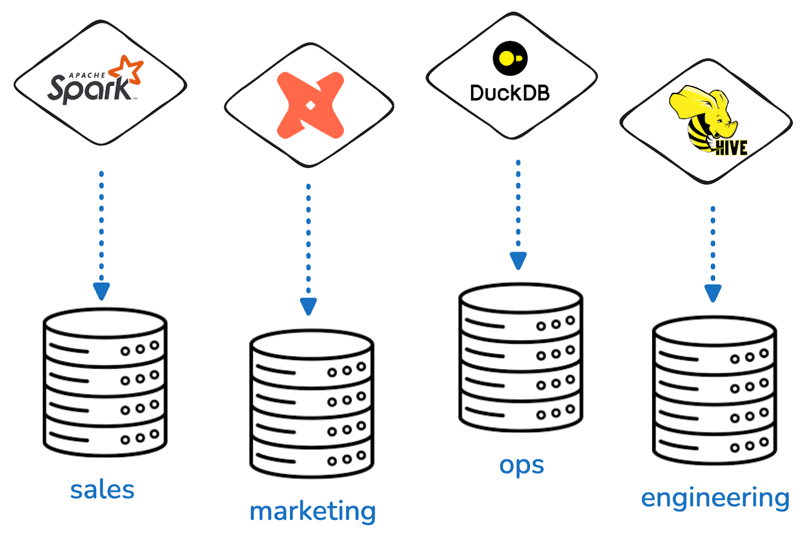
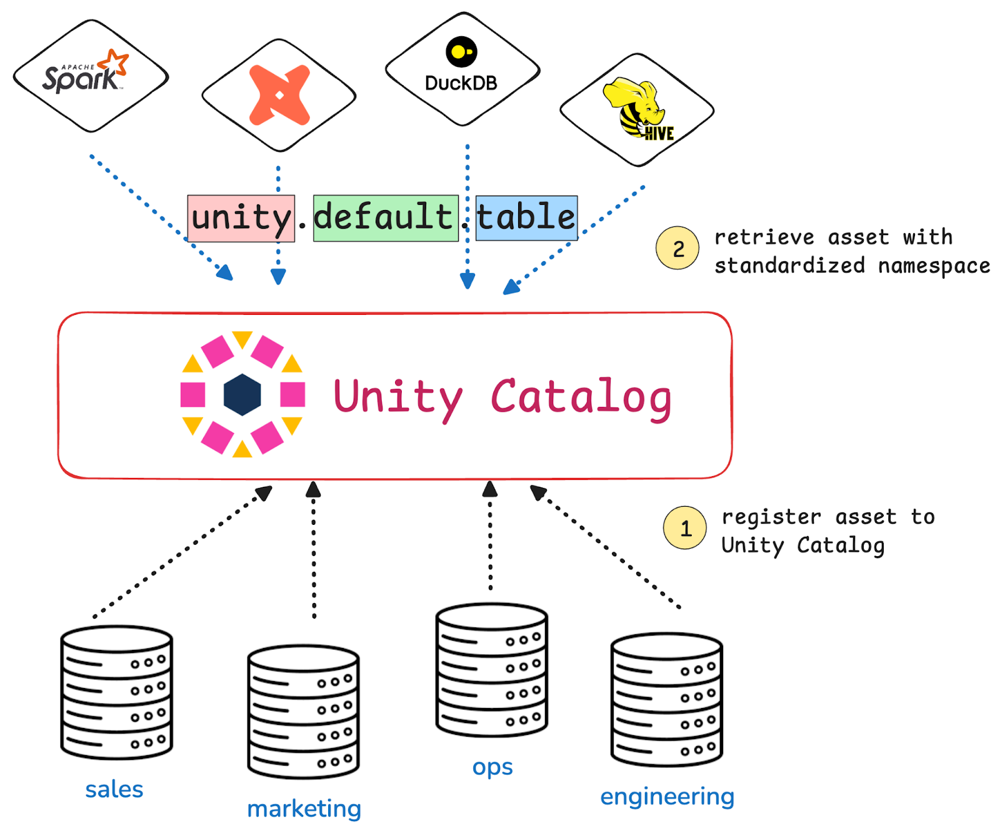
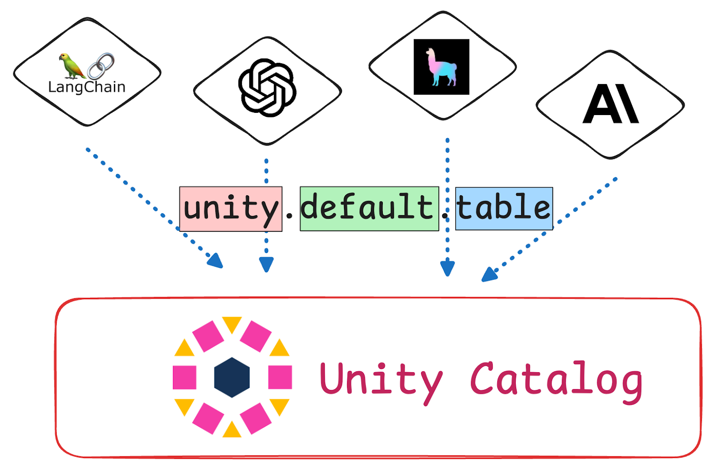

Data silos are a serious problem in many organizations. They downgrade performance by slowing down collaboration and they create risks for data security.

This article explains how Unity Catalog helps you avoid and break down data silos in your organization. We explain the concept of data silos, why they are a problem, and what tools Unity Catalog gives you to avoid this problem.



### What is a data silo?

A data silo happens when your data stream gets isolated in separated locations or workflows and isn’t properly shared for maximum efficiency and performance. You may not even be aware of all the data points you have available for analysis. This causes confusion, wasted effort and missed opportunities. This is a typical data governance problem that Unity Catalog is designed to overcome.

When different parts of an organization use different tools, file formats or storage systems, the data you need for a complete overview gets split up across separate platforms. This negatively impacts your ability to generate valuable insights and makes it difficult to guarantee data security. Data silos also make your analytics workloads brittle and complex as they have to interact across different platforms that may not be fully interoperable.

For example:

- A customer sends you their raw data stored in a private S3 bucket.
- Your data engineering team uses a local PostgreSQL database for product data.
- Business leaders want human-readable spreadsheets stored in Google Drive.

Each group thinks they’re being efficient. They are using the tools that make the most sense for their use case, and that they are comfortable using. But over time, it gets hard to share insight and maintain security across the whole dataset.

### Why are data silos a problem?

You need a complete overview of your dataset to guarantee the highest-quality analyses and predictions. Data silos make this difficult because you can’t easily join or compare data across silos. You can’t guarantee consistency or quality. And you definitely can’t secure everything with a single access control policy. Valuable data ends up spread across systems and you miss out on important opportunities.



Data silos cause three big problems:

1. **Redundant work** — There's no shared source of truth which can lead to different teams cleaning and transforming the same data multiple times.
2. **Inconsistent logic** — Without a shared source of truth, two teams might define the same variable in different ways. This can lead to incorrect analyses and predictions.
3. **Security and access control issues** — Managing access across separate systems and tools is messy. It becomes difficult to audit who accessed or transformed which parts of the data.

These problems block data engineering, slow down AI development, and make compliance harder to guarantee.

### How Unity Catalog helps you avoid data silos

Unity Catalog offers a single unified system to manage, govern, and organize all of your data and AI assets without locking you into a specific table format or query engine. You can define access rules once, keep [metadata](https://www.unitycatalog.io/blogs/metadata-and-data-catalogs) clean and centralized, and easily trace how data flows through your organization. Teams can continue to use the tools and table formats they like and that work best for them, without compromising on efficiency and security.



### How it works

Unity Catalog gives you a shared, structured way to manage data across all your teams and tools. It offers a centralized repository that functions as the single source of truth for all of your data and AI assets. Different teams can access this central repository from their favorite platforms and tools.

Unity Catalog introduces a three-level namespace to easily reference and access any stored asset: `<catalog>.<schema>.<table>`.

This makes it easy to organize all your data into a common structure. For example, you can use the three-level namespace to build the medallion architecture:

- `main.bronze.raw_sales`
- `main.silver.cleaned_sales`
- `main.gold.sales_summary`

All your teams work from the same catalog. You can set access controls at the catalog, schema, or table level. You can define your logic once and reuse it. You can share data across notebooks, tools, and projects without moving it.

## Unity Catalog with PySpark

Launch a Spark session with the following settings to use data stored in your Unity Catalog:

```bash
bin/pyspark --name "local-uc-test" \
  --master "local[*]" \
  --packages "io.delta:delta-spark_2.12:3.2.1,io.unitycatalog:unitycatalog-spark_2.12:0.2.0" \
  --conf "spark.sql.extensions=io.delta.sql.DeltaSparkSessionExtension" \
  --conf "spark.sql.catalog.spark_catalog=io.unitycatalog.spark.UCSingleCatalog" \
  --conf "spark.sql.catalog.unity=io.unitycatalog.spark.UCSingleCatalog" \
  --conf "spark.sql.catalog.unity.uri=http://localhost:8080" \
  --conf "spark.sql.catalog.unity.token=$token" \
  --conf "spark.sql.defaultCatalog=unity"
```

Now you can use standard Spark SQL syntax to access, query, and transform your data.

```sql
-- Show schemas
SHOW SCHEMAS;

-- Show tables
SHOW TABLES IN silver;
```

Read more in the dedicated [Apache Spark and Delta Lake tutorial](https://www.unitycatalog.io/blogs/unity-catalog-spark-delta-lake).

## Unity Catalog with DuckDB

To use Unity Catalog with [DuckDB](https://duckdb.org/), run the following commands in terminal to launch DuckDB and install the required dependencies:

```sql
duckdb

install uc_catalog from core_nightly;
load uc_catalog;
install delta;
load delta;
```

Create a Secret to authenticate the connection:

```sql
CREATE SECRET (
  TYPE UC,
  TOKEN 'not-used',
  ENDPOINT 'http://127.0.0.1:8080',
  AWS_REGION 'us-east-2'
);
```

And then connect to your Unity Catalog:

```sql
ATTACH 'unity' AS unity (TYPE UC_CATALOG);
```

You can now use SQL commands to query your data:

```sql
SHOW ALL TABLES;
SELECT * from main.silver.cleaned_sales;
```

As you can see, teams are free to use their favorite tools and languages to access the centralized data stored in Unity Catalog. This gives you much more freedom while securing reliability and a single source of truth.

### Data Silos and AI

Data silos don’t just slow down analytics. They also get in the way of AI development and deployment. Training a custom LLM or building a retrieval system means pulling together data from different sources, such as customer conversations, product specs, internal documentation, structured logs, unstructured PDFs, etc. If all of that data lives in isolated systems with inconsistent formats and access rules, you will need to manually stitch things together.

It also becomes difficult to reproduce and scale your work or test performance across different AI tools and frameworks. This leads to confusion, bugs, and error-prone data ingestion pipelines.

Unity Catalog solves this by giving you one place to organize all your AI data and assets. You can register [structured tables](https://www.unitycatalog.io/blogs/unity-catalog-managed-vs-external-tables), [unstructured files](https://www.unitycatalog.io/blogs/how-to-use-unity-catalog-volumes), and even all of your [models](https://www.unitycatalog.io/blogs/machine-learning-data-catalog) and [functions](https://www.unitycatalog.io/blogs/working-with-functions-in-unity-catalog). You can [enforce access policies](https://www.unitycatalog.io/blogs/authentication-authorization-unity-catalog) at all three levels of the namespace structure (catalog, schema, and asset), and query everything using consistent permissions. Downstream AI tools like [OpenAI](https://www.unitycatalog.io/blogs/unity-catalog-and-openai), [LlamaIndex](https://www.unitycatalog.io/blogs/unity-catalog-and-llamaindex), or [LangChain](https://www.unitycatalog.io/blogs/unity-catalog-and-langchain) can rely on a single source of truth. This means you will be spending less time gluing things together and more time shipping useful models.



### Why you should avoid data silos

Data silos hold teams back. They create duplicate work, introduce confusion, and make data governance difficult. Unity Catalog gives you the structure to avoid all of this. It helps you organize your data efficiently and securely. Using Unity Catalog as your central data management framework lets teams share clean, trusted data without copying it around. It sets you up for better collaboration, more reliable AI development, and smoother scaling.

## Get Started with Unity Catalog

Use the [Unity Catalog 101 tutorial](https://www.unitycatalog.io/blogs/unity-catalog-oss) to get up and running with Unity Catalog. After that check out the following tutorials to deepen your understanding:

- [Authentication and Authorization in Unity Catalog](https://www.unitycatalog.io/blogs/authentication-authorization-unity-catalog)
- [Managed vs External Tables](https://www.unitycatalog.io/blogs/unity-catalog-managed-vs-external-tables)
- [Understanding Metadata in Unity Catalog](https://www.unitycatalog.io/blogs/metadata-and-data-catalogs)
