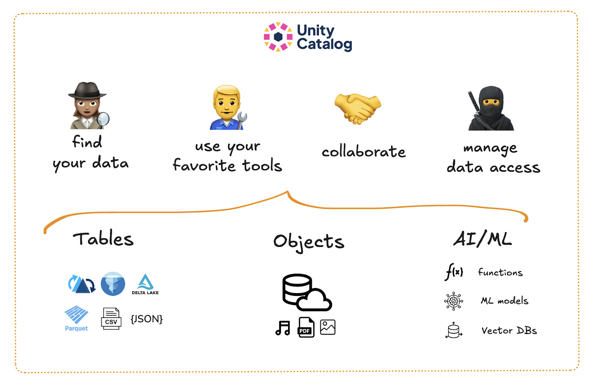

This article explains what metadata is and how it is handled by a data catalog to make your data storage and queries more efficient and secure. The article gives an overview of metadata management and explains why a modern data catalog like Unity Catalog is better than legacy metadata management techniques.

Having data is valuable, but to actually access its value the data needs to be in a format that can be quickly analyzed, easily and securely shared, and properly audited. This is especially critical for AI applications, where high-quality, well-organized data is essential for building accurate and reliable models. A well-designed data and AI catalog makes sure that you can find the right data and models quickly, understand their context, and use them confidently for data science, machine learning, AI, and analytics.

This article explores the concept of metadata, its types, and how a data catalog leverages metadata to help data and AI engineers efficiently manage data securely and efficiently at scale.

Let’s jump in.

## What is metadata?

Metadata is secondary information about your data. For example, the file size, path, and file format are all considered metadata. They describe the characteristics of your primary dataset. 


Metadata can take many different forms and can include descriptors like:

- Table or model name
- Table or model version
- Schema
- Path
- File format
- Roles and permissions
- Access logs
- Latest commit

Different file formats and systems offer different metadata handling capabilities. Some file formats store only basic metadata, others store much more detailed information.  

*How* metadata is stored also changes per file format and data storage system: file formats like Parquet store metadata in the row group footer, while open table formats like Delta Lake store it in a dedicated directory. All of this will affect the efficiency and security of your data storage and the performance of your data and AI workloads. It’s important to choose the right storage format and platform for your metadata requirements.

### Metadata in File Formats

Let’s make this more concrete by looking at metadata for a specific dataset. We’ll work through an example using a local Apache Parquet file. If you don’t have a Parquet file on disk, you can download a publicly available one, for example [here](https://www.tablab.app/parquet/sample).

Open a terminal window and navigate to the directory where your Parquet file is located. Run the following command (for Linux-based systems) to get metadata that is available to your file system:

```
ls -lh
```

This will output some basic metadata about your dataset, including the file size, creation timestamp, and path.

```
total 12688
-rw-r--r--@ 1 user  staff   6.2M 19 Feb 10:04 flights-1m.parquet
```

You can run `mdls <path/to/file>` to get more detailed metadata available to your file system.

Parquet stores your data in row groups and automatically collects statistics for each column in a footer at the end of each row group. This metadata includes information like the **min_value, max_value, null_count,** and **distinct_count** of each column. This metadata is a powerful feature that lets query engines quickly figure out which data can be skipped for a query.

Let’s take a look at the Parquet metadata. We’ll use the pyarrow library and [this flights-1m dataset](https://www.tablab.app/parquet/sample) for this example. You can inspect Parquet metadata about the whole file like this:

```
> import pyarrow.parquet as pq
> pq_file = pq.Parquet(“path/to/file”)
> pq_file.metadata

  created_by: ClickHouse v24.10.1.11275-stable
  num_columns: 7
  num_rows: 1000000
  num_row_groups: 1
  format_version: 2.6
```

This shows you the number of columns, rows, and row groups. You can dig deeper into the column statistics by indexing into a specific row group and column. For example:

```
> pq_file.metadata.row_group(0).column(0).statistics

  has_min_max: True
  min: 2006-01-01
  max: 2006-02-28
  null_count: 0
  distinct_count: None
  num_values: 1000000
  physical_type: INT32
  logical_type: Date
  converted_type (legacy): DATE
```

This returns the min/max values, data types, and other collected statistics.

### Metadata in Data and AI Catalogs

File formats can store lots of useful information about your dataset. But they can’t store governance and access control metadata such as roles and permissions (who is allowed to do what with which files). For that, you will need a more advanced metadata management technology, like a data and AI catalog.

Here’s a quick look at the kind of metadata that becomes available when you store tabular data in a data and AI catalog like Unity Catalog:


All of this metadata is valuable information that a data catalog can use to optimize your data storage, security, and performance.

## What is a data catalog?

A data catalog is a technology that helps you organize and manage your data. It uses advanced metadata management to:

1. **store your data** in the most efficient format and location, 
2. **secure access** by only allowing authorized users to query it, and
3. **prevent data corruption** and provide easy rollback mechanisms.

Data and AI catalogs go beyond the metadata management formats of file and model formats to manage data storage, sharing and querying reliably at scale.


You should consider using a data catalog when:

- You have lots of data, potentially stored in multiple formats and locations
- You need to control access to data assets per user/role 
- Your data is accessed by many different users at the same time
- You need to ensure data governance compliance

Examples of data catalogs include AWS Glue, Apache Atlas, and Google Data Catalog. Unity Catalog is the industry’s first catalog that lets you manage all of your data and AI assets in one place, regardless of the format. You can use Unity Catalog to govern access to your structured, unstructured and AI assets, all at once.

Read more in the [What is a Data Catalog](https://www.unitycatalog.io/blogs/data-catalog) tutorial.

## Data catalog vs Metadata management

Metadata management is the general practice of organizing and making the best possible use of available metadata about your data and AI assets. A data catalog is a specific tool that implements metadata management for you. 

A good data catalog should handle all aspects of metadata management for you, including:

- Clear and easy-to-use data organization
- Reliable security mechanisms and access control
- Simple and secure sharing 
- Historical versioning and auditing capabilities

Legacy metadata management techniques, such as maintaining metadata in custom-built metadata repositories or using tools like Apache Atlas or the Hive Metastore, often struggle with fragmented data, inconsistent governance policies, and limited scalability. These legacy approaches often require a lot of manual effort, making metadata difficult to maintain and increasing the risk of inaccuracies.

## Why should I use Unity Catalog?

Unity Catalog stores metadata about your data assets in a centralized metastore and lets you define users and their permissions to secure access. This makes Unity Catalog the single source of truth for all your data and AI assets.

Having your data, AI assets and metadata in one place allows you to manage and track all your assets consistently across different environments and platforms. This makes it easier to:

- Find your data
- Control data access
- Track data lineage
- Ensure data compliance



Read more about how Unity Catalog secures access in the [Authorization and Authentication blog](https://www.unitycatalog.io/blogs/authentication-authorization-unity-catalog).

## Metadata for Best Data and AI Performance

Proper metadata management is the backbone of any production-grade data and AI workload. With a modern data catalog, your data will be easier to find, safer to share, and easier to govern securely. With AI-assisted data processing quickly becoming a reality, data storage systems need full support for metadata storage and management at scale. Unity Catalog is built to provide this kind of support for both your data and AI assets, no matter their format.

If you’re new to Unity Catalog, take a look at the [Unity Catalog 101 tutorial](https://www.unitycatalog.io/blogs/unity-catalog-oss) to get started.
