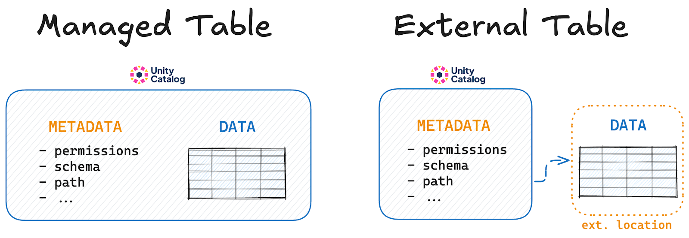

This article explains the difference between managed and external tables and shows you how to work with both types of tables in [Unity Catalog (UC).](https://www.unitycatalog.io/)

Managed tables are great when you want simplicity. They allow you to manage all your data and metadata in one place. External tables are great when you want flexibility over your data storage location or when you're working with external tools or collaborators. Unity Catalog supports working with both types of tables. Depending on your use case, you may want to use exclusively managed or external tables, or a combination of both.

Let's take a closer look at the difference between managed and external tables. We'll also show some examples of how to work with them in Unity Catalog.

## Managed vs External Tables

Managed and external tables are concepts that come from the [Apache Spark](https://spark.apache.org/)™ and [Apache Hive](https://hive.apache.org/)™ ecosystems. If you're a Python engineer you may not have encountered this concept before. Hive and Spark follow conventional relational database practice by managing the entire lifecycle of the table, including data, metadata, and storage. Files are stored at a warehouse location by default, and Spark/Hive can delete files from this location when you drop a table.

Here's how you would create a managed Delta table in Spark:

```python
# Create a managed Delta Lake table
spark.sql("CREATE TABLE managed_table (id INT, name STRING) USING DELTA")

# Write a DataFrame to this table
df.write.saveAsTable("managed_table")
```

Spark stores this table at its default warehouse location. It can manage metadata and remove data at this location. Dropping this table will remove the underlying data.

This is different from working in Python-based environments like [pandas](https://pandas.pydata.org/) where data storage is always managed manually. Libraries like **pandas** do not have built-in support for metadata management. If you've been working with these kinds of libraries, you have been working with external tables only.

## What is a managed table?

A managed table is a table for which Unity Catalog manages both the metadata and the data itself, incl. creation, storage, and deletion. Data is managed at a pre-configured storage location to which Unity Catalog has full read and write access.

Managed tables are great when you want simplicity and security. Data and metadata are managed by a single tool and the risk of data corruption is minimal.



## What is an external table?

An external table is a table for which Unity Catalog manages only the metadata and not the lifecycle of the underlying data itself. The user is responsible for data creation, storage, and deletion at the external location.

External tables are great when you need to share data across multiple applications or when you want to use existing data stored in an external location without having to copy it (e.g.,S3).

### How to Create an External Table in Unity Catalog

Use the [command line interface](https://docs.unitycatalog.io/usage/cli/) (CLI) **`uc/bin table create`** command with a **`storage_location`** to create an external table.

For example:

```bash
bin/uc table create --full_name unity.default.test_ext \
  --storage_location ~/tmp \
  --columns "id INT, name STRING"
```

You will see **`TABLE_TYPE EXTERNAL`** in the returned metadata:

```
┌────────────────────┬──────────────────────────────────────────────────────────────────────────────────────────┐
│        KEY         │                                          VALUE                                           │
├────────────────────┼──────────────────────────────────────────────────────────────────────────────────────────┤
│NAME                │test_ext                                                                                  │
├────────────────────┼──────────────────────────────────────────────────────────────────────────────────────────┤
│CATALOG_NAME        │unity                                                                                     │
├────────────────────┼──────────────────────────────────────────────────────────────────────────────────────────┤
│SCHEMA_NAME         │default                                                                                   │
├────────────────────┼──────────────────────────────────────────────────────────────────────────────────────────┤
│TABLE_TYPE          │EXTERNAL                                                                                  │
├────────────────────┼──────────────────────────────────────────────────────────────────────────────────────────┤
│DATA_SOURCE_FORMAT  │DELTA                                                                                     │
├────────────────────┼──────────────────────────────────────────────────────────────────────────────────────────┤
│COLUMNS             │{"name":"id","type_text":"int","type_json":"{\"name\":\"id\",\"type\":\"integer\",\"nullable":true,"metadata":{}}","type_name":"INT","type_precision":0,"type_scale":0,"type_interval_type":null,"position":0,"comment":null,"nullable":true,"partition_index":null}       │
│                    │{"name":"name","type_text":"string","type_json":"{\"name\":\"name\",\"type\":\"string\",\"nullable":true,"metadata":{}}","type_name":"STRING","type_precision":0,"type_scale":0,"type_interval_type":null,"position":1,"comment":null,"nullable":true,"partition_index":null}                                                                                        │
├────────────────────┼──────────────────────────────────────────────────────────────────────────────────────────┤
│STORAGE_LOCATION    │file:///Users/rpelgrim/tmp/                                                               │
├────────────────────┼──────────────────────────────────────────────────────────────────────────────────────────┤
│COMMENT             │null                                                                                      │
├────────────────────┼──────────────────────────────────────────────────────────────────────────────────────────┤
│PROPERTIES          │{}                                                                                        │
├────────────────────┼──────────────────────────────────────────────────────────────────────────────────────────┤
│CREATED_AT          │1725876982747                                                                             │
├────────────────────┼──────────────────────────────────────────────────────────────────────────────────────────┤
│UPDATED_AT          │null                                                                                      │
├────────────────────┼──────────────────────────────────────────────────────────────────────────────────────────┤
│TABLE_ID            │ad67416b-b3e1-412f-9ab3-bf6926a8ce49                                                      │
└────────────────────┴──────────────────────────────────────────────────────────────────────────────────────────┘
```

The storage location can be a local path (absolute path) or a path to cloud object storage. When a cloud object store path is provided, the server will [vend temporary credentials](https://www.unitycatalog.io/blogs/unity-catalog-spark-delta-lake) to access the cloud storage. The server properties must be set up correctly; see the [server configuration documentation](https://github.com/avriiil/unitycatalog/blob/b19e54f67883511cc499fcc7a6c7fc1af9e3721c/docs/usage/server.md).

## Dropping Managed vs External Tables

One of the most important differences between managed and external tables is what happens when you drop a table from your catalog.

When you drop a managed table from Unity Catalog, the underlying data is also removed. This is quick and avoids confusion downstream when data has not been physically removed. When you drop an external table from Unity Catalog, the underlying data is not touched. If you want the data to be deleted, you will have to do so manually.


## When to use which table

Unity Catalog gives you the freedom to use both managed and external tables, depending on your needs. Both types of tables have full support for CRUD (Create Read Update Delete) operations, including upserts and merges.

You may want to use managed tables when:

- You prefer simplicity and easy data management.
- Your data lifecycle is tightly coupled with the table definition.
- You don't want to worry about the details of data storage.

You may want to use external tables when:

- You need to manage data storage locations explicitly.
- You require data persistence independent of table definitions.
- You need external read or write access to your data from tools that don't integrate with Unity Catalog.

One common practice is to store raw data in external tables and transformed data in managed tables.

## Managed vs External Tables in Unity Catalog

Use managed tables when you want simplicity, unified management, and built-in cleanup of both metadata and data. Use external tables when you need more control over where your data lives or when you're working across systems or teams. Each approach has its strengths, and Unity Catalog gives you the flexibility to choose what works best for your use case.

To learn more about how Unity Catalog works with table data check out the [Using Unity Catalog with Delta Lake and Spark](https://www.unitycatalog.io/blogs/unity-catalog-spark-delta-lake) tutorial.
