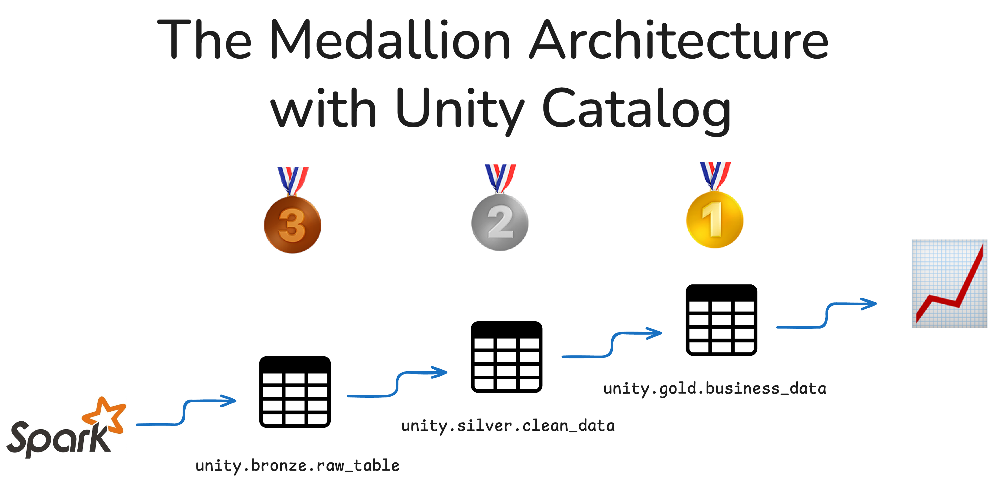
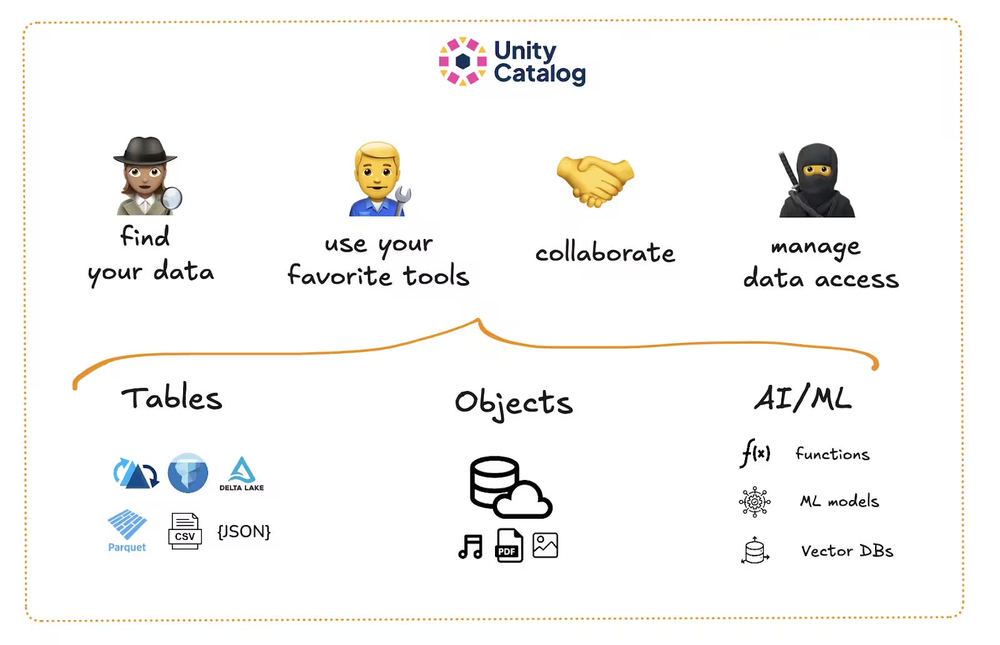
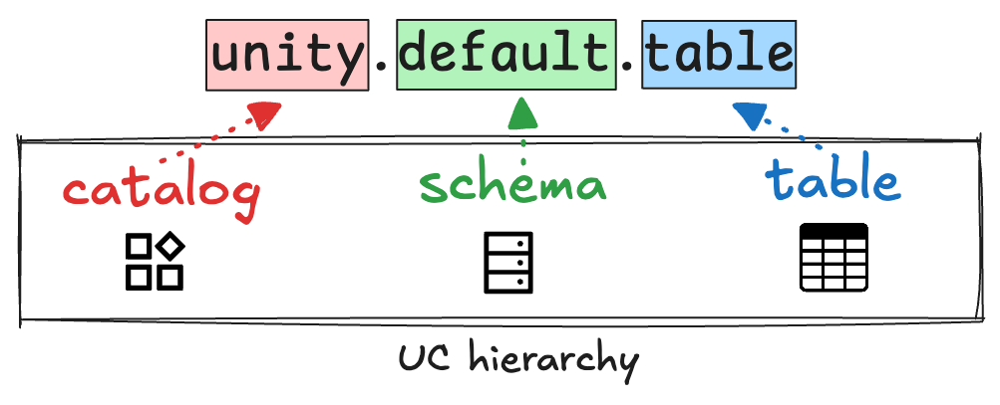
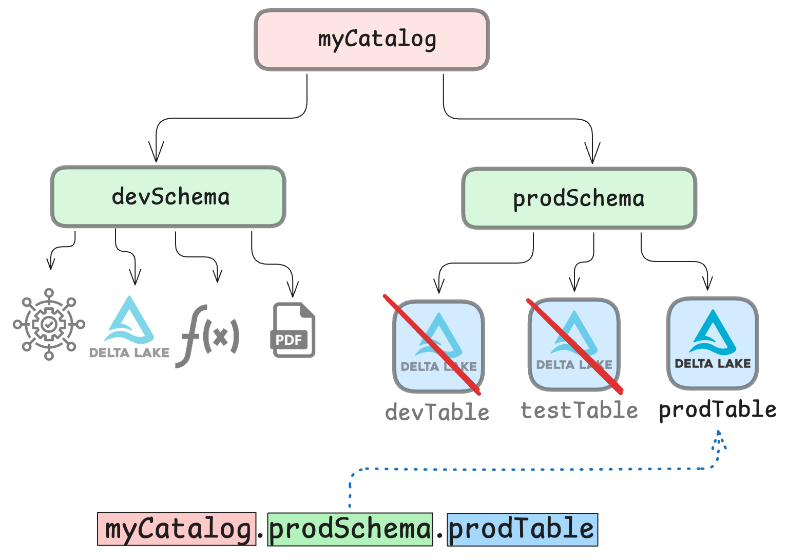

Managing data pipelines at scale is complicated. Valuable data often ends up spread across multiple systems and platforms as different teams use their favorite tools without an overall integration in place. It's called [the data silo problem](https://www.unitycatalog.io/blogs/avoid-data-silos-with-unity-catalog).

This situation makes it hard to track where data assets live, difficult to secure access, and almost impossible to scale cleanly. The Medallion architecture gives you a clear framework to structure your data into three layers:

- **Bronze** for raw, ingested data
- **Silver** for cleaned, enriched data
- **Gold** for business-level data, ready for reporting



Pair this with Unity Catalog, and you get a unified system to manage, govern, and organize your data. You can define access rules once, keep metadata clean, and easily trace how data flows through your organization. Teams can continue to use the tools and file formats that work for them, without compromising the efficiency and security of their data workflows.

Let's walk through how this works.

# What Is Unity Catalog?

[Unity Catalog](https://www.unitycatalog.io/) is an open-source framework that brings structure and governance to your data and AI assets. It [tracks metadata](https://www.unitycatalog.io/blogs/metadata-and-data-catalogs), manages access, and gives you fine-grained control over your data assets. It's designed to work with open storage formats like Delta Lake.



With Unity Catalog, you can:

- Organize data using a clear three-level namespace
- Define who can access what
- Track where data came from and how it's been transformed
- Audit usage for compliance and security

Let's look at the namespace model. It's a logical and hierarchical system for creating your Medallion architecture.

# How the 3-Level Namespace Works

Unity Catalog uses a simple but powerful naming structure:



Here's what each level means:

- **Catalog**: Think of this as your top-level container. You might use one per project (e.g., **`fall_campaign`**), one per department in your organization (e.g., **`sales`**), or another categorization that makes sense for your workflow.
- **Schema**: This is where you can define the layers of your medallion architecture: **`bronze`**, **`silver`**, and **`gold`**.
- **Table**: These are your actual datasets. For example: **`bronze.raw_orders`**, **`silver.cleaned_orders`**, and **`gold.sales_summary`**.

This structure helps you keep things clean and organized. You always know where a table lives and what stage of the pipeline it's in. Different teams can get the data they need using the tools they like best. By implementing [clear access controls](https://www.unitycatalog.io/blogs/authentication-authorization-unity-catalog), you can also make sure that data is never accessed by the wrong user.

# Granular Access Control

You can use Unity Catalog to create secure governance structures that define access to your tables. This works by defining user roles and permissions to create a reliable layer of security. With the proper controls in place, you can make sure that only users and applications (including query engines) with the right permissions can access your data.



Access controls can be defined at all levels of the three-level namespace. You can give a user access to a whole catalog, a whole schema, or only specific assets. Read more in the dedicated [Authentication and Authorization tutorial](https://www.unitycatalog.io/blogs/authentication-authorization-unity-catalog).

# Why Unity Catalog + Medallion Architecture Works So Well

The Medallion architecture gives you a layered system to separate the different types of data flowing through your organization. Unity Catalog gives you the tooling to manage it efficiently and securely.

Together they give you:

- **Clear structure** → Use catalogs and schemas to separate concerns
- **Secure access** → Define who can read or write to each layer
- **Traceable transformations** → Keep metadata and data lineage centralized
- **Easier collaboration** → Teams can work on different layers without stepping on toes

# Unity Catalog + Medallion Architecture example with Apache Spark™

Let's put all of this into practice with a Python example using [Delta Lake](https://delta.io/).

Let's say you're working on customer order data. You have raw data coming in from a client or upstream department. First, you'll set up your bronze layer to funnel in the raw data.

## Launch Spark Session with Unity Catalog

Use the following terminal command from your Spark directory to launch a PySpark session.

```python
bin/pyspark --name "local-uc-test" \
    --master "local[*]" \
    --packages "io.delta:delta-spark_2.12:3.2.1,io.unitycatalog:unitycatalog-spark_2.12:0.2.0" \
    --conf "spark.sql.extensions=io.delta.sql.DeltaSparkSessionExtension" \
    --conf "spark.sql.catalog.spark_catalog=io.unitycatalog.spark.UCSingleCatalog" \
    --conf "spark.sql.catalog.=io.unitycatalog.spark.UCSingleCatalog" \
    --conf "spark.sql.catalog..uri=http://localhost:8080" \
    --conf "spark.sql.catalog..token=" \
    --conf "spark.sql.defaultCatalog="
```

This will launch a Spark session with the Unity Catalog integration enabled, using a local instance of the Unity Catalog server running at **`localhost:8080`**. To run Unity Catalog from another location, check out the documentation on [server deployment](https://docs.unitycatalog.io/deployment/).

Make sure to replace **`<catalog_name>`** with the name of the top-level catalog you want to use. By default, the local Unity Catalog server comes with 1 pre-loaded catalog called **`unity`**. We will use this catalog in the example below. You can also create a new catalog first using the [CLI](https://docs.unitycatalog.io/usage/cli/).

## Create Medallion Layers as Schemas

You are now ready to create your medallion layers as schemas in your catalog. You can do it directly from within your Spark session:

```python
# Create new schemas
spark.sql("CREATE SCHEMA bronze")
spark.sql("CREATE SCHEMA silver")
spark.sql("CREATE SCHEMA gold")
```

You can also use the [CLI](https://www.unitycatalog.io/blogs/unity-catalog-oss) or [REST API](https://www.unitycatalog.io/blogs/how-to-use-the-unity-catalog-rest-api) commands from a separate terminal window to create the new schemas.

## Ingest Raw Data into the Bronze Layer

Now let's ingest data from a CSV file directly into your bronze layer. The same workflow applies to other file types like Parquet or JSON.

```python
spark.sql("""
CREATE TABLE unity.bronze.raw_data
USING CSV
OPTIONS (
  header 'true',
  inferSchema 'true'
)
LOCATION '/path/to/your/file.csv'
""")
```

This creates a new Spark table inside your Bronze medallion layer. Make sure to replace **`/path/to/your/file.csv`** with the actual path to your CSV. The CSV file will be read as an external table in this case. You can read more about [Managed vs External tables](https://www.unitycatalog.io/blogs/unity-catalog-managed-vs-external-tables) in the tutorial.

Note that a Spark Table created directly from a CSV file does not benefit from Delta Lake features like ACID transactions, time travel, and schema enforcement. If you want to make use of the powerful features of Delta Lake, first convert the CSV file to a Delta table:

```python
df = spark.read.option("header","true").csv("/path/to/your/file.csv")
df.write.format("delta").mode("overwrite").save("/your_location/bronze/raw_data")
```

Then use the **`path/to/delta/table`** to register the Delta table to Unity Catalog:

```python
spark.sql("""
CREATE TABLE unity.bronze.raw_data
USING DELTA
LOCATION '/path/to/delta/table'
""")
```

You can confirm that the table has been registered to Unity Catalog by running the following command from the Unity Catalog root directory in a separate terminal:

```python
bin/uc table list --catalog unity --schema bronze
```

This will generate the following output (truncated for legibility), confirming that we have a new table **`raw_data`** stored in the **`bronze`** schema:

```
┌────────┬────────────┬───────────┬──────────┬──────────────────┬───────┬───────────────────────────┬──
│  NAME  │CATALOG_NAME│SCHEMA_NAME│TABLE_TYPE│DATA_SOURCE_FORMAT│COLUMNS│     STORAGE_LOCATION      │ …
├────────┼────────────┼───────────┼──────────┼──────────────────┼───────┼───────────────────────────┼─
│raw_data│unity       │bronze     │EXTERNAL  │DELTA             │[]     │file:///tmp/bronze/raw_data│ …
└────────┴────────────┴───────────┴──────────┴──────────────────┴───────┴───────────────────────────┴──
```

You can now also access the data in this table using the Unity Catalog 3-level namespace from Spark:

```python
spark.sql("SELECT * FROM unity.bronze.raw_data").show()
```

## Clean and Enrich in the Silver Layer

Your raw data is now in your bronze layer, and you or a colleague can access it to clean, transform, or enrich it. Let's imagine we imported raw sales data in the previous step.

Now you want to clean this data by only selecting the columns that are relevant to your team or project:

```python
# Transform the data
silver_df = spark.sql("""
SELECT
  id,
  initcap(first_name) AS first_name,
  initcap(last_name) AS last_name,
  email
FROM unity.bronze.raw_data
WHERE email IS NOT NULL AND id IS NOT NULL
""")

# Write to Silver layer
silver_df.write.format("delta").mode("overwrite").save("/your_location/silver/customers_cleaned")

# Register in Unity Catalog
spark.sql("""
CREATE TABLE unity.silver.customers_cleaned
USING DELTA
LOCATION '/your_location/silver/customers_cleaned'
""")
```

You can confirm again using the CLI:

```python
bin/uc table list --catalog unity --schema silver
```

This will generate the following output (truncated for legibility), confirming that we have a new table **`customers_cleaned`** stored in the **`silver`** schema:

```
┌─────────────────┬────────────┬───────────┬──────────┬──────────────────┬───────┬─────────────────────────────┬──
│      NAME       │CATALOG_NAME│SCHEMA_NAME│TABLE_TYPE│DATA_SOURCE_FORMAT│COLUMNS│      STORAGE_LOCATION       │ …
├─────────────────┼────────────┼───────────┼──────────┼──────────────────┼───────┼─────────────────────────────┼─
│customers_cleaned│unity       │silver     │EXTERNAL  │DELTA             │[]     │file:///tmp/silver/clean_data│ …
└─────────────────┴────────────┴───────────┴──────────┴──────────────────┴───────┴─────────────────────────────┴──
```

Great work!

## Aggregate for Business Use in the Gold Layer

Now that your data is clean, downstream teams can run aggregations on it. For example, we can analyse the number of customers per email domain:

```python
# Aggregate domain stats
gold_df = spark.sql("""
SELECT
  SPLIT(email, '@')[1] AS email_domain,
  COUNT(*) AS user_count
FROM unity.silver.customers_cleaned
GROUP BY SPLIT(email, '@')[1]
""")

# Write to Gold layer
gold_df.write.format("delta").mode("overwrite").save("/your_location/gold/customer_domain_stats")

# Register in Unity Catalog
spark.sql("""
CREATE TABLE demo_catalog.gold.customer_domain_stats
USING DELTA
LOCATION '/your_location/gold/customer_domain_stats'
""")
```

Now you've got your data neatly stored in your own Medallion architecture. Well done!

You can read more about using Unity Catalog with Apache Spark in the [dedicated tutorial](https://docs.unitycatalog.io/integrations/unity-catalog-spark/).

# Unity Catalog + Medallion Architecture for AI workflows

The medallion architecture was originally developed for data engineering pipelines. But the obvious value of separating different data qualities into a reliable and clear hierarchy also applies to AI workflows. You can use Unity Catalog to create a layered hierarchy of AI assets that will make your life easier.

For example, many organizations now treat AI workflows as a lifecycle with distinct stages:

- **Raw data and labeling (Bronze)**: This contains data gathered from logs, user interactions, or third-party sources. This may include embeddings or documents before processing.
- **Feature engineering and training data (Silver)**: This data has been cleaned and transformed, and is stored as training-ready datasets.
- **Model outputs, evaluations, and artifacts (Gold)**: This contains trained models, evaluation results, and production-ready prediction outputs.

Read more about AI applications in the [Unity Catalog for AI tutorial](https://www.unitycatalog.io/blogs/unity-catalog-for-ai). You can also learn more about using Unity Catalog with machine learning models in the [MLflow tutorial](https://www.unitycatalog.io/blogs/machine-learning-data-catalog).

## Benefits of Using Unity Catalog OSS for Medallion Architectures

Unity Catalog OSS brings governance and clarity to your data lake. The Medallion architecture brings structure and flow. Together, they help you build data pipelines that are secure, scalable, and easy to manage.

Here’s what you get by combining Unity Catalog with the Medallion approach:

- Better organization: Everything has a name and a place in a central repository.
- Access control that scales: Set the rules once and they apply everywhere.
- Trust, lineage, and provenance in your data: You can trace where it came from and how it was transformed.
- Flexibility across tools: Open formats and open governance work well with Spark, Dask, DuckDB, and many more.

It’s a system that works well whether you’re one engineer, a whole data platform team, or a collaborative team operating across multiple organizations. It’s safe, reliable, and easy to use.
